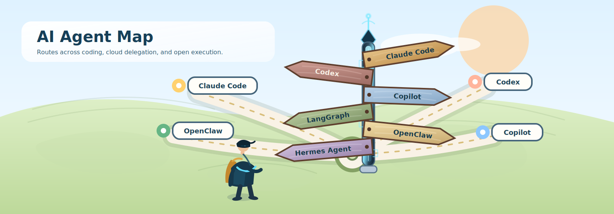

# AI Agent Map

	

AI Agent Map is a practical, visual-first guide for comparing mainstream AI agents, agent platforms, runtimes, and orchestration tools.

The goal is simple: help readers get to a sensible shortlist faster.

## What This Repo Is For

- The agent landscape is crowded.
- Many resources explain ideas, but not fit, anti-fit, or operating cost.
- People usually need a comparison layer, not another pile of links.

This repo stays focused on selection: what a system is good at, where it breaks down, and what kind of operator cost comes with it.

## Where To Start

| If your question is... | Start here |
| --- | --- |
| I need a shortlist first |  |
| I need help choosing for coding automation |  |
| I already have candidates and want a side-by-side view |  |
| I care about dimensions like approval, memory, scheduling, and deployment |  |

## The First Cut Of The Map

| Route | Representative projects | Typical user |
| --- | --- | --- |
| Direct execution | [Claude Code](agents/claude-code.md), [Codex](agents/codex.md), [Devin](agents/devin.md), [OpenHands](agents/openhands.md) | Someone who wants to hand a concrete coding task to an agent |
| Strong approval / strong control | [Cline](agents/cline.md), [GitHub Copilot](agents/github-copilot.md), [Froge Code](agents/froge-code.md) | Someone who wants review and human control to stay central |
| Build-your-own system | [LangChain](agents/langchain.md), [LangGraph](agents/langgraph.md) | Teams building their own agent platform instead of buying one |
| Self-hosted runtime | [Hermes Agent](agents/hermes-agent.md), [OpenClaw](agents/openclaw.md) | Users who need long-running agents, channels, devices, or deeper control |

## Repo Structure

| Directory | Purpose |
| --- | --- |
|  | One page per agent with positioning, boundary, and trade-off. |
|  | Problem-first selection guides. |
|  | Side-by-side comparisons for real decisions. |
|  | Shared vocabulary for capability differences. |

## Current Mainstream Coverage

| Project | Route | One-line positioning |
| --- | --- | --- |
| [Claude Code](agents/claude-code.md) | Direct execution | Local and IDE-first coding agent |
| [Claude Managed Agents](agents/claude-managed-agents.md) | Automation | Anthropic managed / cloud execution mapping |
| [Codex](agents/codex.md) | Direct execution | Async coding delegation in isolated cloud environments |
| [GitHub Copilot](agents/github-copilot.md) | Platform | Multi-surface agent platform across VS Code and GitHub |
| [Cline](agents/cline.md) | Strong-control execution | Approval-first editor-native coding agent |
| [OpenHands](agents/openhands.md) | Open-source execution | Open-source software engineering agent |
| [Devin](agents/devin.md) | Managed execution | End-to-end managed software engineering execution |
| [Hermes Agent](agents/hermes-agent.md) | Multi-agent / self-hosted | Long-lived self-hosted environment with memory and skills |
| [OpenClaw](agents/openclaw.md) | Runtime | Local-first multi-channel runtime layer |
| [LangChain](agents/langchain.md) | Platform | High-level framework for building custom agents quickly |
| [LangGraph](agents/langgraph.md) | Platform | Low-level framework for durable stateful workflows |
| [Froge Code](agents/froge-code.md) | Review-first automation | Provisionally mapped to Automagik Forge |

## Example Reading Paths

If you are still deciding where to begin, use one of these quick routes and then branch out.

| If you sound like this... | Follow this path | What it helps you answer |
| --- | --- | --- |
| I want the best day-to-day coding agent inside my editor | [Claude Code](agents/claude-code.md) → [GitHub Copilot](agents/github-copilot.md) → [Cline](agents/cline.md) → [coding automation guide](use-cases/coding-automation.md) | Direct execution vs assistive IDE flow vs approval-first control |
| I want to hand off tickets and check back later | [Codex](agents/codex.md) → [Devin](agents/devin.md) → [Claude Managed Agents](agents/claude-managed-agents.md) → [mainstream matrix](comparisons/mainstream-agent-landscape.md) | Async cloud delegation vs managed execution |
| I need something open-source or self-hosted | [OpenHands](agents/openhands.md) → [Hermes Agent](agents/hermes-agent.md) → [OpenClaw](agents/openclaw.md) → [capabilities](capabilities/README.md) | Open execution, runtime control, and deployment trade-offs |
| I am building an internal agent stack, not buying a product | [LangChain](agents/langchain.md) → [LangGraph](agents/langgraph.md) → [capabilities](capabilities/README.md) → [mainstream matrix](comparisons/mainstream-agent-landscape.md) | Framework vs runtime vs product boundaries |