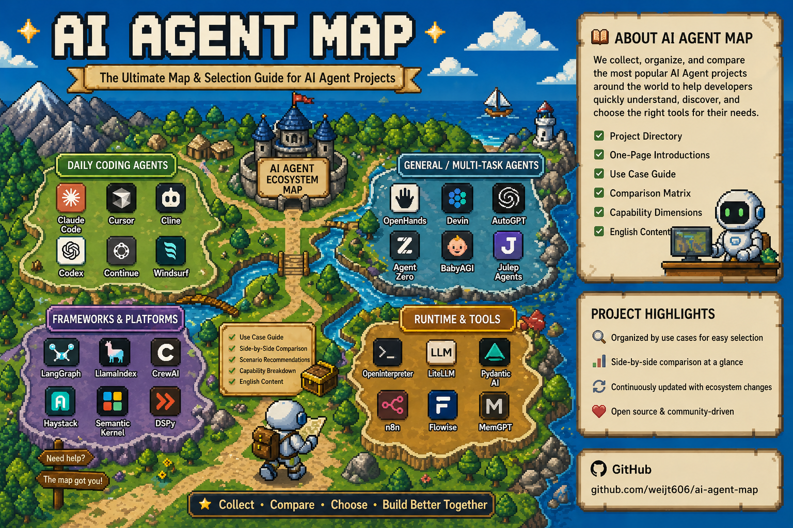

# AI Agent Map

	

AI Agent Map is a practical, visual-first guide for comparing mainstream AI agents, agent platforms, runtimes, and orchestration tools.

The goal is simple: help readers get to a sensible shortlist faster.

## What This Repo Is For

- The agent landscape is crowded.
- Many resources explain ideas, but not fit, anti-fit, or operating cost.
- People usually need a comparison layer, not another pile of links.

This repo stays focused on selection: what a system is good at, where it breaks down, and what kind of operator cost comes with it.

## Where To Start

| If your question is... | Start here |
| --- | --- |
| I need a shortlist first |  |
| I need help choosing for coding automation |  |
| I already have candidates and want a side-by-side view |  |
| I care about dimensions like approval, memory, scheduling, and deployment |  |

## Recent Heat Ranking

Popularity is not fit.

This table tracks projects that showed up as especially hot in the latest weekly GitHub snapshot. The rank follows the 7-day gain. The total star counts below were checked when this repo was updated.

> **Last updated:** 2026-05-02 · **Snapshot window:** 2026-04-26 → 2026-05-02 (7-day gain) · **Star counts:** checked at update time

| Rank | Project | Current stars | Snapshot gain | Map status | How to read it |
| --- | --- | --- | --- | --- | --- |
| #1 | [Hermes Agent](agents/hermes-agent.md) | 129k | +10,800 | In scope | Self-hosted multi-agent environment, still leading absolute growth though decelerating from last week's +58k |
| #2 (new) | [Codex CLI](agents/codex.md) | 79.5k | +3,900 | In scope | OpenAI's terminal-native coding agent — surge driven by April 16 Computer Use + parallel multi-agent update and the GPT-5.5 backbone |
| #3 | [OpenScreen](https://github.com/siddharthvaddem/openscreen) | 34.2k | +1,300 | Out of scope | Still hot, but it is a screen-demo tool rather than an agent |
| #4 | [oh-my-codex](agents/oh-my-codex.md) | 27.2k | +1,100 | In scope | Codex CLI orchestration layer, still riding the Codex wave |
| #5 | [oh-my-claudecode](agents/oh-my-claudecode.md) | 32.2k | +800 | In scope | Workflow and orchestration layer around Claude Code |
| #6 | [Mercury Agent](agents/mercury-agent.md) | 1.9k | +500 | In scope | Sustained week-2 growth — permission-hardened self-hosted CLI / Telegram agent |
| #7 | [AI Edge Gallery](agents/ai-edge-gallery.md) | 22.4k | +300 | In scope with caveat | On-device assistant sandbox, growth flattening |
| Watchlist | [GenericAgent](https://github.com/lsdefine/GenericAgent) | 8.7k | n/a this week | Not yet in scope | New self-evolving agent from a Fudan team — 3.3K-line seed grows a personal skill tree on every task. Tracking before deciding on a profile |

- Heat is useful for discovery, not for selection by itself.
- Some hot repos are adjacent to the agent landscape without actually being agents. OpenScreen is the clearest example in this snapshot.
- Codex CLI is now the second-fastest grower this week — the headline event is OpenAI's April 16 "Codex for (almost) everything" update, which adds Computer Use (autonomous mouse/keyboard across any macOS app), parallel background agents, an in-app browser, and 90+ plugins on top of the GPT-5.5 model layer.

## Market Event: GPT-5.5 Enters The Agent Landscape

On April 23 2026, OpenAI released [GPT-5.5](agents/gpt-5.5.md) — positioned as "a new class of intelligence for real work and powering agents." This is not a GitHub-trending project but a model release that reshapes the capability ceiling across multiple agent surfaces already tracked in this repo.

| What changed | Impact on this map |
| --- | --- |
| 82.7% on Terminal-Bench 2.0 | Highest agentic coding benchmark at launch — raises the bar for Codex and all OpenAI-API-based agents |
| 1M token context window | Long-context tasks that were impractical before become viable for API-based agent builders |
| 2x price vs GPT-5.4 | Cost-sensitive teams must re-benchmark per-task economics |
| SWE-Bench Pro at 58.6% | Still trails Claude Opus 4.7 (64.3%) — model choice depends on workload |

GPT-5.5 does not replace [Codex](agents/codex.md) as a product entry. It is the model layer underneath. See the [GPT-5.5 profile](agents/gpt-5.5.md) for the full breakdown.

### Codex Product Update (April 16 2026)

A week before the GPT-5.5 release, OpenAI shipped "Codex for (almost) everything," a major capability expansion on the [Codex](agents/codex.md) product surface itself.

| What changed | Why it matters |
| --- | --- |
| Background Computer Use | Codex can see, click, and type with its own cursor across any macOS app — even ones without an API |
| Parallel multi-agent execution | Multiple Codex agents can run on the same Mac in parallel without interfering with foreground work |
| 90+ new plugins | Atlassian Rovo, CircleCI, CodeRabbit, GitLab Issues, Microsoft Suite, and more |
| In-app browser + proactive suggestions | Direct iteration on frontend designs and proactive proposals from project context and memory |
| 3M weekly active developers | Reported in April 2026, nearly 2x early-March 2026 |

Combined with the GPT-5.5 backbone, this is the most consequential agent product update in the snapshot window.

## The First Cut Of The Map

| Route | Representative projects | Typical user |
| --- | --- | --- |
| Direct execution | [Claude Code](agents/claude-code.md), [Aider](agents/aider.md), [Codex](agents/codex.md), [Devin](agents/devin.md), [Jules](agents/jules.md), [OpenHands](agents/openhands.md) | Someone who wants to hand a concrete coding task to an agent |
| Frontier agentic model | [GPT-5.5](agents/gpt-5.5.md) | Someone choosing which model to wire into their own agent system or evaluating the capability ceiling of OpenAI-based surfaces |
| Workflow / orchestration layer | [oh-my-claudecode](agents/oh-my-claudecode.md), [oh-my-codex](agents/oh-my-codex.md) | Someone who already likes Claude Code or Codex and wants stronger orchestration on top |
| Editor-centric AI workflow | [Cursor](agents/cursor.md), [Windsurf](agents/windsurf.md), [Continue](agents/continue.md) | Someone who wants the editor itself to stay central |
| Review-first automation | [Cline](agents/cline.md), [GitHub Copilot](agents/github-copilot.md), [Froge Code](agents/froge-code.md) | Someone who wants review and human control to stay central |
| Managed background path | [Claude Managed Agents](agents/claude-managed-agents.md) | Someone who needs scheduled, cloud, or detached Anthropic workflows |
| General-purpose autonomous agent | [AutoGPT](agents/autogpt.md), [Agent Zero](agents/agent-zero.md), [BabyAGI](agents/babyagi.md), [Julep](agents/julep.md) | Someone who wants autonomous, general-purpose task execution |
| Build-your-own system | [LangChain](agents/langchain.md), [LangGraph](agents/langgraph.md), [CrewAI](agents/crewai.md), [LlamaIndex](agents/llamaindex.md), [Haystack](agents/haystack.md), [Semantic Kernel](agents/semantic-kernel.md), [DSPy](agents/dspy.md), [Pydantic AI](agents/pydantic-ai.md) | Teams building their own agent platform instead of buying one |
| Runtime and tools | [n8n](agents/n8n.md), [MemGPT](agents/memgpt.md), [Open Interpreter](agents/open-interpreter.md), [LiteLLM](agents/litellm.md), [Flowise](agents/flowise.md) | Teams that need workflow automation, code execution, LLM gateways, or visual builders |
| Self-hosted / local runtime | [AI Edge Gallery](agents/ai-edge-gallery.md), [Goose](agents/goose.md), [Hermes Agent](agents/hermes-agent.md), [OpenClaw](agents/openclaw.md), [Mercury Agent](agents/mercury-agent.md) | Users who need on-device privacy, long-running agents, local control, channels, or devices |

## Repo Structure

| Directory | Purpose |
| --- | --- |
|  | One page per agent with positioning, boundary, and trade-off. |
|  | Problem-first selection guides. |
|  | Side-by-side comparisons for real decisions. |
|  | Shared vocabulary for capability differences. |

## Current Mainstream Coverage

| Project | Route | One-line positioning |
| --- | --- | --- |
| [Aider](agents/aider.md) | Direct execution | Terminal-first AI pair programmer close to git |
| [Claude Code](agents/claude-code.md) | Direct execution | Local and IDE-first coding agent |
| [Claude Managed Agents](agents/claude-managed-agents.md) | Managed background path | Anthropic managed / cloud execution mapping |
| [Codex](agents/codex.md) | Direct execution | Async coding delegation in isolated cloud environments |
| [oh-my-claudecode](agents/oh-my-claudecode.md) | Workflow layer | Teams-first orchestration layer on top of Claude Code |
| [oh-my-codex](agents/oh-my-codex.md) | Workflow layer | Stronger workflow, teams, and persistent state around Codex CLI |
| [Cursor](agents/cursor.md) | Editor-centric platform | AI editor spanning local coding, cloud agents, and integrations |
| [GitHub Copilot](agents/github-copilot.md) | Platform | Multi-surface agent platform across VS Code and GitHub |
| [Cline](agents/cline.md) | Review-first execution | Approval-first editor-native coding agent |
| [Windsurf](agents/windsurf.md) | AI-native IDE | Cascade-centered AI IDE |
| [OpenHands](agents/openhands.md) | Open-source execution | Open-source software engineering agent |
| [Devin](agents/devin.md) | Managed execution | End-to-end managed software engineering execution |
| [Jules](agents/jules.md) | Managed cloud execution | GitHub-connected coding delegation with PR handoff |
| [AI Edge Gallery](agents/ai-edge-gallery.md) | On-device local runtime | Mobile-first local assistant sandbox with agent skills |
| [Goose](agents/goose.md) | Open-source local platform | Extensible local agent across desktop, CLI, and API |
| [Hermes Agent](agents/hermes-agent.md) | Multi-agent / self-hosted | Long-lived self-hosted environment with memory and skills |
| [OpenClaw](agents/openclaw.md) | Runtime | Local-first multi-channel runtime layer |
| [LangChain](agents/langchain.md) | Platform | High-level framework for building custom agents quickly |
| [LangGraph](agents/langgraph.md) | Platform | Low-level framework for durable stateful workflows |
| [Continue](agents/continue.md) | Editor-centric | Open-source IDE extension with full model freedom |
| [GPT-5.5](agents/gpt-5.5.md) | Frontier agentic model | OpenAI's agentic model powering Codex, ChatGPT, and API agent builders |
| [AutoGPT](agents/autogpt.md) | Autonomous agent platform | Visual agent builder with workflows, marketplace, and multi-model support |
| [CrewAI](agents/crewai.md) | Multi-agent framework | Role-based agent collaboration with fast prototyping |
| [LlamaIndex](agents/llamaindex.md) | Data-first framework | RAG and agentic applications over documents and data |
| [n8n](agents/n8n.md) | Workflow automation | Visual workflow platform with native AI agent nodes and 400+ integrations |
| [MemGPT](agents/memgpt.md) | Stateful agent platform | Persistent memory agents that learn across sessions (now Letta) |
| [Agent Zero](agents/agent-zero.md) | Autonomous agent | Self-building autonomous agent with dynamic tool creation |
| [BabyAGI](agents/babyagi.md) | Experimental | Pioneering autonomous agent experiment — educational, not production |
| [Julep](agents/julep.md) | Workflow engine | Temporal-backed durable workflow engine for stateful AI agents |
| [Haystack](agents/haystack.md) | Framework | Production-oriented RAG and agent framework by deepset |
| [Semantic Kernel](agents/semantic-kernel.md) | Framework | Microsoft's AI orchestration SDK for .NET, Python, and Java |
| [DSPy](agents/dspy.md) | Framework | Programmatic prompt optimization — programming, not prompting, LMs |
| [Open Interpreter](agents/open-interpreter.md) | Runtime | Natural language to local code execution, no sandbox |
| [LiteLLM](agents/litellm.md) | Infrastructure | Unified API gateway for 100+ LLM providers |
| [Pydantic AI](agents/pydantic-ai.md) | Framework | Type-safe Python agent framework with structured outputs |
| [Flowise](agents/flowise.md) | Visual builder | Drag-and-drop LLM app and agent builder on top of LangChain |
| [Froge Code](agents/froge-code.md) | Review-first automation | Provisionally mapped to Automagik Genie |
| [Mercury Agent](agents/mercury-agent.md) | Self-hosted multi-channel | Permission-hardened agent for CLI and Telegram with token budgets |

## Example Reading Paths

If you are still deciding where to begin, use one of these quick routes and then branch out.

| If you sound like this... | Follow this path | What it helps you answer |
| --- | --- | --- |
| I want a day-to-day coding agent and need to choose terminal vs editor | [Aider](agents/aider.md) → [Claude Code](agents/claude-code.md) → [Cursor](agents/cursor.md) → [Cline](agents/cline.md) → [coding automation guide](use-cases/coding-automation.md) | Terminal-first local loop vs editor-led flow vs approval-first control |
| I already like Claude Code or Codex but want stronger orchestration | [Claude Code](agents/claude-code.md) → [oh-my-claudecode](agents/oh-my-claudecode.md) → [Codex](agents/codex.md) → [oh-my-codex](agents/oh-my-codex.md) → [mainstream matrix](comparisons/mainstream-agent-landscape.md) | When the base agent is enough and when a workflow layer actually adds value |
| I want to understand GPT-5.5's impact on the agent landscape | [GPT-5.5](agents/gpt-5.5.md) → [Codex](agents/codex.md) → [Claude Code](agents/claude-code.md) → [mainstream matrix](comparisons/mainstream-agent-landscape.md) | How a frontier model release shifts the capability ceiling and what it means for product choice |
| I want a dedicated AI IDE instead of stitching tools together | [Cursor](agents/cursor.md) → [Windsurf](agents/windsurf.md) → [GitHub Copilot](agents/github-copilot.md) → [mainstream matrix](comparisons/mainstream-agent-landscape.md) | Dedicated AI editor vs ecosystem platform |
| I want to hand off tickets and check back later | [Codex](agents/codex.md) → [Jules](agents/jules.md) → [Devin](agents/devin.md) → [Claude Managed Agents](agents/claude-managed-agents.md) → [mainstream matrix](comparisons/mainstream-agent-landscape.md) | Async cloud delegation vs managed background automation |
| I need something open-source or self-hosted | [Aider](agents/aider.md) → [OpenHands](agents/openhands.md) → [Goose](agents/goose.md) → [Hermes Agent](agents/hermes-agent.md) → [capabilities](capabilities/README.md) | Terminal control, open-source execution, and local runtime ownership |
| I am building an internal agent stack, not buying a product | [LangChain](agents/langchain.md) → [LangGraph](agents/langgraph.md) → [capabilities](capabilities/README.md) → [mainstream matrix](comparisons/mainstream-agent-landscape.md) | Framework vs runtime vs product boundaries |