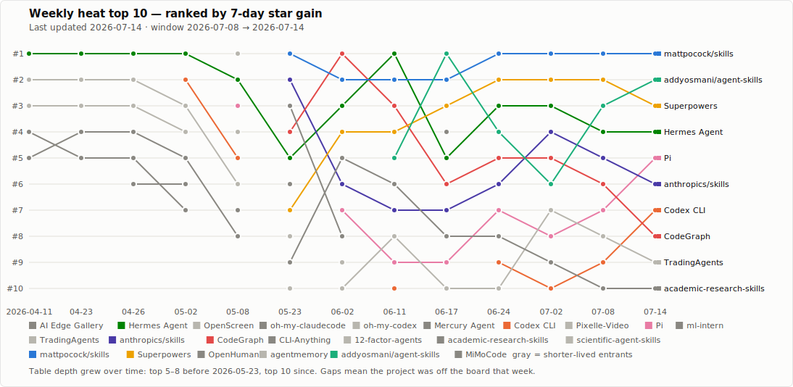

# AI Agent Map

	

AI Agent Map is a practical, visual-first guide for comparing mainstream AI agents, agent platforms, runtimes, and orchestration tools.

The goal is simple: help readers get to a sensible shortlist faster.

## What This Repo Is For

- The agent landscape is crowded.
- Many resources explain ideas, but not fit, anti-fit, or operating cost.
- People usually need a comparison layer, not another pile of links.

This repo stays focused on selection: what a system is good at, where it breaks down, and what kind of operator cost comes with it.

## Where To Start

| If your question is... | Start here |
| --- | --- |
| I need a shortlist first |  |
| I need help choosing for coding automation |  |
| I already have candidates and want a side-by-side view |  |
| I care about dimensions like approval, memory, scheduling, and deployment |  |
| I want the stock rankings and the weekly trend chart |  |
| I want problem-first guides or the full comparison list | [Use cases](use-cases/README.md) · [Comparisons](comparisons/README.md) |

## Recent Heat Ranking

Popularity is not fit.

This table tracks projects that showed up as especially hot in the latest weekly GitHub snapshot. The rank follows the 7-day gain. The total star counts below were checked when this repo was updated.

> **Last updated:** 2026-07-22 · **Snapshot window:** 2026-07-14 → 2026-07-22 (gain since last update, ~8 days, approximate) · **Star counts:** checked at update time

Project names link to the upstream GitHub repo. When this map has a written profile, it is linked separately in the "Map status" column.

| Rank | Project | Current stars | Snapshot gain | Map status | How to read it |
| --- | --- | --- | --- | --- | --- |
| #1&nbsp;(=) | [mattpocock/skills](https://github.com/mattpocock/skills) | 181.8k | +13,570 | Watchlist (Skills Wave) | Held the gain lead for a fifth straight window with its biggest jump yet — Matt Pocock's curated `.claude/skills` directory cleared 181k |
| #2&nbsp;(↑) | [Superpowers](https://github.com/obra/superpowers) | 259.3k | +5,432 | In scope · [profile](agents/superpowers.md) | Reclaimed #2 and neared 260k — the wave's framework anchor keeps compounding |
| #3&nbsp;(↑) | [Pi](https://github.com/earendil-works/pi) | 75.4k | +4,876 | In scope · [profile](agents/pi.md) | Jumped two spots to #3 — the Earendil-owned harness cleared 75k |
| #4&nbsp;(=) | [Hermes Agent](https://github.com/NousResearch/hermes-agent) | 218.8k | +4,588 | In scope · [profile](agents/hermes-agent.md) | Steady at #4 — the in-scope absolute leader cleared 218k |
| #5&nbsp;(↑) | [Codex CLI](https://github.com/openai/codex) | 100.6k | +2,954 | In scope · [profile](agents/codex.md) | Climbed two spots to #5 and crossed 100k — OpenAI's Codex CLI |
| #6&nbsp;(=) | [anthropics/skills](https://github.com/anthropics/skills) | 163.4k | +2,510 | Watchlist (Skills Wave canonical) | Held #6 — Anthropic's own reference `.claude/skills` repo, the upstream source, cleared 163k |
| #7&nbsp;(new) | [jcode](https://github.com/1jehuang/jcode) | 10.6k | +2,319 | In scope · [profile](agents/jcode.md) | Entered the table — the Rust multi-session coding harness accelerated from the watchlist, cleared 10k, and is now profiled |
| #8&nbsp;(=) | [colbymchenry/codegraph](https://github.com/colbymchenry/codegraph) | 61.6k | +1,968 | In scope · [profile](agents/codegraph.md) | Held #8 — the pre-indexed code knowledge graph cleared 61k |
| #9&nbsp;(↓) | [addyosmani/agent-skills](https://github.com/addyosmani/agent-skills) | 79.8k | +1,908 | Watchlist (Skills Wave) | Cooled from #2 to #9 as its gain roughly halved — Addy Osmani's curated agent-skills collection neared 80k |
| #10&nbsp;(new) | [Kimi Code](https://github.com/MoonshotAI/kimi-code) | 4.5k | +1,452 | In scope · [profile](agents/kimi-code.md) | Entered the table — Moonshot's vendor-official Kimi-native CLI cleared 4.5k |

- Heat is useful for discovery, not for selection by itself.
- The headline this window is **[mattpocock/skills](https://github.com/mattpocock/skills) surging to a fifth straight #1** with its biggest gain yet (+13.6k, past 181k — nearly double its usual pace), while last window's #2 [addyosmani/agent-skills](https://github.com/addyosmani/agent-skills) collapsed to #9 as its gain roughly halved (+1.9k). [Superpowers](agents/superpowers.md) reclaimed #2 (+5.4k, near 260k) and [Pi](agents/pi.md) jumped to #3 (+4.9k, past 75k), with [Codex CLI](agents/codex.md) crossing 100k at #5. The other story is two in-scope newcomers entering the gain table: **[jcode](agents/jcode.md) at #7** and [Kimi Code](agents/kimi-code.md) at #10, pushing [TradingAgents](https://github.com/TauricResearch/TradingAgents) and [academic-research-skills](https://github.com/Imbad0202/academic-research-skills) off it.
- **New-inclusion decision: [jcode](agents/jcode.md) is promoted from the watchlist to an in-scope profile.** The Rust multi-session coding harness (`1jehuang/jcode`, 10.6k, MIT) has climbed steadily since May and now enters the gain-ranked top 10 at #7 (+2.3k); it joins the [agent harness framework](comparisons/agent-harness-frameworks.md) route alongside [Pi](agents/pi.md). Nothing else cleared the bar. The freshest new repos — [Sahir619/fable-method](https://github.com/Sahir619/fable-method) (1.8k, the Fable 5 workflow distilled into skills), [ai4s-research/open-science](https://github.com/ai4s-research/open-science) (0.9k, a local-first AI research workbench) and [KlaatAI/klaatcode](https://github.com/KlaatAI/klaatcode) (0.2k, an open terminal coding agent) — join the watchlist, none in-scope yet.

More window notes: skills-wave share, OpenClaw, and everything growing outside the top 10

- The `.claude/skills` wave narrowed to four of the top ten (`mattpocock/skills`, `Superpowers`, `anthropics/skills`, `addyosmani/agent-skills`) as `academic-research-skills` dropped off the gain table. Policy unchanged: curated collections are tracked as Skills Wave entries, the framework end is covered through [Superpowers](agents/superpowers.md).
- [TradingAgents](https://github.com/TauricResearch/TradingAgents) rose to 94.1k (+1.3k) but fell off the top 10 and stays out of scope as a finance-research vertical; [academic-research-skills](https://github.com/Imbad0202/academic-research-skills) also dropped off at 39.0k (+1.3k).
- [OpenClaw](agents/openclaw.md) remains the absolute leader at 383.8k stars (+1.0k); it is profiled but stays out of the gain-ranked table because reliable week-over-week deltas for a project this large are noisy.
- Continuing to grow but outside the top 10 by gain: [Ruflo](agents/ruflo.md) 65.5k (+1.2k), [scientific-agent-skills](https://github.com/K-Dense-AI/scientific-agent-skills) 31.5k (+0.6k), [CLI-Anything](agents/cli-anything.md) 45.7k (+0.5k), [agentmemory](https://github.com/rohitg00/agentmemory) 25.6k (+0.5k), [12-factor-agents](https://github.com/humanlayer/12-factor-agents) 24.7k (+0.4k), [openhuman](agents/openhuman.md) 35.2k (+0.4k), [MiMoCode](agents/mimocode.md) 12.3k (+0.4k), [CodeWhale](agents/codewhale.md) 40.0k (+0.3k), [financial-services](https://github.com/anthropics/financial-services) 33.7k (+0.2k), [CoStrict](agents/costrict.md) 4.3k (flat).

### Ranking Trend

How the weekly top 10 has shifted since tracking began — each line is one project, breaks mean it fell off the board that week:

  

Full stock rankings by category — agents, agent infra, skills, and their verticals, sorted by total stars — live in [rankings/](rankings/README.md).

## Market Pulse

The three structural stories shaping selection right now — full records with dates and sources live in [market-events.md](market-events.md):

- **The `.claude/skills` wave keeps compounding** (May 2026 → ongoing): curated skill collections and skills frameworks have held roughly half of the weekly heat top 10 for two months. For many tasks the skill layer now matters as much as the underlying agent. This map profiles the framework end through [Superpowers](agents/superpowers.md) and tracks collections on the [skill boards](rankings/skill-verticals.md).
- **The model layer became a budget decision**: Anthropic's Mythos-class [Claude Fable 5](agents/claude-fable-5.md) (June 9) sits above Opus 4.8 on metered credits, while OpenAI's GPT-5.6 (July 9) ships in three price tiers — on both sides, "which tier of intelligence for this task" is now part of agent selection. Spring reference point: [GPT-5.5](agents/gpt-5.5.md).
- **Product boundaries are collapsing upward**: OpenAI merged Codex into the ChatGPT app (July 9) — on the OpenAI side, "which coding agent" is turning into "how you use ChatGPT." See [Codex](agents/codex.md).

## The First Cut Of The Map

| Route | Representative projects | Typical user |
| --- | --- | --- |
| Direct execution | [Claude Code](agents/claude-code.md), [Aider](agents/aider.md), [Codex](agents/codex.md), [Kimi Code](agents/kimi-code.md), [MiMoCode](agents/mimocode.md), [CodeWhale](agents/codewhale.md), [Devin](agents/devin.md), [Jules](agents/jules.md) | Someone who wants to hand a concrete coding task to an agent (see the [terminal coding CLI comparison](comparisons/coding-cli-agents.md)) |
| Agent harness framework | [Pi](agents/pi.md), [jcode](agents/jcode.md), [OpenHands](agents/openhands.md), [SWE-agent](agents/swe-agent.md), [mini-swe-agent](agents/mini-swe-agent.md), [OpenHarness](agents/openharness.md) | Someone who wants to own the agent loop, tool surface, and permissions instead of inheriting a vendor's product (see the [harness comparison](comparisons/agent-harness-frameworks.md)) |
| Frontier agentic model | [Claude Fable 5](agents/claude-fable-5.md), [GPT-5.5](agents/gpt-5.5.md) | Someone choosing which model to wire into their own agent system or evaluating the capability ceiling of Anthropic / OpenAI surfaces |
| Agentic skills framework | [Superpowers](agents/superpowers.md) | Someone who wants a methodology + composable skills layer that plugs into Claude Code, Codex, Cursor, and similar agents |
| Workflow / orchestration layer | [oh-my-claudecode](agents/oh-my-claudecode.md), [oh-my-codex](agents/oh-my-codex.md), [Ruflo](agents/ruflo.md) | Someone who already likes Claude Code or Codex and wants stronger orchestration on top (Ruflo extends this to multi-machine federation and 100+ specialized agents) |
| Editor-centric AI workflow | [Cursor](agents/cursor.md), [Windsurf](agents/windsurf.md), [Continue](agents/continue.md) | Someone who wants the editor itself to stay central |
| Review-first automation | [Cline](agents/cline.md), [GitHub Copilot](agents/github-copilot.md), [Froge Code](agents/froge-code.md), [CoStrict](agents/costrict.md) | Someone who wants review and human control to stay central (CoStrict adds enterprise strict-workflow + private deployment) |
| Managed background path | [Claude Managed Agents](agents/claude-managed-agents.md) | Someone who needs scheduled, cloud, or detached Anthropic workflows |
| General-purpose autonomous agent | [AutoGPT](agents/autogpt.md), [Agent Zero](agents/agent-zero.md), [BabyAGI](agents/babyagi.md), [Julep](agents/julep.md), [GenericAgent](agents/generic-agent.md), [ml-intern](agents/ml-intern.md) | Someone who wants autonomous, general-purpose task execution (or, in ml-intern's case, autonomous ML engineering) |
| Build-your-own system | [LangChain](agents/langchain.md), [LangGraph](agents/langgraph.md), [CrewAI](agents/crewai.md), [LlamaIndex](agents/llamaindex.md), [Haystack](agents/haystack.md), [Semantic Kernel](agents/semantic-kernel.md), [DSPy](agents/dspy.md), [Pydantic AI](agents/pydantic-ai.md) | Teams building their own agent platform instead of buying one |
| Runtime and tools | [n8n](agents/n8n.md), [MemGPT](agents/memgpt.md), [Open Interpreter](agents/open-interpreter.md), [LiteLLM](agents/litellm.md), [Flowise](agents/flowise.md), [CodeGraph](agents/codegraph.md), [CLI-Anything](agents/cli-anything.md) | Teams that need workflow automation, code execution, LLM gateways, agent context infrastructure, agent-driven CLIs, or visual builders |
| Self-hosted / local runtime | [AI Edge Gallery](agents/ai-edge-gallery.md), [Goose](agents/goose.md), [Hermes Agent](agents/hermes-agent.md), [OpenClaw](agents/openclaw.md), [Mercury Agent](agents/mercury-agent.md), [OpenHuman](agents/openhuman.md) | Users who need on-device privacy, long-running agents, local control, channels, devices, or personal-data life integration |

## Current Mainstream Coverage

55 profiled projects, grouped by what they are. Expand a group, or browse the full route/coverage tables in [agents/](agents/README.md).

<strong>Coding agents, editors, and orchestration</strong> (24 projects)

| Project | Route | One-line positioning |
| --- | --- | --- |
| [Aider](agents/aider.md) | Direct execution | Terminal-first AI pair programmer close to git |
| [Claude Code](agents/claude-code.md) | Direct execution | Local and IDE-first coding agent |
| [Claude Managed Agents](agents/claude-managed-agents.md) | Managed background path | Anthropic managed / cloud execution mapping |
| [Codex](agents/codex.md) | Direct execution | Coding agent inside the ChatGPT app, with async cloud delegation |
| [oh-my-claudecode](agents/oh-my-claudecode.md) | Workflow layer | Teams-first orchestration layer on top of Claude Code |
| [oh-my-codex](agents/oh-my-codex.md) | Workflow layer | Stronger workflow, teams, and persistent state around Codex CLI |
| [Cursor](agents/cursor.md) | Editor-centric platform | AI editor spanning local coding, cloud agents, and integrations |
| [GitHub Copilot](agents/github-copilot.md) | Platform | Multi-surface agent platform across VS Code and GitHub |
| [Cline](agents/cline.md) | Review-first execution | Approval-first editor-native coding agent |
| [Windsurf](agents/windsurf.md) | AI-native IDE | Cascade-centered AI IDE |
| [OpenHands](agents/openhands.md) | Open-source execution | Open-source software engineering agent |
| [Devin](agents/devin.md) | Managed execution | End-to-end managed software engineering execution |
| [Jules](agents/jules.md) | Managed cloud execution | GitHub-connected coding delegation with PR handoff |
| [Continue](agents/continue.md) | Editor-centric | Open-source IDE extension with full model freedom |
| [Froge Code](agents/froge-code.md) | Review-first automation | Provisionally mapped to Automagik Genie |
| [Pi](agents/pi.md) | Direct execution | Minimal terminal coding-agent harness with multi-provider LLM support |
| [jcode](agents/jcode.md) | Agent harness framework | Rust multi-session coding harness — fastest boot, provider-neutral OAuth, passive semantic memory |
| [CodeWhale](agents/codewhale.md) | Direct execution | DeepSeek + MiMo terminal coding agent (formerly DeepSeek-TUI) |
| [Kimi Code](agents/kimi-code.md) | Direct execution | Moonshot AI's official Kimi-native terminal coding CLI (successor to kimi-cli) |
| [MiMoCode](agents/mimocode.md) | Direct execution | Xiaomi's official MiMo terminal coding agent with built-in cross-session memory |
| [CoStrict](agents/costrict.md) | Review-first automation | Enterprise Cline-lineage coding agent with strict standardized workflow, AI code review, and private deployment |
| [SWE-agent](agents/swe-agent.md) | Agent harness framework | Princeton + Stanford's original SWE-bench harness with single-YAML configuration |
| [mini-swe-agent](agents/mini-swe-agent.md) | Agent harness framework | The ~100-line Python successor to SWE-agent that still scores >74% on SWE-bench Verified |
| [OpenHarness](agents/openharness.md) | Agent harness framework | HKUDS's 10-subsystem open agent harness with 43+ tools, anthropics/skills, and MCP |

<strong>Autonomous and self-hosted agents</strong> (13 projects)

| Project | Route | One-line positioning |
| --- | --- | --- |
| [AI Edge Gallery](agents/ai-edge-gallery.md) | On-device local runtime | Mobile-first local assistant sandbox with agent skills |
| [Goose](agents/goose.md) | Open-source local platform | Extensible local agent across desktop, CLI, and API |
| [Hermes Agent](agents/hermes-agent.md) | Multi-agent / self-hosted | Long-lived self-hosted environment with memory and skills |
| [OpenClaw](agents/openclaw.md) | Runtime | Local-first multi-channel runtime layer |
| [AutoGPT](agents/autogpt.md) | Autonomous agent platform | Visual agent builder with workflows, marketplace, and multi-model support |
| [Agent Zero](agents/agent-zero.md) | Autonomous agent | Self-building autonomous agent with dynamic tool creation |
| [BabyAGI](agents/babyagi.md) | Experimental | Pioneering autonomous agent experiment — educational, not production |
| [Open Interpreter](agents/open-interpreter.md) | Runtime | Natural language to local code execution, no sandbox |
| [Mercury Agent](agents/mercury-agent.md) | Self-hosted multi-channel | Permission-hardened agent for CLI and Telegram with token budgets |
| [ml-intern](agents/ml-intern.md) | Domain-specific autonomous agent | Hugging Face's autonomous ML engineer — research, code, and ship ML using HF tooling |
| [GenericAgent](agents/generic-agent.md) | Self-evolving autonomous agent | Small-seed agent that grows a personal skill tree on every task |
| [OpenHuman](agents/openhuman.md) | Self-hosted / local runtime | Desktop life-integration agent with 118+ connectors, local Memory Tree, and Ollama support |
| [Julep](agents/julep.md) | Workflow engine | Temporal-backed durable workflow engine for stateful AI agents |

<strong>Frameworks and infrastructure</strong> (15 projects)

| Project | Route | One-line positioning |
| --- | --- | --- |
| [LangChain](agents/langchain.md) | Platform | High-level framework for building custom agents quickly |
| [LangGraph](agents/langgraph.md) | Platform | Low-level framework for durable stateful workflows |
| [CrewAI](agents/crewai.md) | Multi-agent framework | Role-based agent collaboration with fast prototyping |
| [LlamaIndex](agents/llamaindex.md) | Data-first framework | RAG and agentic applications over documents and data |
| [n8n](agents/n8n.md) | Workflow automation | Visual workflow platform with native AI agent nodes and 400+ integrations |
| [MemGPT](agents/memgpt.md) | Stateful agent platform | Persistent memory agents that learn across sessions (now Letta) |
| [Haystack](agents/haystack.md) | Framework | Production-oriented RAG and agent framework by deepset |
| [Semantic Kernel](agents/semantic-kernel.md) | Framework | Microsoft's AI orchestration SDK for .NET, Python, and Java |
| [DSPy](agents/dspy.md) | Framework | Programmatic prompt optimization — programming, not prompting, LMs |
| [LiteLLM](agents/litellm.md) | Infrastructure | Unified API gateway for 100+ LLM providers |
| [Pydantic AI](agents/pydantic-ai.md) | Framework | Type-safe Python agent framework with structured outputs |
| [Flowise](agents/flowise.md) | Visual builder | Drag-and-drop LLM app and agent builder on top of LangChain |
| [Ruflo](agents/ruflo.md) | Workflow / orchestration layer | Multi-agent orchestration platform for Claude with federation across machines, neural memory, and 100+ specialized agents |
| [CodeGraph](agents/codegraph.md) | Runtime and tools | Pre-indexed code knowledge graph + MCP server for Claude Code, Cursor, Codex CLI, opencode, and Hermes Agent |
| [CLI-Anything](agents/cli-anything.md) | Runtime and tools | Auto-generates Click-based CLIs for arbitrary software so agents can drive non-API apps |

<strong>Models and skills</strong> (3 entries)

| Project | Route | One-line positioning |
| --- | --- | --- |
| [Claude Fable 5](agents/claude-fable-5.md) | Frontier agentic model | Anthropic's Mythos-class frontier model — the capability ceiling above Opus for Claude-based agents |
| [GPT-5.5](agents/gpt-5.5.md) | Frontier agentic model | OpenAI's spring 2026 agentic model (succeeded by GPT-5.6 in July) |
| [Superpowers](agents/superpowers.md) | Agentic skills framework | Methodology and composable skills layer that plugs into Claude Code, Codex, Cursor, and other agents |

## Example Reading Paths

If you are still deciding where to begin, use one of these quick routes and then branch out.

| If you sound like this... | Follow this path | What it helps you answer |
| --- | --- | --- |
| I want a day-to-day coding agent and need to choose terminal vs editor | [Aider](agents/aider.md) → [Claude Code](agents/claude-code.md) → [terminal coding CLI comparison](comparisons/coding-cli-agents.md) → [Cursor](agents/cursor.md) → [Cline](agents/cline.md) → [coding automation guide](use-cases/coding-automation.md) | Which vendor CLI fits your model, terminal-first local loop vs editor-led flow vs approval-first control |
| I already like Claude Code or Codex but want stronger orchestration | [Claude Code](agents/claude-code.md) → [oh-my-claudecode](agents/oh-my-claudecode.md) → [Codex](agents/codex.md) → [oh-my-codex](agents/oh-my-codex.md) → [mainstream matrix](comparisons/mainstream-agent-landscape.md) | When the base agent is enough and when a workflow layer actually adds value |
| I want to understand how the 2026 model race changes agent choice | [Claude Fable 5](agents/claude-fable-5.md) → [GPT-5.5](agents/gpt-5.5.md) → [Codex](agents/codex.md) → [Claude Code](agents/claude-code.md) → [market events](market-events.md) | How frontier model tiers (Mythos, GPT-5.6) shift the capability ceiling and what it means for product choice |
| I want a dedicated AI IDE instead of stitching tools together | [Cursor](agents/cursor.md) → [Windsurf](agents/windsurf.md) → [GitHub Copilot](agents/github-copilot.md) → [mainstream matrix](comparisons/mainstream-agent-landscape.md) | Dedicated AI editor vs ecosystem platform |
| I want to hand off tickets and check back later | [Codex](agents/codex.md) → [Jules](agents/jules.md) → [Devin](agents/devin.md) → [Claude Managed Agents](agents/claude-managed-agents.md) → [mainstream matrix](comparisons/mainstream-agent-landscape.md) | Async cloud delegation vs managed background automation |
| I need something open-source or self-hosted | [Aider](agents/aider.md) → [OpenHands](agents/openhands.md) → [Goose](agents/goose.md) → [Hermes Agent](agents/hermes-agent.md) → [capabilities](capabilities/README.md) | Terminal control, open-source execution, and local runtime ownership |
| I am building an internal agent stack, not buying a product | [LangChain](agents/langchain.md) → [LangGraph](agents/langgraph.md) → [capabilities](capabilities/README.md) → [mainstream matrix](comparisons/mainstream-agent-landscape.md) | Framework vs runtime vs product boundaries |

## Disclaimer

Star counts and 7-day gains are point-in-time GitHub snapshots taken when the repo is updated; numbers shift quickly between weekly refreshes and small rounding differences are expected. Project descriptions, vendors, and capability summaries reflect public information at the time of writing and may change as projects evolve, get acquired, or pivot. This map is selection guidance — not endorsement, financial advice, or a production-readiness guarantee. Verify against each project's own docs before committing to a choice.