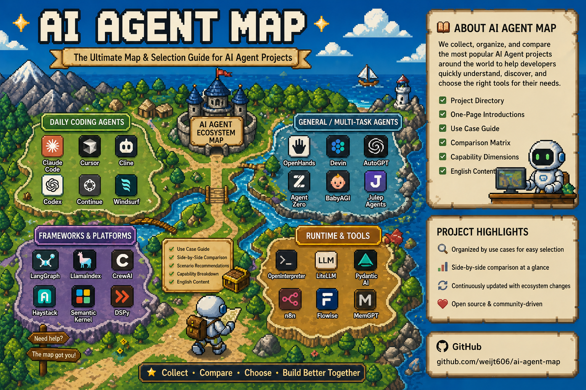
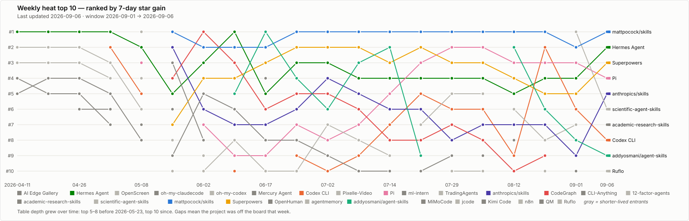
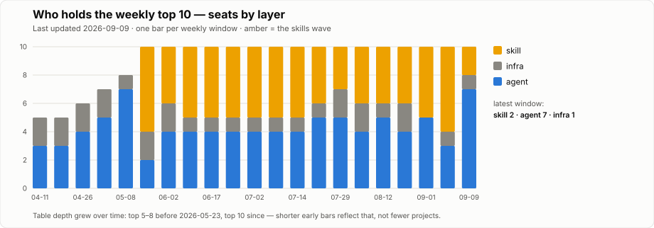
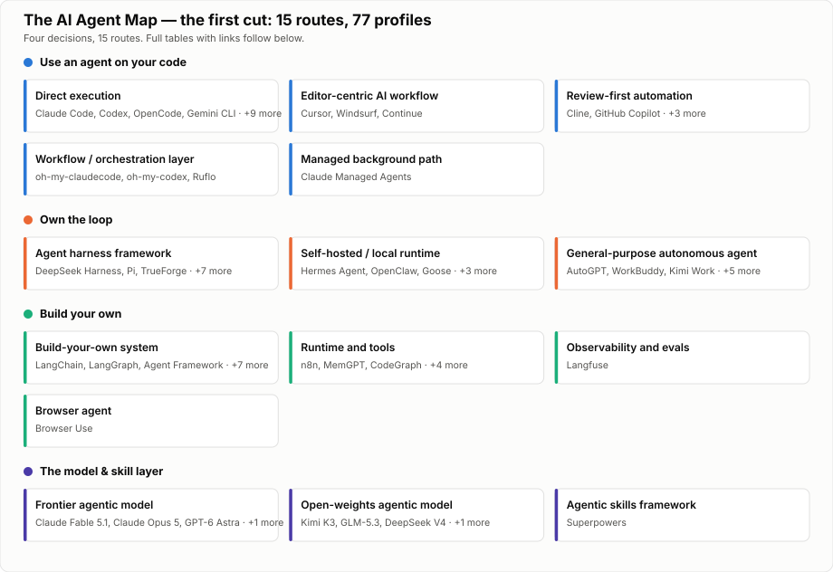

# AI Agent Map

	

AI Agent Map is a practical, visual-first guide for comparing mainstream AI agents, agent platforms, runtimes, and orchestration tools.

The goal is simple: help readers get to a sensible shortlist faster.

## What This Repo Is For

- The agent landscape is crowded.
- Many resources explain ideas, but not fit, anti-fit, or operating cost.
- People usually need a comparison layer, not another pile of links.

This repo stays focused on selection: what a system is good at, where it breaks down, and what kind of operator cost comes with it.

## Where To Start

| If your question is... | Start here |
| --- | --- |
| I need a shortlist first |  |
| I need help choosing for coding automation |  |
| I already have candidates and want a side-by-side view |  |
| I care about dimensions like approval, memory, scheduling, and deployment |  |
| I want every project scored on those dimensions, side by side | [Capability matrix](capabilities/matrix.md) |
| I want to know what it actually costs to run, and which model tier is worth it | [Cost & benchmarks](comparisons/cost-and-benchmarks.md) · [Memory approaches](comparisons/memory-approaches.md) |
| My agents already run — I need to know whether they still work | [Observability & evaluation](comparisons/observability-and-evals.md) |
| I want the stock rankings and the weekly trend chart |  |
| I want problem-first guides or the full comparison list | [Use cases](use-cases/README.md) · [Comparisons](comparisons/README.md) |

## Recent Heat Ranking

Popularity is not fit.

This table tracks projects that showed up as especially hot in the latest weekly GitHub snapshot. The rank follows the 7-day gain. The total star counts below were checked when this repo was updated.

> **Last updated:** 2026-08-05 · **Snapshot window:** 2026-07-29 → 2026-08-05 (gain since last update, 7 days, approximate) · **Star counts:** checked at update time

Project names link to the upstream GitHub repo. When this map has a written profile, it is linked separately in the "Map status" column.

| Rank | Project | Current stars | Snapshot gain | Map status | How to read it |
| --- | --- | --- | --- | --- | --- |
| #1&nbsp;(=) | [mattpocock/skills](https://github.com/mattpocock/skills) | 204.0k | +11,099 | Watchlist (Skills Wave) | A seventh straight window at #1, and the gain ticked *up* — Matt Pocock's curated `.claude/skills` directory blew past **200k** |
| #2&nbsp;(=) | [Pi](https://github.com/earendil-works/pi) | 83.9k | +4,245 | In scope · [profile](agents/pi.md) | Held #2 and cleared 83.9k — the Earendil-owned harness stays the steadiest gainer in the top five |
| #3&nbsp;(=) | [Superpowers](https://github.com/obra/superpowers) | 266.8k | +4,157 | In scope · [profile](agents/superpowers.md) | Held #3 and recovered most of last window's lost gain — cleared 266k as the wave's framework anchor |
| #4&nbsp;(=) | [Hermes Agent](https://github.com/NousResearch/hermes-agent) | 225.7k | +3,852 | In scope · [profile](agents/hermes-agent.md) | A fourth straight window at #4, gain up a quarter — the in-scope absolute leader cleared 225k |
| #5&nbsp;(=) | [jcode](https://github.com/1jehuang/jcode) | 16.0k | +3,160 | In scope · [profile](agents/jcode.md) | Held #5 while adding **a quarter of its own size in a week** (12.8k → 16.0k) — the fastest relative climb on the table |
| #6&nbsp;(=) | [Codex CLI](https://github.com/openai/codex) | 104.1k | +1,914 | In scope · [profile](agents/codex.md) | Held #6 and re-accelerated after the post-100k dip — OpenAI's Codex CLI cleared 104k |
| #7&nbsp;(↑) | [anthropics/skills](https://github.com/anthropics/skills) | 166.4k | +1,549 | Watchlist (Skills Wave canonical) | Up one to #7 — Anthropic's reference `.claude/skills` repo cleared 166k |
| #8&nbsp;(↓) | [colbymchenry/codegraph](https://github.com/colbymchenry/codegraph) | 64.7k | +1,545 | In scope · [profile](agents/codegraph.md) | Down one to #8 on a four-star margin — the pre-indexed code knowledge graph cleared 64k |
| #9&nbsp;(new) | [academic-research-skills](https://github.com/Imbad0202/academic-research-skills) | 41.0k | +1,046 | Watchlist (Skills Wave) | Back on the table after two windows off, clearing 41k — the return that re-broadens the skills wave |
| #10&nbsp;(=) | [n8n](https://github.com/n8n-io/n8n) | 199.4k | +960 | In scope · [profile](agents/n8n.md) | Held the last seat by **20 stars**, and is about to cross 200k — the workflow-automation runtime |

- Heat is useful for discovery, not for selection by itself.
- **The board re-accelerated, and this time the comparison is clean.** Last window's broad cooling came with a caveat — 7 days measured against roughly 8. This window is 7 against 7, and almost every top-10 gain went *up*: [Superpowers](agents/superpowers.md) +4.2k (from +3.4k), [Hermes Agent](agents/hermes-agent.md) +3.9k (from +3.1k), [Codex CLI](agents/codex.md) +1.9k (from +1.5k). The cooling was mostly arithmetic; the demand was not.
- **[mattpocock/skills](https://github.com/mattpocock/skills) cleared 200k** (204.0k, +11,099) — a seventh straight window at #1, with its gain edging *above* last window's. One curated skills directory is still out-gaining everything below #4 on this table combined.
- **The top six did not move at all.** #1 through #6 are identical to last week, which has not happened before on this board. The only churn is a four-star swap at #7/#8 and the bottom of the table.
- **[jcode](agents/jcode.md) is the fastest riser by proportion**: +3,160 to 16.0k, meaning it added roughly a quarter of its entire size in seven days, and its gain grew 47% over last window. Two weeks after promotion from the watchlist, that call looks right.
- **[Grok Build](agents/grok-build.md) posts its first comparable 7-day delta — and misses the table by 20 stars** (+940 to 24.2k). Read that honestly: after 23.2k stars in 15 launch days, a 940-star week is a *hard* deceleration, which is the normal shape once a vendor launch spike passes. The profile stands on its merits, not on its debut.
- **The last seat was a coin-flip again, harder than last week.** [n8n](agents/n8n.md) held #10 with +960, over Grok Build's +940 and [addyosmani/agent-skills](https://github.com/addyosmani/agent-skills)' +938 — three projects inside 22 stars. Last window the margin was 8 stars. Treat #10 as noise; treat the top six as signal.
- **New-inclusion decision: three profiles added.** **[QM](agents/qm.md)** (`yc-software/qm`, TypeScript, MIT) is the window's breakout — Y Combinator's *multiplayer* agent harness reached ~11.4k stars and 1.3k forks in its first seven days. It joins the harness route with a genuinely new angle: the unit is a scope (a person, a channel, a project), each with its own memory, files, keychain, permissions, crons, and durable sandbox, over a core that runs [Pi](agents/pi.md), OpenCode, [Codex](agents/codex.md), or [Claude Code](agents/claude-code.md) interchangeably. Note the governance — contributions are accepted as human-written proposals, not code. **[Omnigent](agents/omnigent.md)** (`omnigent-ai/omnigent`, Python, Apache-2.0, 8.1k) covers the same meta-harness idea for one developer instead of a company, and is self-declared **alpha**. **[Open Code Review](agents/open-code-review.md)** (`alibaba/open-code-review`, Go, Apache-2.0, 19.0k) is a backfill rather than a this-window event — Alibaba open-sourced its two-year internal review assistant in May and the map missed it; it argues that review should be a specialized agent, trading recall for precision. Joining the watchlist: [cobusgreyling/loop-engineering](https://github.com/cobusgreyling/loop-engineering) (9.9k), [Vincentwei1021/video-shotcraft](https://github.com/Vincentwei1021/video-shotcraft) (3.6k) and [Sahir619/fable-method](https://github.com/Sahir619/fable-method) (2.1k).

More window notes: skills-wave share, OpenClaw, and everything growing outside the top 10

- The `.claude/skills` wave **re-broadened to four of the top ten** (`mattpocock/skills`, `Superpowers`, `anthropics/skills`, `academic-research-skills`), ending three straight windows of narrowing (5/10 → 4/10 → 3/10 → 4/10). The consolidation read from last week was premature: what actually happened is rotation at the edge of the table, not a shrinking wave. Policy unchanged: curated collections are tracked as Skills Wave entries, the framework end is covered through [Superpowers](agents/superpowers.md).
- Just off the table: [Grok Build](agents/grok-build.md) 24.2k (+940) and [addyosmani/agent-skills](https://github.com/addyosmani/agent-skills) 81.7k (+938), both within 22 stars of the last seat. [Kimi Code](agents/kimi-code.md) fell off from #9 at 6.1k (+527). [TradingAgents](https://github.com/TauricResearch/TradingAgents) reached 95.7k (+783) and remains out of scope as a finance-research vertical.
- [OpenClaw](agents/openclaw.md) remains the absolute leader at 385.2k stars (+0.8k); it is profiled but stays out of the gain-ranked table because reliable week-over-week deltas for a project this large are noisy.
- **[Langfuse](agents/langfuse.md) enters tracking this window at 32.6k.** It was profiled last week but not yet polled, so it carries no gain figure; its first real delta lands next week. The three projects profiled this window ([QM](agents/qm.md), [Omnigent](agents/omnigent.md), [Open Code Review](agents/open-code-review.md)) are in the same position.
- Continuing to grow but outside the top 10 by gain: [Claude Code](agents/claude-code.md) 140.3k (+0.9k), [TradingAgents](https://github.com/TauricResearch/TradingAgents) 95.7k (+0.8k), [OpenHands](agents/openhands.md) 83.2k (+0.7k), [Ruflo](agents/ruflo.md) 67.1k (+0.7k), [scientific-agent-skills](https://github.com/K-Dense-AI/scientific-agent-skills) 32.7k (+0.7k), [LiteLLM](agents/litellm.md) 55.6k (+0.7k), [LangChain](agents/langchain.md) 143.5k (+0.7k), [agentmemory](https://github.com/rohitg00/agentmemory) 26.6k (+0.6k), [LangGraph](agents/langgraph.md) 38.9k (+0.6k), [Cline](agents/cline.md) 65.7k (+0.5k), [Goose](agents/goose.md) 52.3k (+0.5k), [openhuman](agents/openhuman.md) 36.0k (+0.4k), [CLI-Anything](agents/cli-anything.md) 46.6k (+0.4k), [CrewAI](agents/crewai.md) 56.6k (+0.4k), [CodeWhale](agents/codewhale.md) 40.5k (+0.3k), [MiMoCode](agents/mimocode.md) 12.6k (+0.1k), [CoStrict](agents/costrict.md) 4.3k (+20, flat).

### Ranking Trend

How the weekly top 10 has shifted since tracking began — each line is one project, breaks mean it fell off the board that week:

  

And the same windows read as seats per layer — the quantitative version of the skills-wave story the bullets tell in prose:

  

Full stock rankings by category — agents, agent infra, skills, and their verticals, sorted by total stars — live in [rankings/](rankings/README.md).

## Beyond The Rank

Popularity tells you what to look at. These four pages tell you what to pick:

- **[Capability matrix](capabilities/matrix.md)** — every project scored side by side (●/◐/○/—) across the nine shared [capability dimensions](capabilities/README.md), grouped by route. The answer to "for this capability, who treats it as a core strength."
- **[Cost & benchmarks](comparisons/cost-and-benchmarks.md)** — frontier-model capability vs per-token price, plus how each coding agent actually bills. Since the model layer went tiered and metered, "which tier for this task" is the selection decision.
- **[Memory approaches](comparisons/memory-approaches.md)** — six different things projects mean by "has memory," from self-editing stores to passive semantic recall, and which to pick for what you need to persist.
- **[Observability & evaluation](comparisons/observability-and-evals.md)** — the layer under everything above: once an agent runs unattended, failure stops looking like a crash and starts looking like silent quality drift. Compares [Langfuse](agents/langfuse.md), Opik, Phoenix, Helicone, LangSmith and others — and untangles the four different things "open source" means in that field.

## Market Pulse

The three structural stories shaping selection right now — full records with dates and sources live in [market-events.md](market-events.md):

- **The `.claude/skills` wave keeps compounding** (May 2026 → ongoing): curated skill collections and skills frameworks have held roughly half of the weekly heat top 10 for two months. For many tasks the skill layer now matters as much as the underlying agent. This map profiles the framework end through [Superpowers](agents/superpowers.md) and tracks collections on the [skill boards](rankings/skill-verticals.md).
- **The model layer became a budget decision**: Anthropic's Mythos-class [Claude Fable 5](agents/claude-fable-5.md) (June 9) sits above Opus 4.8 on metered credits, while OpenAI's GPT-5.6 (July 9) ships in three price tiers — on both sides, "which tier of intelligence for this task" is now part of agent selection. Spring reference point: [GPT-5.5](agents/gpt-5.5.md).
- **Product boundaries are collapsing upward**: OpenAI merged Codex into the ChatGPT app (July 9) — on the OpenAI side, "which coding agent" is turning into "how you use ChatGPT." See [Codex](agents/codex.md).

## The First Cut Of The Map

  

| Route | Representative projects | Typical user |
| --- | --- | --- |
| Direct execution | [Claude Code](agents/claude-code.md), [Aider](agents/aider.md), [Codex](agents/codex.md), [Kimi Code](agents/kimi-code.md), [MiMoCode](agents/mimocode.md), [CodeWhale](agents/codewhale.md), [Grok Build](agents/grok-build.md), [Devin](agents/devin.md), [Jules](agents/jules.md) | Someone who wants to hand a concrete coding task to an agent (see the [terminal coding CLI comparison](comparisons/coding-cli-agents.md)) |
| Agent harness framework | [Pi](agents/pi.md), [jcode](agents/jcode.md), [OpenHands](agents/openhands.md), [SWE-agent](agents/swe-agent.md), [mini-swe-agent](agents/mini-swe-agent.md), [OpenHarness](agents/openharness.md), [QM](agents/qm.md), [Omnigent](agents/omnigent.md) | Someone who wants to own the agent loop, tool surface, and permissions instead of inheriting a vendor's product — QM and Omnigent extend this to running *several* harnesses under one layer (see the [harness comparison](comparisons/agent-harness-frameworks.md)) |
| Frontier agentic model | [Claude Fable 5](agents/claude-fable-5.md), [GPT-5.5](agents/gpt-5.5.md) | Someone choosing which model to wire into their own agent system or evaluating the capability ceiling of Anthropic / OpenAI surfaces |
| Agentic skills framework | [Superpowers](agents/superpowers.md) | Someone who wants a methodology + composable skills layer that plugs into Claude Code, Codex, Cursor, and similar agents |
| Workflow / orchestration layer | [oh-my-claudecode](agents/oh-my-claudecode.md), [oh-my-codex](agents/oh-my-codex.md), [Ruflo](agents/ruflo.md) | Someone who already likes Claude Code or Codex and wants stronger orchestration on top (Ruflo extends this to multi-machine federation and 100+ specialized agents) |
| Editor-centric AI workflow | [Cursor](agents/cursor.md), [Windsurf](agents/windsurf.md), [Continue](agents/continue.md) | Someone who wants the editor itself to stay central |
| Review-first automation | [Cline](agents/cline.md), [GitHub Copilot](agents/github-copilot.md), [Froge Code](agents/froge-code.md), [CoStrict](agents/costrict.md), [Open Code Review](agents/open-code-review.md) | Someone who wants review and human control to stay central (CoStrict adds enterprise strict-workflow + private deployment; Open Code Review is review only, tuned for precision in CI) |
| Managed background path | [Claude Managed Agents](agents/claude-managed-agents.md) | Someone who needs scheduled, cloud, or detached Anthropic workflows |
| General-purpose autonomous agent | [AutoGPT](agents/autogpt.md), [Agent Zero](agents/agent-zero.md), [BabyAGI](agents/babyagi.md), [Julep](agents/julep.md), [GenericAgent](agents/generic-agent.md), [ml-intern](agents/ml-intern.md) | Someone who wants autonomous, general-purpose task execution (or, in ml-intern's case, autonomous ML engineering) |
| Build-your-own system | [LangChain](agents/langchain.md), [LangGraph](agents/langgraph.md), [CrewAI](agents/crewai.md), [LlamaIndex](agents/llamaindex.md), [Haystack](agents/haystack.md), [Semantic Kernel](agents/semantic-kernel.md), [DSPy](agents/dspy.md), [Pydantic AI](agents/pydantic-ai.md) | Teams building their own agent platform instead of buying one |
| Runtime and tools | [n8n](agents/n8n.md), [MemGPT](agents/memgpt.md), [Open Interpreter](agents/open-interpreter.md), [LiteLLM](agents/litellm.md), [Flowise](agents/flowise.md), [CodeGraph](agents/codegraph.md), [CLI-Anything](agents/cli-anything.md) | Teams that need workflow automation, code execution, LLM gateways, agent context infrastructure, agent-driven CLIs, or visual builders |
| Observability and evals | [Langfuse](agents/langfuse.md) | Someone whose agents already run in production and needs to know what they did, what they cost, and whether quality is drifting (see [observability & evaluation](comparisons/observability-and-evals.md)) |
| Self-hosted / local runtime | [AI Edge Gallery](agents/ai-edge-gallery.md), [Goose](agents/goose.md), [Hermes Agent](agents/hermes-agent.md), [OpenClaw](agents/openclaw.md), [Mercury Agent](agents/mercury-agent.md), [OpenHuman](agents/openhuman.md) | Users who need on-device privacy, long-running agents, local control, channels, devices, or personal-data life integration |

## Current Mainstream Coverage

60 profiled projects, grouped by what they are. Expand a group, or browse the full route/coverage tables in [agents/](agents/README.md).

<strong>Coding agents, editors, and orchestration</strong> (27 projects)

| Project | Route | One-line positioning |
| --- | --- | --- |
| [Aider](agents/aider.md) | Direct execution | Terminal-first AI pair programmer close to git |
| [Claude Code](agents/claude-code.md) | Direct execution | Local and IDE-first coding agent |
| [Claude Managed Agents](agents/claude-managed-agents.md) | Managed background path | Anthropic managed / cloud execution mapping |
| [Codex](agents/codex.md) | Direct execution | Coding agent inside the ChatGPT app, with async cloud delegation |
| [oh-my-claudecode](agents/oh-my-claudecode.md) | Workflow layer | Teams-first orchestration layer on top of Claude Code |
| [oh-my-codex](agents/oh-my-codex.md) | Workflow layer | Stronger workflow, teams, and persistent state around Codex CLI |
| [Cursor](agents/cursor.md) | Editor-centric platform | AI editor spanning local coding, cloud agents, and integrations |
| [GitHub Copilot](agents/github-copilot.md) | Platform | Multi-surface agent platform across VS Code and GitHub |
| [Cline](agents/cline.md) | Review-first execution | Approval-first editor-native coding agent |
| [Windsurf](agents/windsurf.md) | AI-native IDE | Cascade-centered AI IDE |
| [OpenHands](agents/openhands.md) | Open-source execution | Open-source software engineering agent |
| [Devin](agents/devin.md) | Managed execution | End-to-end managed software engineering execution |
| [Jules](agents/jules.md) | Managed cloud execution | GitHub-connected coding delegation with PR handoff |
| [Continue](agents/continue.md) | Editor-centric | Open-source IDE extension with full model freedom |
| [Froge Code](agents/froge-code.md) | Review-first automation | Provisionally mapped to Automagik Genie |
| [Pi](agents/pi.md) | Direct execution | Minimal terminal coding-agent harness with multi-provider LLM support |
| [jcode](agents/jcode.md) | Agent harness framework | Rust multi-session coding harness — fastest boot, provider-neutral OAuth, passive semantic memory |
| [CodeWhale](agents/codewhale.md) | Direct execution | DeepSeek + MiMo terminal coding agent (formerly DeepSeek-TUI) |
| [Kimi Code](agents/kimi-code.md) | Direct execution | Moonshot AI's official Kimi-native terminal coding CLI (successor to kimi-cli) |
| [MiMoCode](agents/mimocode.md) | Direct execution | Xiaomi's official MiMo terminal coding agent with built-in cross-session memory |
| [Grok Build](agents/grok-build.md) | Direct execution | SpaceXAI's official Rust terminal coding agent — full-screen TUI, headless CI mode, ACP editor server |
| [CoStrict](agents/costrict.md) | Review-first automation | Enterprise Cline-lineage coding agent with strict standardized workflow, AI code review, and private deployment |
| [SWE-agent](agents/swe-agent.md) | Agent harness framework | Princeton + Stanford's original SWE-bench harness with single-YAML configuration |
| [mini-swe-agent](agents/mini-swe-agent.md) | Agent harness framework | The ~100-line Python successor to SWE-agent that still scores >74% on SWE-bench Verified |
| [OpenHarness](agents/openharness.md) | Agent harness framework | HKUDS's 10-subsystem open agent harness with 43+ tools, anthropics/skills, and MCP |
| [Omnigent](agents/omnigent.md) | Agent harness framework | Meta-harness that mixes Claude Code, Codex, Cursor, OpenCode, Hermes, and Pi in one session, with policies and cloud sandboxes |
| [Open Code Review](agents/open-code-review.md) | Review-first automation | Alibaba's precision-first code-review CLI — deterministic pipeline around the model, plus CI and agent-plugin surfaces |

<strong>Autonomous and self-hosted agents</strong> (14 projects)

| Project | Route | One-line positioning |
| --- | --- | --- |
| [AI Edge Gallery](agents/ai-edge-gallery.md) | On-device local runtime | Mobile-first local assistant sandbox with agent skills |
| [Goose](agents/goose.md) | Open-source local platform | Extensible local agent across desktop, CLI, and API |
| [Hermes Agent](agents/hermes-agent.md) | Multi-agent / self-hosted | Long-lived self-hosted environment with memory and skills |
| [OpenClaw](agents/openclaw.md) | Runtime | Local-first multi-channel runtime layer |
| [AutoGPT](agents/autogpt.md) | Autonomous agent platform | Visual agent builder with workflows, marketplace, and multi-model support |
| [Agent Zero](agents/agent-zero.md) | Autonomous agent | Self-building autonomous agent with dynamic tool creation |
| [BabyAGI](agents/babyagi.md) | Experimental | Pioneering autonomous agent experiment — educational, not production |
| [Open Interpreter](agents/open-interpreter.md) | Runtime | Natural language to local code execution, no sandbox |
| [Mercury Agent](agents/mercury-agent.md) | Self-hosted multi-channel | Permission-hardened agent for CLI and Telegram with token budgets |
| [ml-intern](agents/ml-intern.md) | Domain-specific autonomous agent | Hugging Face's autonomous ML engineer — research, code, and ship ML using HF tooling |
| [GenericAgent](agents/generic-agent.md) | Self-evolving autonomous agent | Small-seed agent that grows a personal skill tree on every task |
| [OpenHuman](agents/openhuman.md) | Self-hosted / local runtime | Desktop life-integration agent with 118+ connectors, local Memory Tree, and Ollama support |
| [Julep](agents/julep.md) | Workflow engine | Temporal-backed durable workflow engine for stateful AI agents |
| [QM](agents/qm.md) | Agent harness framework | Y Combinator's multiplayer agent for Slack and web — per-person and per-room scopes, self-hosted, harness-agnostic |

<strong>Frameworks and infrastructure</strong> (16 projects)

| Project | Route | One-line positioning |
| --- | --- | --- |
| [LangChain](agents/langchain.md) | Platform | High-level framework for building custom agents quickly |
| [LangGraph](agents/langgraph.md) | Platform | Low-level framework for durable stateful workflows |
| [CrewAI](agents/crewai.md) | Multi-agent framework | Role-based agent collaboration with fast prototyping |
| [LlamaIndex](agents/llamaindex.md) | Data-first framework | RAG and agentic applications over documents and data |
| [n8n](agents/n8n.md) | Workflow automation | Visual workflow platform with native AI agent nodes and 400+ integrations |
| [MemGPT](agents/memgpt.md) | Stateful agent platform | Persistent memory agents that learn across sessions (now Letta) |
| [Haystack](agents/haystack.md) | Framework | Production-oriented RAG and agent framework by deepset |
| [Semantic Kernel](agents/semantic-kernel.md) | Framework | Microsoft's AI orchestration SDK for .NET, Python, and Java |
| [DSPy](agents/dspy.md) | Framework | Programmatic prompt optimization — programming, not prompting, LMs |
| [LiteLLM](agents/litellm.md) | Infrastructure | Unified API gateway for 100+ LLM providers |
| [Langfuse](agents/langfuse.md) | Infrastructure | Open-source agent observability, evals, and prompt management (watches agents, does not run them) |
| [Pydantic AI](agents/pydantic-ai.md) | Framework | Type-safe Python agent framework with structured outputs |
| [Flowise](agents/flowise.md) | Visual builder | Drag-and-drop LLM app and agent builder on top of LangChain |
| [Ruflo](agents/ruflo.md) | Workflow / orchestration layer | Multi-agent orchestration platform for Claude with federation across machines, neural memory, and 100+ specialized agents |
| [CodeGraph](agents/codegraph.md) | Runtime and tools | Pre-indexed code knowledge graph + MCP server for Claude Code, Cursor, Codex CLI, opencode, and Hermes Agent |
| [CLI-Anything](agents/cli-anything.md) | Runtime and tools | Auto-generates Click-based CLIs for arbitrary software so agents can drive non-API apps |

<strong>Models and skills</strong> (3 entries)

| Project | Route | One-line positioning |
| --- | --- | --- |
| [Claude Fable 5](agents/claude-fable-5.md) | Frontier agentic model | Anthropic's Mythos-class frontier model — the capability ceiling above Opus for Claude-based agents |
| [GPT-5.5](agents/gpt-5.5.md) | Frontier agentic model | OpenAI's spring 2026 agentic model (succeeded by GPT-5.6 in July) |
| [Superpowers](agents/superpowers.md) | Agentic skills framework | Methodology and composable skills layer that plugs into Claude Code, Codex, Cursor, and other agents |

## Example Reading Paths

If you are still deciding where to begin, use one of these quick routes and then branch out.

| If you sound like this... | Follow this path | What it helps you answer |
| --- | --- | --- |
| I want a day-to-day coding agent and need to choose terminal vs editor | [Aider](agents/aider.md) → [Claude Code](agents/claude-code.md) → [terminal coding CLI comparison](comparisons/coding-cli-agents.md) → [Cursor](agents/cursor.md) → [Cline](agents/cline.md) → [coding automation guide](use-cases/coding-automation.md) | Which vendor CLI fits your model, terminal-first local loop vs editor-led flow vs approval-first control |
| I already like Claude Code or Codex but want stronger orchestration | [Claude Code](agents/claude-code.md) → [oh-my-claudecode](agents/oh-my-claudecode.md) → [Codex](agents/codex.md) → [oh-my-codex](agents/oh-my-codex.md) → [mainstream matrix](comparisons/mainstream-agent-landscape.md) | When the base agent is enough and when a workflow layer actually adds value |
| I want to understand how the 2026 model race changes agent choice | [Claude Fable 5](agents/claude-fable-5.md) → [GPT-5.5](agents/gpt-5.5.md) → [Codex](agents/codex.md) → [Claude Code](agents/claude-code.md) → [market events](market-events.md) | How frontier model tiers (Mythos, GPT-5.6) shift the capability ceiling and what it means for product choice |
| I want a dedicated AI IDE instead of stitching tools together | [Cursor](agents/cursor.md) → [Windsurf](agents/windsurf.md) → [GitHub Copilot](agents/github-copilot.md) → [mainstream matrix](comparisons/mainstream-agent-landscape.md) | Dedicated AI editor vs ecosystem platform |
| I want to hand off tickets and check back later | [Codex](agents/codex.md) → [Jules](agents/jules.md) → [Devin](agents/devin.md) → [Claude Managed Agents](agents/claude-managed-agents.md) → [mainstream matrix](comparisons/mainstream-agent-landscape.md) | Async cloud delegation vs managed background automation |
| I need something open-source or self-hosted | [Aider](agents/aider.md) → [OpenHands](agents/openhands.md) → [Goose](agents/goose.md) → [Hermes Agent](agents/hermes-agent.md) → [capabilities](capabilities/README.md) | Terminal control, open-source execution, and local runtime ownership |
| I am building an internal agent stack, not buying a product | [LangChain](agents/langchain.md) → [LangGraph](agents/langgraph.md) → [capabilities](capabilities/README.md) → [mainstream matrix](comparisons/mainstream-agent-landscape.md) | Framework vs runtime vs product boundaries |

## Disclaimer

Star counts and 7-day gains are point-in-time GitHub snapshots taken when the repo is updated; numbers shift quickly between weekly refreshes and small rounding differences are expected. Project descriptions, vendors, and capability summaries reflect public information at the time of writing and may change as projects evolve, get acquired, or pivot. This map is selection guidance — not endorsement, financial advice, or a production-readiness guarantee. Verify against each project's own docs before committing to a choice.