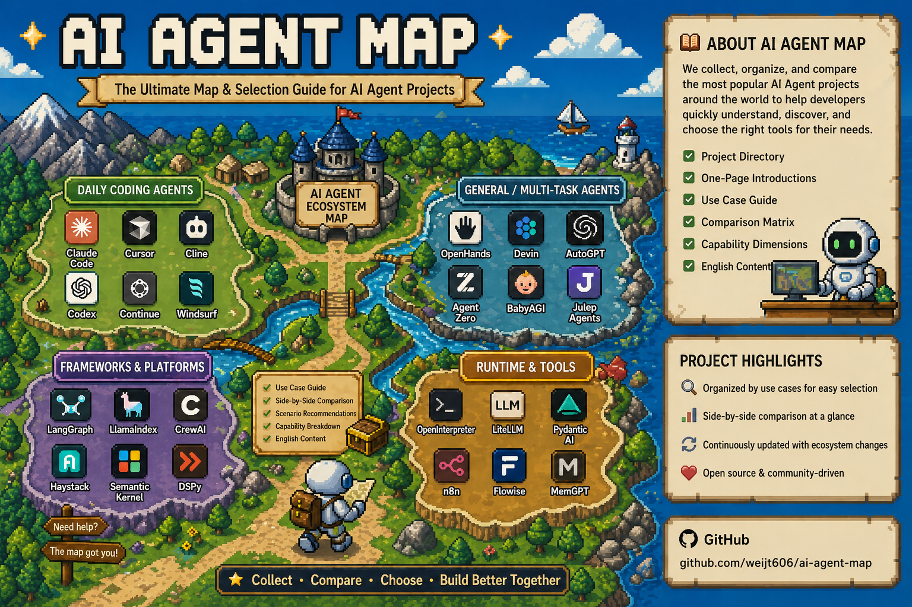
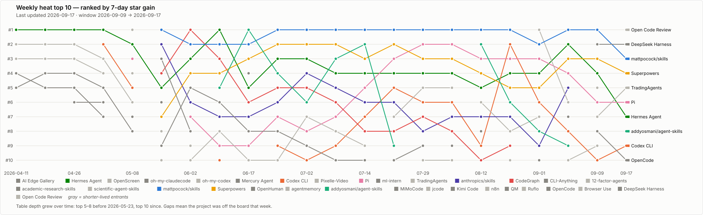
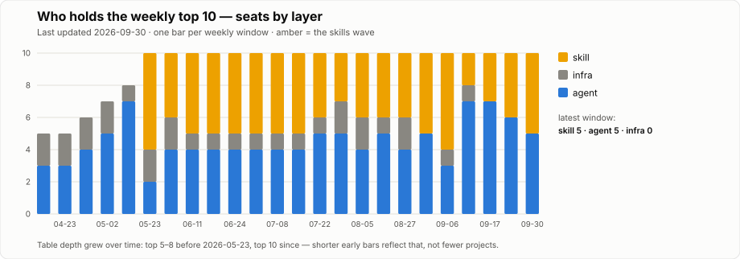
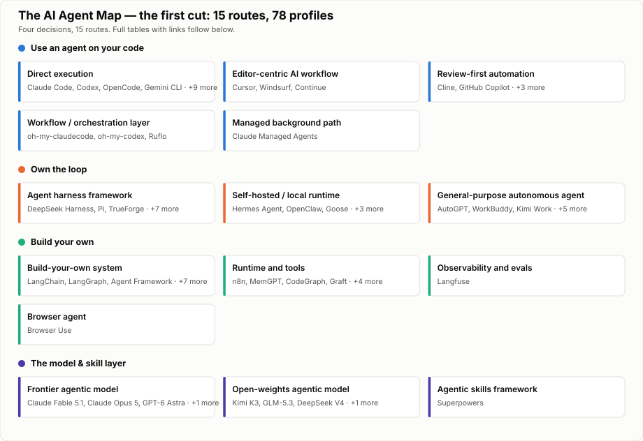

# AI Agent Map

	

AI Agent Map is a practical, visual-first guide for comparing mainstream AI agents, agent platforms, runtimes, and orchestration tools.

The goal is simple: help readers get to a sensible shortlist faster.

## What This Repo Is For

- The agent landscape is crowded.
- Many resources explain ideas, but not fit, anti-fit, or operating cost.
- People usually need a comparison layer, not another pile of links.

This repo stays focused on selection: what a system is good at, where it breaks down, and what kind of operator cost comes with it.

## Where To Start

| If your question is... | Start here |
| --- | --- |
| I need a shortlist first |  |
| I need help choosing for coding automation |  |
| I already have candidates and want a side-by-side view |  |
| I care about dimensions like approval, memory, scheduling, and deployment |  |
| I want every project scored on those dimensions, side by side |  |
| I want to know what it actually costs to run, and which model tier is worth it |   |
| My agents already run — I need to know whether they still work |  |
| I want the stock rankings and the weekly trend chart |  |
| I want problem-first guides or the full comparison list |   |

## Recent Heat Ranking

Popularity is not fit.

This table tracks projects that showed up as especially hot in the latest weekly GitHub snapshot. The rank follows the 7-day gain. The total star counts below were checked when this repo was updated.

> **Last updated:** 2026-09-30 · **Snapshot window:** 2026-09-24 → 2026-09-30 (gain since last update, **6 days** against last window's 7, so the two columns are not directly comparable; every claim below is stated on the **weekly rate**) · **Star counts:** checked at update time

Project names link to the upstream GitHub repo. When this map has a written profile, it is linked separately in the "Map status" column.

| Rank | Project | Current stars | Snapshot gain | Map status | How to read it |
| --- | --- | --- | --- | --- | --- |
| #1&nbsp;(↑) | [DeepSeek Harness](https://github.com/deepseek-ai/deepseek-harness) | 240.0k | +5,633 | In scope · [profile](agents/deepseek-harness.md) | **Its first #1**, in its fourth window on the board after three straight at #2. It did not accelerate into the seat — the rate fell 7% — the seat came to it. Past **235k**, and 2,083 clear of #2 |
| #2&nbsp;(↑) | [mattpocock/skills](https://github.com/mattpocock/skills) | 272.0k | +3,550 | Watchlist (Skills Wave) | Back inside the top two after two windows outside it. Rate down 10%. Past **270k** |
| #3&nbsp;(↓) | [Open Code Review](https://github.com/alibaba/open-code-review) | 42.6k | +2,387 | In scope · [profile](agents/open-code-review.md) | **Rate down 61%** in its third window, ending a two-window run at #1. Still roughly 7x its pre-Trending rate (~370/week), so this is a spike settling onto a higher floor, not a collapse |
| #4&nbsp;(↑) | [Superpowers](https://github.com/obra/superpowers) | 292.9k | +2,265 | In scope · [profile](agents/superpowers.md) | Rate down 8%, up one seat because others fell further |
| #5&nbsp;(↑) | [Hermes Agent](https://github.com/NousResearch/hermes-agent) | 250.1k | +1,652 | In scope · [profile](agents/hermes-agent.md) | Rate down 7%, up three seats. Crossed **250k**, and **present in all 24 recorded windows** — still the only project that has never missed one |
| #6&nbsp;(=) | [Pi](https://github.com/earendil-works/pi) | 110.4k | +1,467 | In scope · [profile](agents/pi.md) | A fourth consecutive window at #6, but the rate fell **30%** to its lowest in the last seven windows. Past **110k** |
| #7&nbsp;(↑) | [anthropics/financial-services](https://github.com/anthropics/financial-services) | 38.2k | +1,297 | Out of scope (finance vertical) | **The spike held a second window.** Rate down 26%, but still ~14x its pre-spike rate of ~105/week, with no commits at all in this window. The cause is still undocumented |
| #8&nbsp;(↑) | [OpenCode](https://github.com/anomalyco/opencode) | 210.9k | +1,243 | In scope · [profile](agents/opencode.md) | Rate down 13% after two flat windows. Past **210k** |
| #9&nbsp;(↓) | [addyosmani/agent-skills](https://github.com/addyosmani/agent-skills) | 99.9k | +1,197 | Watchlist (Skills Wave) | Rate down **54%**, giving back both of its last two accelerations. It sits at **99,909 — 91 stars short of 100k**, so not there yet |
| #10&nbsp;(new) | [anthropics/skills](https://github.com/anthropics/skills) | 179.0k | +1,166 | Watchlist (Skills Wave) | Back after three windows off the board, on a rate up 29% — one of only 13 tracked repos to accelerate this window |

- Heat is useful for discovery, not for selection by itself.
- **This window is 6 days against last window's 7.** The raw gains in the two columns are not directly comparable, so every claim here is on the **weekly rate** (this window: gain ÷ 6 × 7; last window: the gain as printed).
- **The board cooled again, harder: 13 of 55 tracked repos accelerated, 42 slowed** (last window 19 and 36). Nothing on the top ten sped up except anthropics/skills. The reshuffle at the top is the result of one project falling faster than its neighbours, not of anything new arriving.
- **[DeepSeek Harness](agents/deepseek-harness.md) takes #1 for the first time**, on its fourth measured window after three consecutive at #2. It gave back 7% of its rate to get there. The honest read is that it is the steadiest large grower on the board — ~6,600–8,800 a week for four straight windows — and the project above it cooled first.
- **[Open Code Review](agents/open-code-review.md) settles.** Its rate fell 61% and it dropped to #3. Last window this board called its two-window hold a confirmed trend; the third window does not reverse that — it is still ~7x its pre-Trending baseline — but it does show where the trend levels off. Read it as a new floor, not a new leader.
- **Last window's two open questions got opposite answers.** [anthropics/financial-services](https://github.com/anthropics/financial-services) held: 1,297 in 6 days, ~14x its old ~105/week baseline, with no commits in the window and still no documented cause. [Claude Code](agents/claude-code.md) did not: its rate fell **57%** to ~910/week and it dropped to 15th, back in the 610–1,030 range it held for the four windows before Opus 5.5. Its first top-ten seat was the Opus 5.5 release, not a new baseline — and **[Sonnet 5.5](market-events.md#september-2829-2026--sonnet-55-and-gpt-61-sol-become-the-defaults-in-one-week) becoming its default Sonnet model on September 28 did not repeat the effect.**
- **[CLI-Anything](agents/cli-anything.md) tripled its rate** (~410 → ~1,265/week) and crossed **50k**, finishing 11th. One window, no documented cause checked yet — under this board's rule that is a spike until the next window says otherwise.
- The skills wave rose to **5 of 10** — the third consecutive window it has gained a seat (2 → 3 → 4 → 5), and the most since the 6 of 2026-09-06. The composition is what changed: [mattpocock](https://github.com/mattpocock/skills) and [Superpowers](agents/superpowers.md) as before, [addyosmani](https://github.com/addyosmani/agent-skills) holding on through a 54% drop, and **two `anthropics/*` collections**, one vendor-general and one vertical.
- **Two more coding agents changed their default model inside a patch release this week.** [Codex CLI](agents/codex.md) `rust-v0.159.1` (Sept 29) made **GPT-6.1 Sol** the bundled default, replacing the [GPT-6 Astra](agents/gpt-6-astra.md) default it set on September 4; [Claude Code](agents/claude-code.md) `2.1.284` made **Sonnet 5.5** its default Sonnet model. That is four such changes this map has recorded in September. See [market-events](market-events.md).
- **A correction found by this window's scan: [ZCode](agents/zcode.md) is now open source.** Zhipu published the client, backend and agent CLI as `zai-org/ZCode` under **Apache-2.0** on September 20 (7.2k stars by this refresh). The profile had said "the client is proprietary"; it is corrected in place with a dated note, and the repo enters tracking next refresh.
- Milestones, checked against the raw counts rather than the rounded column: DeepSeek Harness crossed **235k**, mattpocock/skills **270k**, Hermes Agent **250k**, OpenCode **210k**, Pi **110k**, CLI-Anything **50k**, and [Langfuse](agents/langfuse.md) **35k**. addyosmani/agent-skills did **not** reach 100k (99,909).
- [OpenClaw](agents/openclaw.md) remains the absolute leader at 390.8k stars (+450, rate up 26%); it is profiled but stays out of the gain-ranked table because reliable week-over-week deltas for a project this large are noisy.

More window notes: skills-wave share, OpenClaw, and everything growing outside the top 10

- The `.claude/skills` wave **holds five of the top ten**, up from four: #2, #4, #7, #9 and #10. [mattpocock/skills](https://github.com/mattpocock/skills) at +3,550 is still short of the other general collections combined (+2,265 Superpowers, +1,197 addyosmani, +1,166 anthropics/skills = 4,628), the third window running that the old "one directory is the wave" read has not held. Policy unchanged: curated collections are tracked as Skills Wave entries, the framework end is covered through [Superpowers](agents/superpowers.md).
- Just off the table: [CLI-Anything](agents/cli-anything.md) 51.0k (+1,084) at 11th on a tripled rate, [Codex CLI](agents/codex.md) 127.2k (+1,009) at 12th, [TradingAgents](https://github.com/TauricResearch/TradingAgents) 109.3k (+937) at 13th, [scientific-agent-skills](https://github.com/K-Dense-AI/scientific-agent-skills) 47.1k (+790) at 14th, and [Claude Code](agents/claude-code.md) 148.6k (+781) at 15th. OpenClaw is excluded from the board, so these off-board positions are counted the same way.
- **The research collections kept cooling.** [K-Dense](https://github.com/K-Dense-AI/scientific-agent-skills) (−11%, 47.1k) has now slowed for a **fifth consecutive window** since its 09-01 peak, and [academic-research-skills](https://github.com/Imbad0202/academic-research-skills) (−20%, 49.9k) for a **fourth** since its own 09-06 peak. Both are now running at roughly a tenth and under a third of their peaks.
- **[eve](agents/eve.md) and [TrueForge](agents/trueforge.md) swapped places.** eve went from ~18 to ~85/week (+73 to 5.4k) after nearly stopping last window; TrueForge fell 59% to ~90/week (+78, 6.0k). At these sizes a swing of a few dozen stars is noise in both directions.
- **[Graft](agents/graft.md) entered tracking this refresh** at **9,409** stars (9.1k when profiled a week ago). Its first measured gain lands next window. The next pending pickup is `zai-org/ZCode` (see the correction above).
- Continuing to grow but outside the top 10 by gain (raw 6-day figures): [CLI-Anything](agents/cli-anything.md) 51.0k (+1,084), [Codex CLI](agents/codex.md) 127.2k (+1,009), [TradingAgents](https://github.com/TauricResearch/TradingAgents) 109.3k (+937), [scientific-agent-skills](https://github.com/K-Dense-AI/scientific-agent-skills) 47.1k (+790), [Claude Code](agents/claude-code.md) 148.6k (+781), [Browser Use](agents/browser-use.md) 116.7k (+656), [academic-research-skills](https://github.com/Imbad0202/academic-research-skills) 49.9k (+604), [OpenHands](agents/openhands.md) 89.5k (+543), [n8n](agents/n8n.md) 206.3k (+497), [CodeGraph](agents/codegraph.md) 72.4k (+440), [Cline](agents/cline.md) 69.6k (+392), [LiteLLM](agents/litellm.md) 59.9k (+377), [Ruflo](agents/ruflo.md) 73.5k (+361), [LangChain](agents/langchain.md) 147.3k (+334), [LangGraph](agents/langgraph.md) 42.5k (+280), [agentmemory](https://github.com/rohitg00/agentmemory) 29.0k (+249), [CrewAI](agents/crewai.md) 59.2k (+235), [Langfuse](agents/langfuse.md) 35.2k (+227), [Goose](agents/goose.md) 54.8k (+185), [mini-swe-agent](agents/mini-swe-agent.md) 8.1k (+170), [Omnigent](agents/omnigent.md) 10.3k (+159), [jcode](agents/jcode.md) 20.2k (+156), [Aider](agents/aider.md) 49.3k (+144), [Qwen Code](agents/qwen-code.md) 28.2k (+123), [MiMoCode](agents/mimocode.md) 13.6k (+116), [Letta (MemGPT)](agents/memgpt.md) 25.0k (+111), [Microsoft Agent Framework](agents/microsoft-agent-framework.md) 13.9k (+105), [AutoGPT](agents/autogpt.md) 187.6k (+102), [Grok Build](agents/grok-build.md) 27.2k (+101), [Kimi Code](agents/kimi-code.md) 7.7k (+100), [12-factor-agents](https://github.com/humanlayer/12-factor-agents) 26.5k (+97), [OpenHuman](agents/openhuman.md) 40.2k (+96), [TrueForge](agents/trueforge.md) 6.0k (+78), [eve](agents/eve.md) 5.4k (+73), [QM](agents/qm.md) 15.3k (+64), [Continue](agents/continue.md) 36.1k (+60), [Open Interpreter](agents/open-interpreter.md) 68.5k (+60), [LlamaIndex](agents/llamaindex.md) 52.4k (+59), [SWE-agent](agents/swe-agent.md) 20.4k (+57), [Gemini CLI](agents/gemini-cli.md) 107.2k (+56), [OpenHarness](agents/openharness.md) 15.9k (+41), [Flowise](agents/flowise.md) 55.5k (+16), [CodeWhale](agents/codewhale.md) 41.0k (+9), [CoStrict](agents/costrict.md) 4.4k (+1)

### Ranking Trend

How the weekly top 10 has shifted since tracking began — each line is one project, breaks mean it fell off the board that week:

  

And the same windows read as seats per layer — the quantitative version of the skills-wave story the bullets tell in prose:

  

Full stock rankings by category — agents, agent infra, skills, and their verticals, sorted by total stars — live in [rankings/](rankings/README.md).

## Beyond The Rank

Popularity tells you what to look at. These four pages tell you what to pick:

- **[Capability matrix](capabilities/matrix.md)** — every project scored side by side (●/◐/○/—) across the nine shared [capability dimensions](capabilities/README.md), grouped by route. The answer to "for this capability, who treats it as a core strength."
- **[Cost & benchmarks](comparisons/cost-and-benchmarks.md)** — frontier-model capability vs per-token price, plus how each coding agent actually bills. Since the model layer went tiered and metered, "which tier for this task" is the selection decision.
- **[Memory approaches](comparisons/memory-approaches.md)** — seven different things projects mean by "has memory," from self-editing stores to passive semantic recall, and which to pick for what you need to persist.
- **[Observability & evaluation](comparisons/observability-and-evals.md)** — the layer under everything above: once an agent runs unattended, failure stops looking like a crash and starts looking like silent quality drift. Compares [Langfuse](agents/langfuse.md), Opik, Phoenix, Helicone, LangSmith and others — and untangles the four different things "open source" means in that field.

## Market Pulse

The three structural stories shaping selection right now — full records with dates and sources live in [market-events.md](market-events.md):

- **The `.claude/skills` wave is back to half the board, and it is no longer one directory** (May 2026 → ongoing): curated skill collections and skills frameworks have held roughly half of the weekly heat top 10 for four months, and the count rotates rather than sitting still — 6/10, then 2/10, 3/10, 4/10, now **5 of 10** (2026-09-30), the third straight window it gained a seat. What changed is the split inside the wave. Through August [mattpocock/skills](https://github.com/mattpocock/skills) out-gained the other general collections combined; for three windows now it has not (+3,550 against +4,628 this window), and **two of the five seats belong to `anthropics/*` vendor collections** — [anthropics/skills](https://github.com/anthropics/skills) and [anthropics/financial-services](https://github.com/anthropics/financial-services). Read the key-person risk as easing, not as resolved. This map profiles the framework end through [Superpowers](agents/superpowers.md) and tracks collections on the [skill boards](rankings/skill-verticals.md).
- **The model layer became a budget decision — and in September both vendors moved their coding agents down the ladder**: [Claude Fable 5.1](agents/claude-fable-5.md) (Sept 1) and [GPT-6 Astra](agents/gpt-6-astra.md) (Sept 3) still both list at **$10 / $50**, but on September 22 Anthropic shipped **Claude Opus 5.5** at **$4 / $20** and OpenAI **GPT-6 Sol** at **$2 / $10** and **GPT-6 Luna** at **$0.10 / $0.50**. A week later both mid tiers turned over again: **Claude Sonnet 5.5** (Sept 28) and **GPT-6.1 Sol** (Sept 29), both at **$2 / $10**, and each became its vendor's coding-agent default — [Claude Code](agents/claude-code.md) `2.1.284` and [Codex CLI](agents/codex.md) `rust-v0.159.1`. That is four default-model changes inside a patch release in one month. With the mid-tier stickers identical, **cache read is the column that separates them again** — $0.10/M for GPT-6.1 Sol against $0.20/M for Sonnet 5.5, one week after the two vendors had converged on $0.20 — along with long-context shape (OpenAI reprices the whole request past 272k input tokens; Anthropic does not). See [cost & benchmarks](comparisons/cost-and-benchmarks.md).
- **Product boundaries are collapsing upward**: OpenAI merged Codex into the ChatGPT app (July 9), and at DevDay (Sept 29) moved it further off the laptop with reusable cloud environments usable from any device — on the OpenAI side, "which coding agent" keeps turning into "how you use ChatGPT." The bundled default model changed twice in a month: [GPT-6 Astra](agents/gpt-6-astra.md) from `rust-v0.153.4` (Sept 4), then **GPT-6.1 Sol** from `rust-v0.159.1` (Sept 29). If you run Codex on defaults, pin the model id; the product will not hold it still for you. See [Codex](agents/codex.md).

## The First Cut Of The Map

  

| Route | Representative projects | Typical user |
| --- | --- | --- |
| Direct execution | [Claude Code](agents/claude-code.md), [Aider](agents/aider.md), [Codex](agents/codex.md), [Kimi Code](agents/kimi-code.md), [MiMoCode](agents/mimocode.md), [CodeWhale](agents/codewhale.md), [ZCode](agents/zcode.md), [OpenCode](agents/opencode.md), [Gemini CLI](agents/gemini-cli.md), [Qwen Code](agents/qwen-code.md), [Grok Build](agents/grok-build.md), [Devin](agents/devin.md), [Jules](agents/jules.md) | Someone who wants to hand a concrete coding task to an agent (see the [terminal coding CLI comparison](comparisons/coding-cli-agents.md)) |
| Agent harness framework | [DeepSeek Harness](agents/deepseek-harness.md), [Pi](agents/pi.md), [jcode](agents/jcode.md), [OpenHands](agents/openhands.md), [SWE-agent](agents/swe-agent.md), [mini-swe-agent](agents/mini-swe-agent.md), [OpenHarness](agents/openharness.md), [QM](agents/qm.md), [Omnigent](agents/omnigent.md), [TrueForge](agents/trueforge.md) | Someone who wants to own the agent loop, tool surface, and permissions instead of inheriting a vendor's product — QM and Omnigent extend this to running *several* harnesses under one layer (see the [harness comparison](comparisons/agent-harness-frameworks.md)) |
| Frontier agentic model | [Claude Fable 5.1](agents/claude-fable-5.md), [Claude Opus 5](agents/claude-opus-5.md), [GPT-6 Astra](agents/gpt-6-astra.md), [GPT-5.5](agents/gpt-5.5.md) | Someone choosing which model to wire into their own agent system or evaluating the capability ceiling of Anthropic / OpenAI surfaces — the ceilings (Fable 5.1, Astra) and the default you actually run (Opus 5) are separate decisions |
| Open-weights agentic model | [Kimi K3](agents/kimi-k3.md), [GLM-5.3](agents/glm-5.md), [DeepSeek V4](agents/deepseek-v4.md), [Qwen3-Coder](agents/qwen3-coder.md) | Someone who wants frontier-class capability on weights they host and licence themselves — a different decision from picking between the closed ceilings |
| Agentic skills framework | [Superpowers](agents/superpowers.md) | Someone who wants a methodology + composable skills layer that plugs into Claude Code, Codex, Cursor, and similar agents |
| Workflow / orchestration layer | [oh-my-claudecode](agents/oh-my-claudecode.md), [oh-my-codex](agents/oh-my-codex.md), [Ruflo](agents/ruflo.md) | Someone who already likes Claude Code or Codex and wants stronger orchestration on top (Ruflo extends this to multi-machine federation and 100+ specialized agents) |
| Editor-centric AI workflow | [Cursor](agents/cursor.md), [Windsurf](agents/windsurf.md), [Continue](agents/continue.md) | Someone who wants the editor itself to stay central |
| Review-first automation | [Cline](agents/cline.md), [GitHub Copilot](agents/github-copilot.md), [Froge Code](agents/froge-code.md), [CoStrict](agents/costrict.md), [Open Code Review](agents/open-code-review.md) | Someone who wants review and human control to stay central (CoStrict adds enterprise strict-workflow + private deployment; Open Code Review is review only, tuned for precision in CI) |
| Managed background path | [Claude Managed Agents](agents/claude-managed-agents.md) | Someone who needs scheduled, cloud, or detached Anthropic workflows |
| General-purpose autonomous agent | [AutoGPT](agents/autogpt.md), [Agent Zero](agents/agent-zero.md), [BabyAGI](agents/babyagi.md), [Julep](agents/julep.md), [GenericAgent](agents/generic-agent.md), [ml-intern](agents/ml-intern.md), [WorkBuddy](agents/workbuddy.md), [Kimi Work](agents/kimi-work.md) | Someone who wants autonomous, general-purpose task execution — ml-intern is the ML-specialized variant, while WorkBuddy and Kimi Work aim the same loop at desktop knowledge work rather than repositories |
| Build-your-own system | [LangChain](agents/langchain.md), [LangGraph](agents/langgraph.md), [CrewAI](agents/crewai.md), [LlamaIndex](agents/llamaindex.md), [Haystack](agents/haystack.md), [Semantic Kernel](agents/semantic-kernel.md), [DSPy](agents/dspy.md), [Pydantic AI](agents/pydantic-ai.md), [Microsoft Agent Framework](agents/microsoft-agent-framework.md) | Teams building their own agent platform instead of buying one |
| Runtime and tools | [n8n](agents/n8n.md), [MemGPT](agents/memgpt.md), [Open Interpreter](agents/open-interpreter.md), [LiteLLM](agents/litellm.md), [Flowise](agents/flowise.md), [CodeGraph](agents/codegraph.md), [Graft](agents/graft.md), [CLI-Anything](agents/cli-anything.md) | Teams that need workflow automation, code execution, LLM gateways, agent context infrastructure, agent-driven CLIs, or visual builders |
| Observability and evals | [Langfuse](agents/langfuse.md) | Someone whose agents already run in production and needs to know what they did, what they cost, and whether quality is drifting (see [observability & evaluation](comparisons/observability-and-evals.md)) |
| Browser agent | [Browser Use](agents/browser-use.md) | Someone whose task lives on a website with no API — a different question from how an agent edits files, because it decides what an agent may do as you on the open web |
| Self-hosted / local runtime | [AI Edge Gallery](agents/ai-edge-gallery.md), [Goose](agents/goose.md), [Hermes Agent](agents/hermes-agent.md), [OpenClaw](agents/openclaw.md), [Mercury Agent](agents/mercury-agent.md), [OpenHuman](agents/openhuman.md) | Users who need on-device privacy, long-running agents, local control, channels, devices, or personal-data life integration |

## Current Mainstream Coverage

78 profiled projects, grouped by what they are. Expand a group, or browse the full route/coverage tables in [agents/](agents/README.md).

<strong>Coding agents, editors, and orchestration</strong> (32 projects)

| Project | Route | One-line positioning |
| --- | --- | --- |
| [Aider](agents/aider.md) | Direct execution | Terminal-first AI pair programmer close to git |
| [Claude Code](agents/claude-code.md) | Direct execution | Local and IDE-first coding agent |
| [Claude Managed Agents](agents/claude-managed-agents.md) | Managed background path | Anthropic managed / cloud execution mapping |
| [Codex](agents/codex.md) | Direct execution | Coding agent inside the ChatGPT app, with async cloud delegation |
| [oh-my-claudecode](agents/oh-my-claudecode.md) | Workflow layer | Teams-first orchestration layer on top of Claude Code |
| [oh-my-codex](agents/oh-my-codex.md) | Workflow layer | Stronger workflow, teams, and persistent state around Codex CLI |
| [Cursor](agents/cursor.md) | Editor-centric platform | AI editor spanning local coding, cloud agents, and integrations |
| [GitHub Copilot](agents/github-copilot.md) | Platform | Multi-surface agent platform across VS Code and GitHub |
| [Cline](agents/cline.md) | Review-first execution | Approval-first editor-native coding agent |
| [Windsurf](agents/windsurf.md) | AI-native IDE | Cascade-centered AI IDE |
| [OpenHands](agents/openhands.md) | Open-source execution | Open-source software engineering agent |
| [Devin](agents/devin.md) | Managed execution | End-to-end managed software engineering execution |
| [Jules](agents/jules.md) | Managed cloud execution | GitHub-connected coding delegation with PR handoff |
| [Continue](agents/continue.md) | Editor-centric | Open-source IDE extension with full model freedom |
| [Froge Code](agents/froge-code.md) | Review-first automation | Provisionally mapped to Automagik Genie |
| [Pi](agents/pi.md) | Direct execution | Minimal terminal coding-agent harness with multi-provider LLM support |
| [jcode](agents/jcode.md) | Agent harness framework | Rust multi-session coding harness — fastest boot, provider-neutral OAuth, passive semantic memory |
| [CodeWhale](agents/codewhale.md) | Direct execution | DeepSeek + MiMo terminal coding agent (formerly DeepSeek-TUI) |
| [Kimi Code](agents/kimi-code.md) | Direct execution | Moonshot AI's official Kimi-native terminal coding CLI (successor to kimi-cli) |
| [MiMoCode](agents/mimocode.md) | Direct execution | Xiaomi's official MiMo terminal coding agent with built-in cross-session memory |
| [Grok Build](agents/grok-build.md) | Direct execution | SpaceXAI's official Rust terminal coding agent — full-screen TUI, headless CI mode, ACP editor server |
| [CoStrict](agents/costrict.md) | Review-first automation | Enterprise Cline-lineage coding agent with strict standardized workflow, AI code review, and private deployment |
| [SWE-agent](agents/swe-agent.md) | Agent harness framework | Princeton + Stanford's original SWE-bench harness with single-YAML configuration |
| [mini-swe-agent](agents/mini-swe-agent.md) | Agent harness framework | The ~100-line Python successor to SWE-agent that still scores >74% on SWE-bench Verified |
| [OpenHarness](agents/openharness.md) | Agent harness framework | HKUDS's 10-subsystem open agent harness with 43+ tools, anthropics/skills, and MCP |
| [Omnigent](agents/omnigent.md) | Agent harness framework | Meta-harness that mixes Claude Code, Codex, Cursor, OpenCode, Hermes, and Pi in one session, with policies and cloud sandboxes |
| [OpenCode](agents/opencode.md) | Direct execution | The largest vendor-neutral open-source coding agent — 205k stars, MIT |
| [Gemini CLI](agents/gemini-cli.md) | Direct execution | Google's terminal agent; 1,000 free requests a day and Search grounding built in |
| [Qwen Code](agents/qwen-code.md) | Direct execution | Open client and open weights, switchable across OpenAI/Anthropic/Gemini/local at runtime |
| [DeepSeek Harness](agents/deepseek-harness.md) | Agent harness framework | Everything-is-a-plugin harness — even the agent loop is swappable from config |
| [ZCode](agents/zcode.md) | Direct execution | Zhipu's desktop agentic dev environment: long-horizon "Goal" tasks, steerable from WeChat/Feishu/Telegram |
| [Open Code Review](agents/open-code-review.md) | Review-first automation | Alibaba's precision-first code-review CLI — deterministic pipeline around the model, plus CI and agent-plugin surfaces |

<strong>Autonomous and self-hosted agents</strong> (17 projects)

| Project | Route | One-line positioning |
| --- | --- | --- |
| [AI Edge Gallery](agents/ai-edge-gallery.md) | On-device local runtime | Mobile-first local assistant sandbox with agent skills |
| [Goose](agents/goose.md) | Open-source local platform | Extensible local agent across desktop, CLI, and API |
| [Hermes Agent](agents/hermes-agent.md) | Multi-agent / self-hosted | Long-lived self-hosted environment with memory and skills |
| [OpenClaw](agents/openclaw.md) | Runtime | Local-first multi-channel runtime layer |
| [AutoGPT](agents/autogpt.md) | Autonomous agent platform | Visual agent builder with workflows, marketplace, and multi-model support |
| [Agent Zero](agents/agent-zero.md) | Autonomous agent | Self-building autonomous agent with dynamic tool creation |
| [BabyAGI](agents/babyagi.md) | Experimental | Pioneering autonomous agent experiment — educational, not production |
| [Open Interpreter](agents/open-interpreter.md) | Runtime | Natural language to local code execution, no sandbox |
| [Mercury Agent](agents/mercury-agent.md) | Self-hosted multi-channel | Permission-hardened agent for CLI and Telegram with token budgets |
| [ml-intern](agents/ml-intern.md) | Domain-specific autonomous agent | Hugging Face's autonomous ML engineer — research, code, and ship ML using HF tooling |
| [GenericAgent](agents/generic-agent.md) | Self-evolving autonomous agent | Small-seed agent that grows a personal skill tree on every task |
| [OpenHuman](agents/openhuman.md) | Self-hosted / local runtime | Desktop life-integration agent with 118+ connectors, local Memory Tree, and Ollama support |
| [Julep](agents/julep.md) | Workflow engine | Temporal-backed durable workflow engine for stateful AI agents |
| [QM](agents/qm.md) | Agent harness framework | Y Combinator's multiplayer agent for Slack and web — per-person and per-room scopes, self-hosted, harness-agnostic |
| [WorkBuddy](agents/workbuddy.md) | General-purpose autonomous agent | Tencent's desktop office agent — the same loop, aimed at documents, decks, and spreadsheets |
| [Kimi Work](agents/kimi-work.md) | General-purpose autonomous agent | Moonshot's desktop knowledge-work agent: mounted folders, browser automation, built-in cron |
| [TrueForge](agents/trueforge.md) | Agent harness framework | Harness-as-a-server — one loop behind an HTTP API, with a chat UI, a TypeScript SDK, and an embeddable UI |

<strong>Frameworks and infrastructure</strong> (20 projects)

| Project | Route | One-line positioning |
| --- | --- | --- |
| [eve](agents/eve.md) | Build-your-own platform | Vercel's filesystem-first agent framework — durable execution, sandboxes, approvals, channels, evals |
| [LangChain](agents/langchain.md) | Platform | High-level framework for building custom agents quickly |
| [LangGraph](agents/langgraph.md) | Platform | Low-level framework for durable stateful workflows |
| [CrewAI](agents/crewai.md) | Multi-agent framework | Role-based agent collaboration with fast prototyping |
| [LlamaIndex](agents/llamaindex.md) | Data-first framework | RAG and agentic applications over documents and data |
| [n8n](agents/n8n.md) | Workflow automation | Visual workflow platform with native AI agent nodes and 400+ integrations |
| [MemGPT](agents/memgpt.md) | Stateful agent platform | Persistent memory agents that learn across sessions (now Letta) |
| [Haystack](agents/haystack.md) | Framework | Production-oriented RAG and agent framework by deepset |
| [Semantic Kernel](agents/semantic-kernel.md) | Framework | Microsoft's AI orchestration SDK for .NET, Python, and Java |
| [DSPy](agents/dspy.md) | Framework | Programmatic prompt optimization — programming, not prompting, LMs |
| [LiteLLM](agents/litellm.md) | Infrastructure | Unified API gateway for 100+ LLM providers |
| [Langfuse](agents/langfuse.md) | Infrastructure | Open-source agent observability, evals, and prompt management (watches agents, does not run them) |
| [Pydantic AI](agents/pydantic-ai.md) | Framework | Type-safe Python agent framework with structured outputs |
| [Flowise](agents/flowise.md) | Visual builder | Drag-and-drop LLM app and agent builder on top of LangChain |
| [Ruflo](agents/ruflo.md) | Workflow / orchestration layer | Multi-agent orchestration platform for Claude with federation across machines, neural memory, and 100+ specialized agents |
| [CodeGraph](agents/codegraph.md) | Runtime and tools | Pre-indexed code knowledge graph + MCP server for Claude Code, Cursor, Codex CLI, opencode, and Hermes Agent |
| [Graft](agents/graft.md) | Runtime and tools | Code context written as linked markdown in your repo, wired into eight-plus agents with one command |
| [Browser Use](agents/browser-use.md) | Browser agent | Gives an agent a real browser — opens pages, clicks, types, fills forms |
| [Microsoft Agent Framework](agents/microsoft-agent-framework.md) | Build-your-own system | AutoGen's successor; production multi-agent workflows across Python, .NET, and Go |
| [CLI-Anything](agents/cli-anything.md) | Runtime and tools | Auto-generates Click-based CLIs for arbitrary software so agents can drive non-API apps |

<strong>Models and skills</strong> (9 entries)

| Project | Route | One-line positioning |
| --- | --- | --- |
| [Claude Fable 5.1](agents/claude-fable-5.md) | Frontier agentic model | Anthropic's Mythos-class ceiling — the model you spend credits on, refreshed Sept 1 2026 |
| [Claude Opus 5](agents/claude-opus-5.md) | Frontier agentic model | The Opus tier at half the ceiling's price — the Claude model most agents actually run on |
| [GPT-6 Astra](agents/gpt-6-astra.md) | Frontier agentic model | OpenAI's current ceiling (Sept 3 2026), shipped to the public in a restricted version |
| [GPT-5.5](agents/gpt-5.5.md) | Frontier agentic model | OpenAI's spring 2026 model, kept as the lineage reference through GPT-5.6 to Astra |
| [Kimi K3](agents/kimi-k3.md) | Open-weights agentic model | First open 3T-class model — 2.8T params, native vision, 1M context, custom licence |
| [GLM-5.3](agents/glm-5.md) | Open-weights agentic model | Strongest open-weights coding model on vendor numbers, Apache-2.0 — and ungated cyber capability |
| [DeepSeek V4](agents/deepseek-v4.md) | Open-weights agentic model | MIT at 1.6T params; SWE-bench Verified 80.6, reproducible because the weights are open |
| [Qwen3-Coder](agents/qwen3-coder.md) | Open-weights agentic model | The one that fits — ~3B activated of 80B, 256K→1M context, runs where you are |
| [Superpowers](agents/superpowers.md) | Agentic skills framework | Methodology and composable skills layer that plugs into Claude Code, Codex, Cursor, and other agents |

## Example Reading Paths

If you are still deciding where to begin, use one of these quick routes and then branch out.

| If you sound like this... | Follow this path | What it helps you answer |
| --- | --- | --- |
| I want a day-to-day coding agent and need to choose terminal vs editor | [Aider](agents/aider.md) → [Claude Code](agents/claude-code.md) → [terminal coding CLI comparison](comparisons/coding-cli-agents.md) → [Cursor](agents/cursor.md) → [Cline](agents/cline.md) → [coding automation guide](use-cases/coding-automation.md) | Which vendor CLI fits your model, terminal-first local loop vs editor-led flow vs approval-first control |
| I already like Claude Code or Codex but want stronger orchestration | [Claude Code](agents/claude-code.md) → [oh-my-claudecode](agents/oh-my-claudecode.md) → [Codex](agents/codex.md) → [oh-my-codex](agents/oh-my-codex.md) → [mainstream matrix](comparisons/mainstream-agent-landscape.md) | When the base agent is enough and when a workflow layer actually adds value |
| I want to understand how the 2026 model race changes agent choice | [Claude Fable 5.1](agents/claude-fable-5.md) → [Claude Opus 5](agents/claude-opus-5.md) → [GPT-6 Astra](agents/gpt-6-astra.md) → [Codex](agents/codex.md) → [Claude Code](agents/claude-code.md) → [market events](market-events.md) | How the frontier tiers and the default tier under them shift the capability ceiling, and what it means for product choice |
| I want a dedicated AI IDE instead of stitching tools together | [Cursor](agents/cursor.md) → [Windsurf](agents/windsurf.md) → [GitHub Copilot](agents/github-copilot.md) → [mainstream matrix](comparisons/mainstream-agent-landscape.md) | Dedicated AI editor vs ecosystem platform |
| I want to hand off tickets and check back later | [Codex](agents/codex.md) → [Jules](agents/jules.md) → [Devin](agents/devin.md) → [Claude Managed Agents](agents/claude-managed-agents.md) → [mainstream matrix](comparisons/mainstream-agent-landscape.md) | Async cloud delegation vs managed background automation |
| I need something open-source or self-hosted | [Aider](agents/aider.md) → [OpenHands](agents/openhands.md) → [Goose](agents/goose.md) → [Hermes Agent](agents/hermes-agent.md) → [capabilities](capabilities/README.md) | Terminal control, open-source execution, and local runtime ownership |
| I am building an internal agent stack, not buying a product | [LangChain](agents/langchain.md) → [LangGraph](agents/langgraph.md) → [capabilities](capabilities/README.md) → [mainstream matrix](comparisons/mainstream-agent-landscape.md) | Framework vs runtime vs product boundaries |

## Disclaimer

Star counts and 7-day gains are point-in-time GitHub snapshots taken when the repo is updated; numbers shift quickly between weekly refreshes and small rounding differences are expected. Project descriptions, vendors, and capability summaries reflect public information at the time of writing and may change as projects evolve, get acquired, or pivot. This map is selection guidance — not endorsement, financial advice, or a production-readiness guarantee. Verify against each project's own docs before committing to a choice.