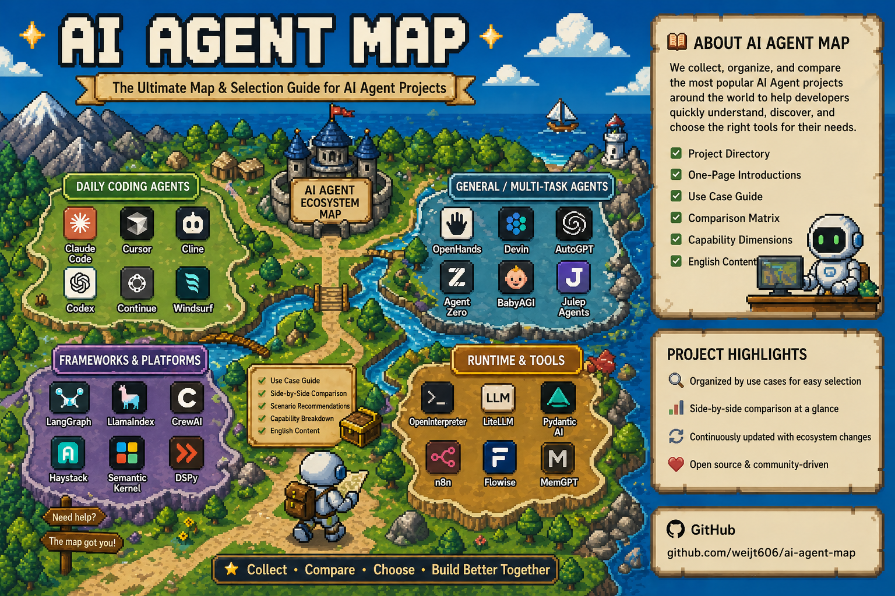
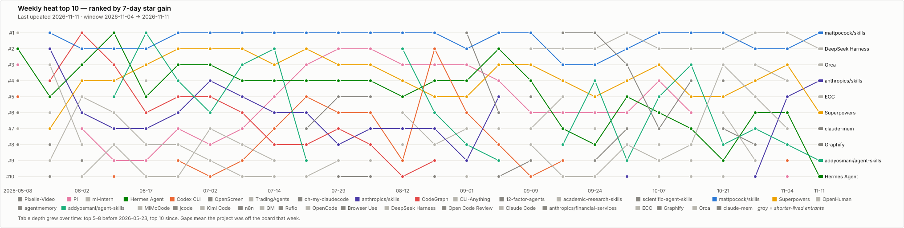
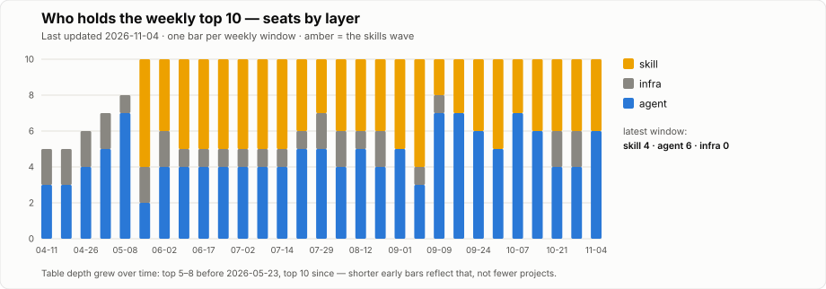
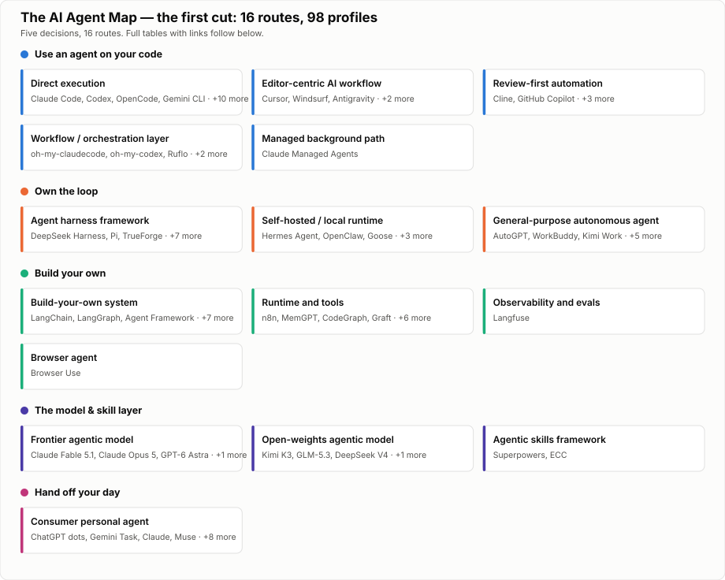

# AI Agent Map

	

AI Agent Map is a practical, visual-first guide for comparing mainstream AI agents, agent platforms, runtimes, and orchestration tools.

The goal is simple: help readers get to a sensible shortlist faster.

## What This Repo Is For

- The agent landscape is crowded.
- Many resources explain ideas, but not fit, anti-fit, or operating cost.
- People usually need a comparison layer, not another pile of links.

This repo stays focused on selection: what a system is good at, where it breaks down, and what kind of operator cost comes with it.

## Where To Start

| If your question is... | Start here |
| --- | --- |
| I need a shortlist first |  |
| I need help choosing for coding automation |  |
| I already have candidates and want a side-by-side view |  |
| I care about dimensions like approval, memory, scheduling, and deployment |  |
| I want every project scored on those dimensions, side by side |  |
| I want to know what it actually costs to run, and which model tier is worth it |   |
| My agents already run — I need to know whether they still work |  |
| I want the stock rankings and the weekly trend chart |  |
| I want problem-first guides or the full comparison list |   |

## Recent Heat Ranking

Popularity is not fit.

This table tracks projects that showed up as especially hot in the latest weekly GitHub snapshot. The rank follows the 7-day gain. The total star counts below were checked when this repo was updated.

> **Last updated:** 2026-11-04 · **Snapshot window:** 2026-10-28 → 2026-11-04 (gain since last update: **7 calendar days**, about 7.45 by fetch time against about 6.24 last window, so comparisons below use elapsed time) · **Star counts:** checked at update time

Project names link to the upstream GitHub repo. When this map has a written profile, it is linked separately in the "Map status" column.

| Rank | Project | Current stars | Snapshot gain | Map status | How to read it |
| --- | --- | --- | --- | --- | --- |
| #1&nbsp;(=) | [DeepSeek Harness](https://github.com/deepseek-ai/deepseek-harness) | 271.3k | +7,781 | In scope · [profile](agents/deepseek-harness.md) | **Holds #1**, the first time it has kept the top seat for two straight windows (09-30's lasted one); its third #1 in 29 windows. The raw gain is up 11%, but the window ran longer: down 7% on elapsed time, about 7,311 a week. **Past 270k** (271,301). Pre-releases only (`dsh-v0.2.1-rc.4`, `rc.5`, `v0.2.2-alpha.2`, `alpha.3`) |
| #2&nbsp;(=) | [mattpocock/skills](https://github.com/mattpocock/skills) | 311.6k | +6,918 | Watchlist (Skills Wave) | Up 6% on elapsed time, about flat, #2 again. **Past 310k** (311,605) and now **324 behind** [Superpowers](agents/superpowers.md), down from 1,457. It gained 3,882 *less* than the other three general collections combined. One patch release, `v1.3.2` (Oct 29) |
| #3&nbsp;(↑) | [Superpowers](https://github.com/obra/superpowers) | 311.9k | +5,785 | In scope · [profile](agents/superpowers.md) | Up **46%** on elapsed time to about 5,436 a week, its fastest since 07-08, and up a seat. **Past 310k** (311,929), still the largest collection by 324. `v7.0.2` shipped late on Nov 3 (UTC), after +5,143 of the gain was already in, so it does not explain the jump. No documented cause; treated as a spike |
| #4&nbsp;(↓) | [TradingAgents](https://github.com/TauricResearch/TradingAgents) | 120.4k | +3,266 | Watchlist (finance vertical) | Down **42%** on elapsed time after last window's spike, but it kept a seat: down one place, not off the board. **Past 120k** (120,393). No release and no commit in the window |
| #5&nbsp;(↑) | [anthropics/skills](https://github.com/anthropics/skills) | 187.2k | +2,979 | Watchlist (Skills Wave) | Up **60%** on elapsed time, #10 to #5: its fastest since 06-17 and its best seat since 09-06. Past **185k**. One commit in the window (an `mcp-builder` update, Oct 28) |
| #6&nbsp;(=) | [Hermes Agent](https://github.com/NousResearch/hermes-agent) | 260.3k | +2,631 | In scope · [profile](agents/hermes-agent.md) | Up 15% on elapsed time, same seat. **Past 260k** (260,283). **Present in all 29 recorded windows**. Two releases (`v0.22.6`, `v0.22.7`) |
| #7&nbsp;(↓) | [OpenCode](https://github.com/anomalyco/opencode) | 224.4k | +2,120 | In scope · [profile](agents/opencode.md) | Down **37%** on elapsed time, a second straight slowdown after the 2.0 breakout; a ninth straight seat. `v2.2.1`–`v2.2.5` shipped in the window |
| #8&nbsp;(↓) | [addyosmani/agent-skills](https://github.com/addyosmani/agent-skills) | 113.1k | +2,036 | Watchlist (Skills Wave) | Raw gain up 7%, but down 11% on elapsed time, a third straight slowdown, and down a place. Two releases (`0.6.14`, `0.6.15`) |
| #9&nbsp;(new) | [Codex CLI](https://github.com/openai/codex) | 133.0k | +1,790 | In scope · [profile](agents/codex.md) | From 15th: up **49%** on elapsed time, its first seat since 09-17. `rust-v0.165.0` and `rust-v0.166.0` add GPT-6.1 Terra to the model catalogs; the default is unchanged |
| #10&nbsp;(new) | [Pi](https://github.com/earendil-works/pi) | 119.9k | +1,635 | In scope · [profile](agents/pi.md) | From 12th, flat on elapsed time, and back because others fell: its first seat since 10-14. `v1.5.0` shipped Nov 2. **129 short of 120k** |

- Heat is useful for discovery, not for selection by itself.
- **This edition replaces the one dated 2026-11-03**, which ran a day early, on a Tuesday, over a 6-day window. That window is gone from the [boards](rankings/README.md) and the charts; its star counts stay in `history.json` as a mid-window fetch.
- **Both windows are 7 days by the calendar, but not by the clock.** Fetches were about **7.45 days** apart this window (Oct 28 00:25 → Nov 4 11:16, Beijing time) against about **6.24** last window, so raw gains overstate any speed-up by about 19%. The table shows raw gains; every "up/down" below is on elapsed time, and single-digit changes count as flat. Comparisons with windows before last still use their whole-date rates. The same effect overstated last window's cooling.
- **The top held steady; it did not warm.** On elapsed time **21 of 57 measured repos accelerated and 36 slowed** (on raw gains it would read 32 and 24, with one level). The ten seats ran about 34,710 a week against about 35,843 (−3%), and the bar for #10 fell about 12% (about 1,746 → about 1,536 a week). Four seat-holders sped up ([Superpowers](agents/superpowers.md), [anthropics/skills](https://github.com/anthropics/skills), [Codex CLI](agents/codex.md), [Hermes Agent](agents/hermes-agent.md)); three were about flat; three slowed.
- **[DeepSeek Harness](https://github.com/deepseek-ai/deepseek-harness) holds #1 for the first time.** Its #1 on 09-30 lasted one window; this one has lasted two. +7,781 is its largest raw gain in a 7-day window, but about 7,311 a week on elapsed time, down 7% from about 7,865. That makes three #1s in 29 windows, against [mattpocock/skills](https://github.com/mattpocock/skills)' 15. Pre-releases only; past 270k.
- **The gap at the top of the collections is nearly gone.** Superpowers (311,929) leads mattpocock/skills (311,605) by **324**, down from 1,457, and mattpocock out-gained it by 1,133. Superpowers is still the change: up **46%** on elapsed time. Its one release, `v7.0.2`, came after +5,143 of the +5,785 was already in, and no other cause is documented, so by the board's rule it is a spike until a second window confirms it. A crossing looks close, but this map's last forecast of one (10-21) was wrong.
- **Last window's spikes split.** [TradingAgents](https://github.com/TauricResearch/TradingAgents) gave back 42% and kept a seat at #4. [Gemini CLI](agents/gemini-cli.md) gave back **89%** (+140, 38th), so its +665% was a one-window event, still with no documented cause. [Ruflo](agents/ruflo.md) (−45%, 11th) and [CLI-Anything](agents/cli-anything.md) (−57%, 17th) left the board, which takes infra from two seats to **none** for the first time since 10-14.
- **The wave holds 4 of 10 a fourth straight window** (#2, #3, #5, #8), all general collections for a second straight window. anthropics/skills rose 60%, #10 to #5, and mattpocock gained **3,882 less** than the other three combined (6,918 against 5,785 + 2,979 + 2,036 = 10,800). The other six seats are agents (#1, #4, #6, #7, #9, #10); Codex CLI (#9) and [Pi](agents/pi.md) (#10) returned. Hermes Agent (29 of 29), Superpowers and mattpocock/skills (24 each) are the long runs still going; DeepSeek Harness and [OpenCode](agents/opencode.md) are next at 9.
- **The model layer moved on routing and billing, not on prices or defaults.** (1) **GitHub made Copilot Fusion generally available** on Oct 28: pick Fusion and Copilot routes between models for you. GitHub says Fusion Max scored 60 on the Artificial Analysis Coding Agent Index, within two points of Claude Code with Opus 5.5 Max, at about half the average API cost per task; that is GitHub's report, and this map has not copied it into the benchmark table. (2) **Copilot is now included with GitHub Enterprise** for customers working with an account team, with AI usage "metered from the first request", which moves part of Copilot off the flat seat. (3) **OpenAI released GPT-6 Rosalind** (Oct 30, $15 / $75, trusted access for life sciences), which is not a coding model and does not enter the cost table. (4) **Kimi K3.1 Pro's weights were not public at this fetch**, on Moonshot's own "by Nov 4" date with the day not over, so it stays out of the open-weights table. Its quickstart has replaced the `[xx.x%]` placeholders with scores: Moonshot reports 65.7% on Terminal-Bench 4.0, against 66.4% for Claude Opus 5.5 and 58.2% for GPT-6 Astra. That is the vendor's own report. (5) **Google will route `gemini-2.5-pro` to `gemini-3.8-flash` on Dec 1**; that string is still [Gemini CLI](agents/gemini-cli.md)'s source default, so watch it. **No tracked coding agent changed its default model for a fifth straight window**: [Claude Code](agents/claude-code.md) `v2.1.312`–`v2.1.318`, [Codex CLI](agents/codex.md) `rust-v0.166.0` (Terra joins the catalog, Sol stays first), Gemini CLI `v0.66.0`, [OpenCode](agents/opencode.md) `v2.2.5` (its "New Default Model Picker" is a UI change). Every row of the [cost table](comparisons/cost-and-benchmarks.md) was re-checked against the Anthropic, OpenAI, Google and Meta pricing pages on Nov 3 and no price changed; the main rows were re-read on Nov 4, again with no change; both promotions (GPT-5.6 Sol to at least Nov 21, Gemini 4 Argon to Nov 30) are live. Three of its notes were wrong or stale and are corrected there. Details in [market-events](market-events.md).
- **Personal agents and skills pages refreshed.** [Muse](agents/meta-muse.md) opened in Singapore (Oct 27) and [ChatGPT dots](agents/chatgpt-dots.md) added texting for US Pro users; see [recent changes](comparisons/personal-agents.md#recent-changes). The [Agent Skills](comparisons/agent-skills.md) page now uses this snapshot, and [ECC](agents/ecc.md) and [Superpowers](agents/superpowers.md) are corrected to their current READMEs.
- **Five repos entered tracking**: [Graphify](agents/graphify.md) 141,908, [ECC](agents/ecc.md) 296,608, [Orca](agents/orca.md) 114,648, [claude-mem](agents/claude-mem.md) 112,044 and [Paperclip](agents/paperclip.md) 110,857. They appear on the [category boards](rankings/README.md) now; their first measured gain comes next window. **No new profile this window.**
- Milestones, checked against the raw counts rather than the rounded column: **Superpowers and mattpocock/skills 310k**, DeepSeek Harness **270k**, Hermes Agent **260k**, anthropics/skills **185k**, TradingAgents **120k**, [Ruflo](agents/ruflo.md) **80k**, scientific-agent-skills and academic-research-skills **55k**, [agentmemory](https://github.com/rohitg00/agentmemory) **30k**, [Trail Code](agents/graft.md) **11k** and [mini-swe-agent](agents/mini-swe-agent.md) **9k**. Near misses: [Browser Use](agents/browser-use.md) is **30 short of 120k**, [Aider](agents/aider.md) 69 short of 50k, Pi 129 short of 120k.
- [OpenClaw](agents/openclaw.md) remains the absolute leader at 393.9k stars (+668, flat on elapsed time); it is profiled but stays out of the gain-ranked table because reliable week-over-week deltas for a project this large are noisy.

More window notes: skills-wave share, OpenClaw, and everything growing outside the top 10

- The `.claude/skills` wave **holds four of the top ten for a fourth straight window**: #2, #3, #5 and #8, all general collections for a second straight window. Policy unchanged: curated collections are tracked as Skills Wave entries and compared on the [Agent Skills](comparisons/agent-skills.md) page; the framework end is profiled through [Superpowers](agents/superpowers.md) and [ECC](agents/ecc.md).
- Just off the table, on elapsed time: [Ruflo](agents/ruflo.md) 80.8k (+1,093) at 11th, down 45%, past 80k; academic-research-skills 55.2k (+1,078) at 12th, flat; scientific-agent-skills 56.0k (+1,068) at 13th, down 40%, 10 short of 56k; [Claude Code](agents/claude-code.md) 154.4k (+874) at 14th, down 19%, on five releases (`v2.1.312`–`v2.1.318`); [Open Code Review](agents/open-code-review.md) 49.4k (+861) at 15th, flat; and [CodeGraph](agents/codegraph.md) 76.4k (+843) at 16th, down 30%. [CLI-Anything](agents/cli-anything.md) (+825, 17th) has still had no commit since Sept 22. OpenClaw is excluded from the board, so these off-board positions are counted the same way.
- **The research collections sit level.** academic-research-skills held its pace while scientific-agent-skills slowed, and both crossed 55k; K-Dense stays the larger, 55,990 against 55,236. [Gemini CLI](agents/gemini-cli.md) fell from 13th to 38th. [anthropics/financial-services](https://github.com/anthropics/financial-services) slowed again (+179, down 41%, 33rd), and crossed 41k.
- Continuing to grow but outside the top 10 by gain (raw figures, 7 calendar days): [Ruflo](agents/ruflo.md) 80.8k (+1,093), [academic-research-skills](https://github.com/Imbad0202/academic-research-skills) 55.2k (+1,078), [scientific-agent-skills](https://github.com/K-Dense-AI/scientific-agent-skills) 56.0k (+1,068), [Claude Code](agents/claude-code.md) 154.4k (+874), [Open Code Review](agents/open-code-review.md) 49.4k (+861), [CodeGraph](agents/codegraph.md) 76.4k (+843), [CLI-Anything](agents/cli-anything.md) 58.2k (+825), [n8n](agents/n8n.md) 209.5k (+715), [Browser Use](agents/browser-use.md) 120.0k (+679), [OpenHands](agents/openhands.md) 92.6k (+599), [LiteLLM](agents/litellm.md) 62.7k (+493), [LangGraph](agents/langgraph.md) 44.4k (+427), [LangChain](agents/langchain.md) 149.0k (+424), [Goose](agents/goose.md) 56.2k (+377), [Langfuse](agents/langfuse.md) 37.0k (+364), [Cline](agents/cline.md) 71.3k (+357), [CrewAI](agents/crewai.md) 60.5k (+294), [Trail Code (Graft)](agents/graft.md) 11.1k (+258), [Qwen Code](agents/qwen-code.md) 29.0k (+229), [jcode](agents/jcode.md) 21.4k (+199), [mini-swe-agent](agents/mini-swe-agent.md) 9.1k (+184), [Microsoft Agent Framework](agents/microsoft-agent-framework.md) 14.5k (+184), [anthropics/financial-services](https://github.com/anthropics/financial-services) 41.0k (+179), [agentmemory](https://github.com/rohitg00/agentmemory) 30.1k (+178), [Aider](agents/aider.md) 49.9k (+159), [OpenHuman](agents/openhuman.md) 42.5k (+158), [ZCode](agents/zcode.md) 8.5k (+152), [Gemini CLI](agents/gemini-cli.md) 108.7k (+140), [Omnigent](agents/omnigent.md) 11.2k (+115), [Grok Build](agents/grok-build.md) 27.7k (+108), [LlamaIndex](agents/llamaindex.md) 52.8k (+107), [AutoGPT](agents/autogpt.md) 187.9k (+99), [Open Interpreter](agents/open-interpreter.md) 68.8k (+97), [eve](agents/eve.md) 5.8k (+89), [Kimi Code](agents/kimi-code.md) 8.1k (+88), [QM](agents/qm.md) 15.6k (+82), [Letta (MemGPT)](agents/memgpt.md) 25.3k (+76), [12-factor-agents](https://github.com/humanlayer/12-factor-agents) 27.0k (+75), [SWE-agent](agents/swe-agent.md) 20.7k (+63), [Continue](agents/continue.md) 36.4k (+58), [OpenHarness](agents/openharness.md) 16.2k (+51), [TrueForge](agents/trueforge.md) 6.4k (+46), [CodeWhale](agents/codewhale.md) 41.2k (+30), [Flowise](agents/flowise.md) 55.5k (+17), [MiMoCode](agents/mimocode.md) 13.7k (+11), [CoStrict](agents/costrict.md) 4.5k (+2)

### Ranking Trend

How the weekly top 10 has shifted since tracking began — each line is one project, breaks mean it fell off the board that week:

  

And the same windows read as seats per layer — the quantitative version of the skills-wave story the bullets tell in prose:

  

Full stock rankings by category — agents, agent infra, skills, and their verticals, sorted by total stars — live in [rankings/](rankings/README.md).

## Beyond The Rank

Popularity tells you what to look at. These six pages tell you what to pick:

- **[Capability matrix](capabilities/matrix.md)** — every project scored side by side (●/◐/○/—) across the nine shared [capability dimensions](capabilities/README.md), grouped by route. The answer to "for this capability, who treats it as a core strength."
- **[Cost & benchmarks](comparisons/cost-and-benchmarks.md)** — frontier-model capability vs per-token price, plus how each coding agent actually bills. Since the model layer went tiered and metered, "which tier for this task" is the selection decision.
- **[Memory approaches](comparisons/memory-approaches.md)** — seven different things projects mean by "has memory," from self-editing stores to passive semantic recall, and which to pick for what you need to persist.
- **[Consumer personal agents](comparisons/personal-agents.md)** — the agents you hand your day to — ChatGPT dots, Gemini Task, Claude, Muse, Grok Bot, Cue, Doubao, Qwen, AutoGLM, Yuanbao, Today — compared on facts and control rather than popularity, because closed products have no public number to rank by.
- **[Agent Skills](comparisons/agent-skills.md)** — what a skill is, which agents load one, and the five largest collections and frameworks (Superpowers, mattpocock/skills, ECC, anthropics/skills, addyosmani/agent-skills) compared on kind, footprint, maintainer and license, plus what to check before installing someone else's. Collections are compared here rather than profiled.
- **[Observability & evaluation](comparisons/observability-and-evals.md)** — the layer under everything above: once an agent runs unattended, failure stops looking like a crash and starts looking like silent quality drift. Compares [Langfuse](agents/langfuse.md), Opik, Phoenix, Helicone, LangSmith and others — and untangles the four different things "open source" means in that field.

## Market Pulse

The three structural stories shaping selection right now — full records with dates and sources live in [market-events.md](market-events.md):

- **The `.claude/skills` wave holds four seats for a fourth straight window, and the two largest collections both passed 310k** (May 2026 → ongoing): curated skill collections and skills frameworks have held between two and six of the weekly heat top 10 for five months, and the count rotates rather than sitting still: 6/10, then 2/10, 3/10, 4/10, 5/10, 3/10, then **4 of 10** four windows running (2026-11-04). All four seats are general collections for a second straight window: [mattpocock/skills](https://github.com/mattpocock/skills), [Superpowers](agents/superpowers.md), [anthropics/skills](https://github.com/anthropics/skills) and [addyosmani/agent-skills](https://github.com/addyosmani/agent-skills). mattpocock (311,605) is 324 stars behind Superpowers (311,929), and it gained 3,882 less than the other three combined, so the key-person risk this map has flagged since June keeps easing. [ECC](agents/ecc.md) (296,608) entered tracking this window and is the third-largest collection on the [skill boards](rankings/skill-verticals.md). This map profiles the framework end through Superpowers and ECC, and compares collections on the [Agent Skills](comparisons/agent-skills.md) page.
- **The model layer became a budget decision — and the ladder now has every rung filled at both vendors**: [Claude Fable 5.1](agents/claude-fable-5.md) (Sept 1) and [GPT-6 Astra](agents/gpt-6-astra.md) (Sept 3) still both list at **$10 / $50**; below them sit **Opus 5.5** ($4 / $20, Sept 22), the two mid tiers **Sonnet 5.5** and **GPT-6.1 Sol** (both $2 / $10, Sept 28–29, both their vendor's coding-agent default), and now the floor: **GPT-6 Luna** ($0.10 / $0.50, Sept 22) and **Claude Haiku 5.5** (Oct 7, $0.10 / $0.50 for prompts up to 100K tokens, $0.50 / $2.50 above). On **Oct 26** OpenAI filled the rung between the floor and the mid tier with **GPT-6.1 Terra** at **$1 / $5** (cache $0.05), selectable in Codex but not made a default. Google joined the priced field on **Oct 13** when **Gemini 4 Argon** opened to the paid API at $2 / $10 through Nov 30, then $4 / $20, and Meta's **Muse Wonder** (Oct 12) lands on **$4 / $20 with $0.20 cache reads** — Opus 5.5's numbers exactly, which makes $4 / $20 a three-vendor price point. The column this map said separated the two mid tiers has closed: Anthropic's pricing page now lists Sonnet 5.5 cache reads at **$0.10/M**, not the $0.20 recorded from the Sept 28 changelog (Claude Code `v2.1.296` corrected its own figure on Oct 9), so Sonnet 5.5 and GPT-6.1 Sol are identical on sticker and on cache. What still separates them is long-context shape (OpenAI reprices the whole request past 272k input tokens; Anthropic does not; Haiku 5.5 prices by prompt length). See [cost & benchmarks](comparisons/cost-and-benchmarks.md).
- **Product boundaries are collapsing upward**: OpenAI merged Codex into the ChatGPT app (July 9), and at DevDay (Sept 29) moved it further off the laptop with reusable cloud environments usable from any device — on the OpenAI side, "which coding agent" keeps turning into "how you use ChatGPT." The bundled default model changed twice in a month: [GPT-6 Astra](agents/gpt-6-astra.md) from `rust-v0.153.4` (Sept 4), then **GPT-6.1 Sol** from `rust-v0.159.1` (Sept 29), carried to the main release line by `rust-v0.161.0` (Oct 7). Since `0.162.0` (Oct 8) the TUI also follows the server's model default, so the effective default can change without a release, and on **Oct 14** OpenAI retired GPT-5.5 from Codex and ChatGPT for ChatGPT sign-in. Five windows have now passed with no tracked coding agent changing a default in a release. If you run Codex on defaults, pin the model id anyway — and know that a pinned model can be retired under you; the product will not hold either still for you. See [Codex](agents/codex.md).

## The First Cut Of The Map

  

| Route | Representative projects | Typical user |
| --- | --- | --- |
| Direct execution | [Claude Code](agents/claude-code.md), [Aider](agents/aider.md), [Codex](agents/codex.md), [Kimi Code](agents/kimi-code.md), [MiMoCode](agents/mimocode.md), [CodeWhale](agents/codewhale.md), [ZCode](agents/zcode.md), [CodeBuddy](agents/codebuddy.md), [OpenCode](agents/opencode.md), [Gemini CLI](agents/gemini-cli.md), [Qwen Code](agents/qwen-code.md), [Grok Build](agents/grok-build.md), [Devin](agents/devin.md), [Jules](agents/jules.md) | Someone who wants to hand a concrete coding task to an agent (see the [terminal coding CLI comparison](comparisons/coding-cli-agents.md)) |
| Agent harness framework | [DeepSeek Harness](agents/deepseek-harness.md), [Pi](agents/pi.md), [jcode](agents/jcode.md), [OpenHands](agents/openhands.md), [SWE-agent](agents/swe-agent.md), [mini-swe-agent](agents/mini-swe-agent.md), [OpenHarness](agents/openharness.md), [QM](agents/qm.md), [Omnigent](agents/omnigent.md), [TrueForge](agents/trueforge.md) | Someone who wants to own the agent loop, tool surface, and permissions instead of inheriting a vendor's product — QM and Omnigent extend this to running *several* harnesses under one layer (see the [harness comparison](comparisons/agent-harness-frameworks.md)) |
| Frontier agentic model | [Claude Fable 5.1](agents/claude-fable-5.md), [Claude Opus 5](agents/claude-opus-5.md), [GPT-6 Astra](agents/gpt-6-astra.md), [GPT-5.5](agents/gpt-5.5.md) | Someone choosing which model to wire into their own agent system or evaluating the capability ceiling of Anthropic / OpenAI surfaces — the ceilings (Fable 5.1, Astra) and the tier you actually run under them are separate decisions (Opus 5 was Claude Code's default Opus until Opus 5.5 replaced it on Sept 22, and Sonnet 5.5 became the default Sonnet on Sept 28) |
| Open-weights agentic model | [Kimi K3](agents/kimi-k3.md), [GLM-5.3](agents/glm-5.md), [DeepSeek V4](agents/deepseek-v4.md), [Qwen3-Coder](agents/qwen3-coder.md) | Someone who wants frontier-class capability on weights they host and licence themselves — a different decision from picking between the closed ceilings |
| Agentic skills framework | [Superpowers](agents/superpowers.md), [ECC](agents/ecc.md) | Someone who wants a methodology + composable skills layer that plugs into Claude Code, Codex, Cursor, and similar agents |
| Workflow / orchestration layer | [oh-my-claudecode](agents/oh-my-claudecode.md), [oh-my-codex](agents/oh-my-codex.md), [Ruflo](agents/ruflo.md), [Orca](agents/orca.md), [Paperclip](agents/paperclip.md) | Someone who already likes Claude Code or Codex and wants stronger orchestration on top (Ruflo extends this to multi-machine federation and 100+ specialized agents); Orca and Paperclip coordinate many different agents at once |
| Editor-centric AI workflow | [Cursor](agents/cursor.md), [Windsurf](agents/windsurf.md), [Google Antigravity](agents/antigravity.md), [TRAE](agents/trae.md), [Continue](agents/continue.md) | Someone who wants the editor itself to stay central |
| Review-first automation | [Cline](agents/cline.md), [GitHub Copilot](agents/github-copilot.md), [Froge Code](agents/froge-code.md), [CoStrict](agents/costrict.md), [Open Code Review](agents/open-code-review.md) | Someone who wants review and human control to stay central (CoStrict adds enterprise strict-workflow + private deployment; Open Code Review is review only, tuned for precision in CI) |
| Managed background path | [Claude Managed Agents](agents/claude-managed-agents.md) | Someone who needs scheduled, cloud, or detached Anthropic workflows |
| Consumer personal agent | [ChatGPT dots](agents/chatgpt-dots.md), [Gemini Task](agents/gemini-task.md), [Claude (Cowork)](agents/claude-cowork.md), [Claude Duet](agents/claude-duet.md), [Muse (Meta)](agents/meta-muse.md), [Grok Bot](agents/grok-bot.md), [Cue (Manus)](agents/manus-cue.md), [Doubao](agents/doubao.md), [Qwen app](agents/qwen-app.md), [AutoGLM](agents/autoglm.md), [Yuanbao](agents/yuanbao.md), [Today](agents/today-ai.md) | Someone who wants to hand errands, inboxes, bookings or their phone to an agent sold as a product rather than run as software (see the [personal agents comparison](comparisons/personal-agents.md)) |
| General-purpose autonomous agent | [AutoGPT](agents/autogpt.md), [Agent Zero](agents/agent-zero.md), [BabyAGI](agents/babyagi.md), [Julep](agents/julep.md), [GenericAgent](agents/generic-agent.md), [ml-intern](agents/ml-intern.md), [WorkBuddy](agents/workbuddy.md), [Kimi Work](agents/kimi-work.md) | Someone who wants autonomous, general-purpose task execution — ml-intern is the ML-specialized variant, while WorkBuddy and Kimi Work aim the same loop at desktop knowledge work rather than repositories |
| Build-your-own system | [LangChain](agents/langchain.md), [LangGraph](agents/langgraph.md), [CrewAI](agents/crewai.md), [LlamaIndex](agents/llamaindex.md), [Haystack](agents/haystack.md), [Semantic Kernel](agents/semantic-kernel.md), [DSPy](agents/dspy.md), [Pydantic AI](agents/pydantic-ai.md), [eve](agents/eve.md), [Microsoft Agent Framework](agents/microsoft-agent-framework.md) | Teams building their own agent platform instead of buying one |
| Runtime and tools | [n8n](agents/n8n.md), [MemGPT](agents/memgpt.md), [Open Interpreter](agents/open-interpreter.md), [LiteLLM](agents/litellm.md), [Flowise](agents/flowise.md), [CodeGraph](agents/codegraph.md), [Trail Code (Graft)](agents/graft.md), [CLI-Anything](agents/cli-anything.md), [claude-mem](agents/claude-mem.md), [Graphify](agents/graphify.md) | Teams that need workflow automation, code execution, LLM gateways, agent context infrastructure, agent-driven CLIs, or visual builders |
| Observability and evals | [Langfuse](agents/langfuse.md) | Someone whose agents already run in production and needs to know what they did, what they cost, and whether quality is drifting (see [observability & evaluation](comparisons/observability-and-evals.md)) |
| Browser agent | [Browser Use](agents/browser-use.md) | Someone whose task lives on a website with no API — a different question from how an agent edits files, because it decides what an agent may do as you on the open web |
| Self-hosted / local runtime | [AI Edge Gallery](agents/ai-edge-gallery.md), [Goose](agents/goose.md), [Hermes Agent](agents/hermes-agent.md), [OpenClaw](agents/openclaw.md), [Mercury Agent](agents/mercury-agent.md), [OpenHuman](agents/openhuman.md) | Users who need on-device privacy, long-running agents, local control, channels, devices, or personal-data life integration |

## Current Mainstream Coverage

98 profiled projects, grouped by what they are. Expand a group, or browse the full route/coverage tables in [agents/](agents/README.md).

<strong>Coding agents, editors, and orchestration</strong> (36 projects)

| Project | Route | One-line positioning |
| --- | --- | --- |
| [Aider](agents/aider.md) | Direct execution | Terminal-first AI pair programmer close to git |
| [Claude Code](agents/claude-code.md) | Direct execution | Local and IDE-first coding agent |
| [Claude Managed Agents](agents/claude-managed-agents.md) | Managed background path | Anthropic managed / cloud execution mapping |
| [Codex](agents/codex.md) | Direct execution | Coding agent inside the ChatGPT app, with async cloud delegation |
| [oh-my-claudecode](agents/oh-my-claudecode.md) | Workflow layer | Teams-first orchestration layer on top of Claude Code |
| [oh-my-codex](agents/oh-my-codex.md) | Workflow layer | Stronger workflow, teams, and persistent state around Codex CLI |
| [Orca](agents/orca.md) | Workflow / orchestration layer | Open-source desktop app that runs any CLI coding agent side by side, each in its own git worktree, with review, browser, remote servers and a phone companion |
| [Cursor](agents/cursor.md) | Editor-centric platform | AI editor spanning local coding, cloud agents, and integrations |
| [GitHub Copilot](agents/github-copilot.md) | Platform | Multi-surface agent platform across VS Code and GitHub |
| [Cline](agents/cline.md) | Review-first execution | Approval-first editor-native coding agent |
| [Windsurf](agents/windsurf.md) | AI-native IDE | Cascade-centered AI IDE |
| [Google Antigravity](agents/antigravity.md) | Editor-centric AI workflow | Google's agent-first platform: desktop agent app, `agy` CLI, standalone IDE and editor extensions on one Gemini-tuned harness; free weekly tier, closed source |
| [TRAE](agents/trae.md) | Editor-centric AI workflow | ByteDance's AI IDE: VS Code-style IDE with an AI-led SOLO mode, plus an Agent window for parallel, cloud and scheduled tasks; separate international and China editions; chats may train models unless Privacy Mode is on |
| [OpenHands](agents/openhands.md) | Open-source execution | Open-source software engineering agent |
| [Devin](agents/devin.md) | Managed execution | End-to-end managed software engineering execution |
| [Jules](agents/jules.md) | Managed cloud execution | GitHub-connected coding delegation with PR handoff |
| [Continue](agents/continue.md) | Editor-centric | Open-source IDE extension with full model freedom |
| [Froge Code](agents/froge-code.md) | Review-first automation | Provisionally mapped to Automagik Genie |
| [Pi](agents/pi.md) | Agent harness framework | Minimal terminal coding-agent harness with multi-provider LLM support |
| [jcode](agents/jcode.md) | Agent harness framework | Rust multi-session coding harness — fastest boot, provider-neutral OAuth, passive semantic memory |
| [CodeWhale](agents/codewhale.md) | Direct execution | Provider-neutral Rust terminal coding agent, 40+ provider routes, DeepSeek still the default (formerly DeepSeek-TUI) |
| [Kimi Code](agents/kimi-code.md) | Direct execution | Moonshot AI's official Kimi-native terminal coding CLI (successor to kimi-cli) |
| [MiMoCode](agents/mimocode.md) | Direct execution | Xiaomi's official MiMo terminal coding agent with built-in cross-session memory |
| [Grok Build](agents/grok-build.md) | Direct execution | SpaceXAI's official Rust terminal coding agent — full-screen TUI, headless CI mode, ACP editor server |
| [CoStrict](agents/costrict.md) | Review-first automation | Enterprise Cline-lineage coding agent with strict standardized workflow, AI code review, and private deployment |
| [SWE-agent](agents/swe-agent.md) | Agent harness framework | Princeton + Stanford's original SWE-bench harness with single-YAML configuration |
| [mini-swe-agent](agents/mini-swe-agent.md) | Agent harness framework | The ~100-line Python successor to SWE-agent that still scores >74% on SWE-bench Verified |
| [OpenHarness](agents/openharness.md) | Agent harness framework | HKUDS's 10-subsystem open agent harness with 43+ tools, anthropics/skills, and MCP |
| [Omnigent](agents/omnigent.md) | Agent harness framework | Meta-harness that mixes Claude Code, Codex, Cursor, OpenCode, Hermes, and Pi in one session, with policies and cloud sandboxes |
| [OpenCode](agents/opencode.md) | Direct execution | The largest vendor-neutral open-source coding agent — 222k stars (2026-10-28), MIT |
| [Gemini CLI](agents/gemini-cli.md) | Direct execution | Google's open-source terminal agent with Search grounding built in; since 2026-06-18 it serves Code Assist Standard/Enterprise and paid API keys, while consumer users were moved to Antigravity CLI |
| [Qwen Code](agents/qwen-code.md) | Direct execution | Open client and open weights, switchable across OpenAI/Anthropic/Gemini/local at runtime |
| [DeepSeek Harness](agents/deepseek-harness.md) | Agent harness framework | Everything-is-a-plugin harness — even the agent loop is swappable from config |
| [ZCode](agents/zcode.md) | Direct execution | Zhipu's desktop agentic dev environment: long-horizon "Goal" tasks, steerable from WeChat/Feishu/Telegram |
| [CodeBuddy](agents/codebuddy.md) | Direct execution | Tencent Cloud's coding line (editor plugin, CodeBuddy IDE, CodeBuddy Code CLI): a Claude-Code-shaped loop with a multi-vendor model catalog and private-cloud editions |
| [Open Code Review](agents/open-code-review.md) | Review-first automation | Alibaba's precision-first code-review CLI — deterministic pipeline around the model, plus CI and agent-plugin surfaces |

<strong>Autonomous and self-hosted agents</strong> (17 projects)

| Project | Route | One-line positioning |
| --- | --- | --- |
| [AI Edge Gallery](agents/ai-edge-gallery.md) | On-device local runtime | Mobile-first local assistant sandbox with agent skills |
| [Goose](agents/goose.md) | Open-source local platform | Extensible local agent across desktop, CLI, and API |
| [Hermes Agent](agents/hermes-agent.md) | Multi-agent / self-hosted | Long-lived self-hosted environment with memory and skills |
| [OpenClaw](agents/openclaw.md) | Runtime | Local-first multi-channel runtime layer |
| [AutoGPT](agents/autogpt.md) | Autonomous agent platform | Visual agent builder with workflows, marketplace, and multi-model support |
| [Agent Zero](agents/agent-zero.md) | Autonomous agent | Self-building autonomous agent with dynamic tool creation |
| [BabyAGI](agents/babyagi.md) | Experimental | Pioneering autonomous agent experiment — educational, not production |
| [Open Interpreter](agents/open-interpreter.md) | Runtime | Natural language to local code execution, no sandbox |
| [Mercury Agent](agents/mercury-agent.md) | Self-hosted multi-channel | Permission-hardened agent for CLI and Telegram with token budgets |
| [ml-intern](agents/ml-intern.md) | Domain-specific autonomous agent | Hugging Face's autonomous ML engineer — research, code, and ship ML using HF tooling |
| [GenericAgent](agents/generic-agent.md) | Self-evolving autonomous agent | Small-seed agent that grows a personal skill tree on every task |
| [OpenHuman](agents/openhuman.md) | Self-hosted / local runtime | Desktop life-integration agent with 118+ connectors, local Memory Tree, and Ollama support |
| [Julep](agents/julep.md) | Workflow engine | Temporal-backed durable workflow engine for stateful AI agents |
| [QM](agents/qm.md) | Agent harness framework | Y Combinator's multiplayer agent for Slack and web — per-person and per-room scopes, self-hosted, harness-agnostic |
| [WorkBuddy](agents/workbuddy.md) | General-purpose autonomous agent | Tencent's desktop office agent — the same loop, aimed at documents, decks, and spreadsheets |
| [Kimi Work](agents/kimi-work.md) | General-purpose autonomous agent | Moonshot's desktop knowledge-work agent: mounted folders, browser automation, built-in cron |
| [TrueForge](agents/trueforge.md) | Agent harness framework | Harness-as-a-server — one loop behind an HTTP API, with a chat UI, a TypeScript SDK, and an embeddable UI |

<strong>Frameworks and infrastructure</strong> (23 projects)

| Project | Route | One-line positioning |
| --- | --- | --- |
| [eve](agents/eve.md) | Build-your-own platform | Vercel's filesystem-first agent framework — durable execution, sandboxes, approvals, channels, evals |
| [LangChain](agents/langchain.md) | Platform | High-level framework for building custom agents quickly |
| [LangGraph](agents/langgraph.md) | Platform | Low-level framework for durable stateful workflows |
| [CrewAI](agents/crewai.md) | Multi-agent framework | Role-based agent collaboration with fast prototyping |
| [LlamaIndex](agents/llamaindex.md) | Data-first framework | RAG and agentic applications over documents and data |
| [n8n](agents/n8n.md) | Workflow automation | Visual workflow platform with native AI agent nodes and 400+ integrations |
| [MemGPT](agents/memgpt.md) | Stateful agent platform | Persistent memory agents that learn across sessions (now Letta) |
| [Haystack](agents/haystack.md) | Framework | Production-oriented RAG and agent framework by deepset |
| [Semantic Kernel](agents/semantic-kernel.md) | Framework | Microsoft's AI orchestration SDK for .NET, Python, and Java |
| [DSPy](agents/dspy.md) | Framework | Programmatic prompt optimization — programming, not prompting, LMs |
| [LiteLLM](agents/litellm.md) | Infrastructure | Unified API gateway for 100+ LLM providers |
| [Langfuse](agents/langfuse.md) | Infrastructure | Open-source agent observability, evals, and prompt management (watches agents, does not run them) |
| [Pydantic AI](agents/pydantic-ai.md) | Framework | Type-safe Python agent framework with structured outputs |
| [Flowise](agents/flowise.md) | Visual builder | Drag-and-drop LLM app and agent builder on top of LangChain |
| [Ruflo](agents/ruflo.md) | Workflow / orchestration layer | Multi-agent orchestration platform for Claude with federation across machines, neural memory, and 100+ specialized agents |
| [Paperclip](agents/paperclip.md) | Workflow / orchestration layer | Self-hosted control plane that runs a team of agents like a company: goal-linked tickets, org chart, budgets, approvals and scheduled routines |
| [CodeGraph](agents/codegraph.md) | Runtime and tools | Pre-indexed code knowledge graph + MCP server for Claude Code, Cursor, Codex CLI, opencode, and Hermes Agent |
| [Trail Code (Graft)](agents/graft.md) | Runtime and tools | Code context written as linked markdown in your repo, wired into eight-plus agents with one command |
| [claude-mem](agents/claude-mem.md) | Runtime and tools | Bolt-on cross-session memory: hooks capture agent activity, a model compresses it, relevant context is injected next session; paid hosted observer optional |
| [Graphify](agents/graphify.md) | Runtime and tools | Turns a codebase plus its docs, PDFs and media into a provenance-tagged knowledge graph that agents query through a skill, CLI or local MCP server |
| [Browser Use](agents/browser-use.md) | Browser agent | Gives an agent a real browser — opens pages, clicks, types, fills forms |
| [Microsoft Agent Framework](agents/microsoft-agent-framework.md) | Build-your-own system | AutoGen's successor; production multi-agent workflows across Python, .NET, and Go |
| [CLI-Anything](agents/cli-anything.md) | Runtime and tools | Auto-generates Click-based CLIs for arbitrary software so agents can drive non-API apps |

<strong>Models and skills</strong> (10 entries)

| Project | Route | One-line positioning |
| --- | --- | --- |
| [Claude Fable 5.1](agents/claude-fable-5.md) | Frontier agentic model | Anthropic's Mythos-class ceiling — the model you spend credits on, refreshed Sept 1 2026 |
| [Claude Opus 5](agents/claude-opus-5.md) | Frontier agentic model | The Opus tier at half the ceiling's price; Claude Code's default Opus until Opus 5.5 replaced it on Sept 22 (Sonnet 5.5 became the default Sonnet on Sept 28) |
| [GPT-6 Astra](agents/gpt-6-astra.md) | Frontier agentic model | OpenAI's current ceiling (Sept 3 2026), shipped to the public in a restricted version |
| [GPT-5.5](agents/gpt-5.5.md) | Frontier agentic model | OpenAI's spring 2026 model, kept as the lineage reference through GPT-5.6 to Astra |
| [Kimi K3](agents/kimi-k3.md) | Open-weights agentic model | First open 3T-class model — 2.8T params, native vision, 1M context, custom licence |
| [GLM-5.3](agents/glm-5.md) | Open-weights agentic model | Strongest open-weights coding model on vendor numbers, Apache-2.0 — and ungated cyber capability |
| [DeepSeek V4](agents/deepseek-v4.md) | Open-weights agentic model | MIT at 1.6T params; SWE-bench Verified 80.6, reproducible because the weights are open |
| [Qwen3-Coder](agents/qwen3-coder.md) | Open-weights agentic model | The one that fits — ~3B activated of 80B, 256K→1M context, runs where you are |
| [Superpowers](agents/superpowers.md) | Agentic skills framework | Methodology and composable skills layer that plugs into Claude Code, Codex, Cursor, and other agents |
| [ECC](agents/ecc.md) | Agentic skills framework | Cross-harness plugin bundling 314 skills, 71 subagents, enforcement hooks, a memory vault and the AgentShield config scanner; Claude Code first |

<strong>Consumer personal agents</strong> (12 products)

| Project | Route | One-line positioning |
| --- | --- | --- |
| [ChatGPT dots](agents/chatgpt-dots.md) | Consumer personal agent | OpenAI's always-on agent in ChatGPT — GPT-6 Astra, its own cloud computer, reachable in Slack, Teams and by call; Pro only, not in Europe |
| [Gemini Task](agents/gemini-task.md) | Consumer personal agent | The Gemini app's agent mode (formerly Spark) — scheduled work across Google Workspace and Chrome, with a published confirmation list |
| [Claude (Cowork)](agents/claude-cowork.md) | Consumer personal agent | Cowork merged into the Claude app — tasks that schedule and keep running in an isolated cloud session, three named approval modes |
| [Claude Duet](agents/claude-duet.md) | Consumer personal agent | Anthropic's separate proactive-agent app: morning brief, checks your accounts every few hours, own VM, approval before it sends, pays, signs or deletes; US waitlist |
| [Muse (Meta)](agents/meta-muse.md) | Consumer personal agent | Meta's errand agent in its own app and WhatsApp — a dedicated cloud VM, one-time card payments, US limited testing, open in Singapore |
| [Grok Bot](agents/grok-bot.md) | Consumer personal agent | xAI's team of always-on Bots sharing one cloud computer in Cursor's cloud, with saved skills on a schedule |
| [Cue (Manus)](agents/manus-cue.md) | Consumer personal agent | Manus's personal-agent app where each agent has its own email, phone number, wallet and computer; invite-only early access |
| [Doubao](agents/doubao.md) | Consumer personal agent | ByteDance's assistant with a work-task mode and a phone-OS assistant that operates other apps on partner phones (Beta) |
| [Qwen app](agents/qwen-app.md) | Consumer personal agent | Alibaba's consumer app turned errand agent — deliverables, scheduled tasks, food, hotels and government services |
| [AutoGLM](agents/autoglm.md) | Consumer personal agent | Zhipu's phone-use agent: a free app on cloud phones, plus the Apache-2.0 Open-AutoGLM framework for your own phone |
| [Yuanbao](agents/yuanbao.md) | Consumer personal agent | Tencent's free assistant with a Hy3 Agent feature that delivers office files — the consumer end of WorkBuddy's model family |
| [Today](agents/today-ai.md) | Consumer personal agent | A personal AI assistant built on memory and proactive help: morning and evening briefings, scheduled tasks, cloud computers and a Chrome extension; China-edition data kept in mainland China in principle, plus an international edition |

## Example Reading Paths

If you are still deciding where to begin, use one of these quick routes and then branch out.

| If you sound like this... | Follow this path | What it helps you answer |
| --- | --- | --- |
| I want a day-to-day coding agent and need to choose terminal vs editor | [Aider](agents/aider.md) → [Claude Code](agents/claude-code.md) → [terminal coding CLI comparison](comparisons/coding-cli-agents.md) → [Cursor](agents/cursor.md) → [Cline](agents/cline.md) → [coding automation guide](use-cases/coding-automation.md) | Which vendor CLI fits your model, terminal-first local loop vs editor-led flow vs approval-first control |
| I already like Claude Code or Codex but want stronger orchestration | [Claude Code](agents/claude-code.md) → [oh-my-claudecode](agents/oh-my-claudecode.md) → [Codex](agents/codex.md) → [oh-my-codex](agents/oh-my-codex.md) → [mainstream matrix](comparisons/mainstream-agent-landscape.md) | When the base agent is enough and when a workflow layer actually adds value |
| I want to understand how the 2026 model race changes agent choice | [Claude Fable 5.1](agents/claude-fable-5.md) → [Claude Opus 5](agents/claude-opus-5.md) → [GPT-6 Astra](agents/gpt-6-astra.md) → [Codex](agents/codex.md) → [Claude Code](agents/claude-code.md) → [market events](market-events.md) | How the frontier tiers and the default tier under them shift the capability ceiling, and what it means for product choice |
| I want a dedicated AI IDE instead of stitching tools together | [Cursor](agents/cursor.md) → [Windsurf](agents/windsurf.md) → [GitHub Copilot](agents/github-copilot.md) → [mainstream matrix](comparisons/mainstream-agent-landscape.md) | Dedicated AI editor vs ecosystem platform |
| I want to hand off tickets and check back later | [Codex](agents/codex.md) → [Jules](agents/jules.md) → [Devin](agents/devin.md) → [Claude Managed Agents](agents/claude-managed-agents.md) → [mainstream matrix](comparisons/mainstream-agent-landscape.md) | Async cloud delegation vs managed background automation |
| I need something open-source or self-hosted | [Aider](agents/aider.md) → [OpenHands](agents/openhands.md) → [Goose](agents/goose.md) → [Hermes Agent](agents/hermes-agent.md) → [capabilities](capabilities/README.md) | Terminal control, open-source execution, and local runtime ownership |
| I am building an internal agent stack, not buying a product | [LangChain](agents/langchain.md) → [LangGraph](agents/langgraph.md) → [capabilities](capabilities/README.md) → [mainstream matrix](comparisons/mainstream-agent-landscape.md) | Framework vs runtime vs product boundaries |

## Disclaimer

Star counts and 7-day gains are point-in-time GitHub snapshots taken when the repo is updated; numbers shift quickly between weekly refreshes and small rounding differences are expected. Project descriptions, vendors, and capability summaries reflect public information at the time of writing and may change as projects evolve, get acquired, or pivot. This map is selection guidance — not endorsement, financial advice, or a production-readiness guarantee. Verify against each project's own docs before committing to a choice.