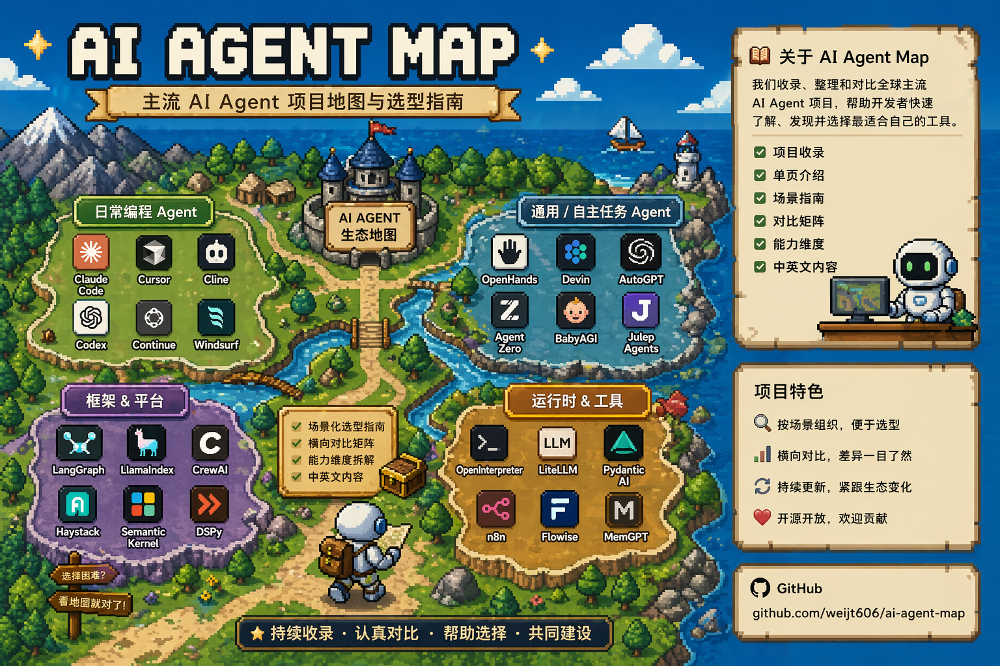
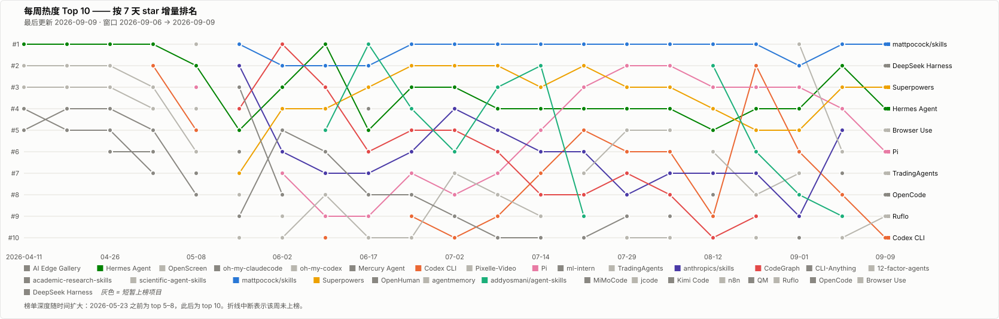
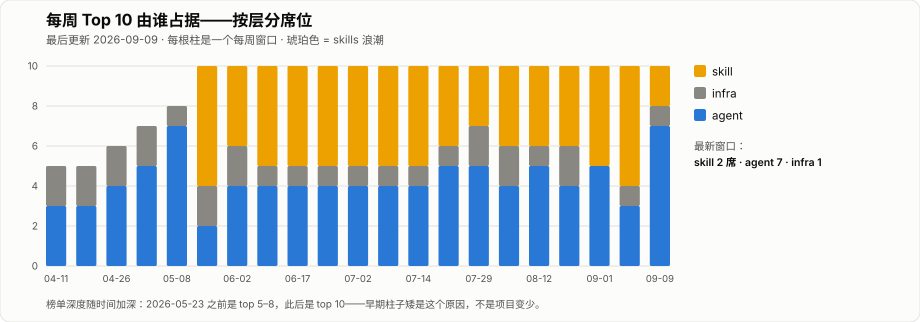
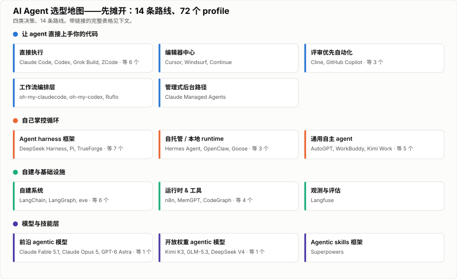

# AI Agent Map

	

AI Agent Map 是一个更偏实用、偏可视化的仓库，用来横向比较主流 AI agent、agent 平台、runtime 和 orchestration 工具。

目标很简单：帮读者更快得到一个靠谱的 shortlist。

## 这个仓库想解决什么

- agent 世界很热闹，但真正帮助选型的内容不多。
- 很多资料会讲理念，却不讲适合什么、不适合什么、代价是什么。
- 大多数人需要的是比较层，不是链接堆。

这个仓库只关注选型：它擅长什么、边界在哪、使用成本是什么。

## 从哪里开始

| 你现在的问题更像什么 | 先看哪里 |
| --- | --- |
| 我要先得到一个候选 shortlist |  |
| 我的问题是“代码自动化怎么选” |  |
| 我已经有候选，想做横向对比 |  |
| 我在意审批、记忆、调度、部署这类能力维度 |  |
| 我想看每个项目在这些维度上并排打分 | [能力矩阵](capabilities/matrix.md) |
| 我想知道跑起来到底多少钱、哪一档模型值得 | [成本 & benchmark](comparisons/cost-and-benchmarks.md) · [记忆方案](comparisons/memory-approaches.md) |
| agent 已经在跑了——我需要知道它是不是还正常 | [观测与评估](comparisons/observability-and-evals.md) |
| 我想看存量排行和每周趋势图 |  |
| 我想看问题导向的指南或全部对比页 | [用例](use-cases/README.md) · [对比](comparisons/README.md) |

## 近期热门榜

热度不等于适合度。

这张表记录的是最近一周 GitHub 快照里特别热的 agent 项目。排名按 7 天增量。下面的总 star 数是这次更新仓库时重新核对过的当前值。

> **最后更新：** 2026-08-05 · **快照窗口：** 2026-07-29 → 2026-08-05（自上次更新以来的增量，7 天，估算） · **Star 总数：** 更新时实时核对

项目名链接指向上游 GitHub 仓库。本仓库已写入的 profile，在"在本仓库中的状态"列单独给出链接。

| 排名 | 项目 | 当前 stars | 快照增量 | 在本仓库中的状态 | 应该怎么读 |
| --- | --- | --- | --- | --- | --- |
| #1&#8288;（=） | [mattpocock/skills](https://github.com/mattpocock/skills) | 204.0k | +11,136 | 候补（Skills 浪潮） | 连续第七个窗口守住 #1，而且增量还*涨*了一点——Matt Pocock 的 `.claude/skills` 个人技能集直接冲破 **20 万** |
| #2&#8288;（=） | [Pi](https://github.com/earendil-works/pi) | 83.9k | +4,263 | 已收录 · [profile](agents/pi.md) | 稳守 #2 并越过 83.9k——Earendil 接手的 harness 仍是前五里最稳的增长者 |
| #3&#8288;（=） | [Superpowers](https://github.com/obra/superpowers) | 266.9k | +4,174 | 已收录 · [profile](agents/superpowers.md) | 稳守 #3，把上窗口丢掉的增量基本收了回来——越过 266k，仍是浪潮的框架锚点 |
| #4&#8288;（=） | [Hermes Agent](https://github.com/NousResearch/hermes-agent) | 225.8k | +3,865 | 已收录 · [profile](agents/hermes-agent.md) | 连续第四个窗口稳守 #4，增量涨了四分之一——已收录项目里绝对总数第一，越过 225k |
| #5&#8288;（=） | [jcode](https://github.com/1jehuang/jcode) | 16.0k | +3,163 | 已收录 · [profile](agents/jcode.md) | 稳守 #5，一周内**长出了自身体量的四分之一**（12.8k → 16.0k）——榜上相对涨幅最快的一个 |
| #6&#8288;（=） | [Codex CLI](https://github.com/openai/codex) | 104.1k | +1,917 | 已收录 · [profile](agents/codex.md) | 稳守 #6，过 10 万后的低谷已经回弹——越过 104k |
| #7&#8288;（↑） | [anthropics/skills](https://github.com/anthropics/skills) | 166.4k | +1,558 | 候补（Skills 浪潮源头） | 升一位到 #7——Anthropic 自家参考仓库越过 166k |
| #8&#8288;（↓） | [colbymchenry/codegraph](https://github.com/colbymchenry/codegraph) | 64.7k | +1,552 | 已收录 · [profile](agents/codegraph.md) | 以 6 个 star 之差退一位到 #8——预索引代码知识图谱越过 64k |
| #9&#8288;（新） | [academic-research-skills](https://github.com/Imbad0202/academic-research-skills) | 41.0k | +1,048 | 候补（Skills 浪潮） | 缺席两个窗口后重回榜单，逼近 41k——正是它的回归让 skills 浪潮重新扩面 |
| #10&#8288;（=） | [n8n](https://github.com/n8n-io/n8n) | 199.4k | +964 | 已收录 · [profile](agents/n8n.md) | 以 **24 个 star** 之差守住最后一席，而且马上就要破 20 万——工作流自动化运行时 |

- 热度适合拿来发现新项目，不适合直接当选型顺序。
- **榜单重新加速了，而且这次的对比是干净的。** 上窗口的全面降温带着一个说明——7 天对约 8 天。本窗口是 7 天对 7 天，而前 10 里几乎每一项增量都*涨*了：[Superpowers](agents/superpowers.md) +4.2k（上次 +3.4k）、[Hermes Agent](agents/hermes-agent.md) +3.9k（上次 +3.1k）、[Codex CLI](agents/codex.md) +1.9k（上次 +1.5k）。降温大部分是算术，需求并没有降。
- **[mattpocock/skills](https://github.com/mattpocock/skills) 冲破 20 万**（204.0k，+11,136）——连续第七个窗口守住 #1，增量还略高于上窗口。一个 curated 技能目录的增量，仍然超过本表 #4 以下所有项目之和。
- **前六名一位都没动。** #1 到 #6 与上周完全相同，这在本榜上还是第一次。全部变动只发生在 #7/#8 之间 6 个 star 的对调，以及榜尾。
- **[jcode](agents/jcode.md) 是按比例涨得最猛的**：+3,163 到 16.0k，等于七天里长出了自身体量的约四分之一，增量比上窗口高 47%。从候补转正两周，这个决策看来是对的。
- **[Grok Build](agents/grok-build.md) 交出第一个可比的 7 天增量——差 24 个 star 没进榜**（+940 到 24.2k）。诚实地读：在 15 天拿下 23.2k 之后，一周 940 是**急剧**减速，而这正是厂商发布的尖峰过去后的正常形态。这个 profile 立得住是靠它本身，不是靠首秀。
- **最后一席又是抛硬币，而且比上周更险。** [n8n](agents/n8n.md) 以 +964 守住 #10，压过 [addyosmani/agent-skills](https://github.com/addyosmani/agent-skills) 的 +945 和 Grok Build 的 +940——三个项目挤在 24 个 star 之内。上窗口这个差距是 8 个 star。#10 请当作噪声看，前六名才是信号。
- **新收录决策：新增三个 profile。** **[QM](agents/qm.md)**（`yc-software/qm`，TypeScript，MIT）是本窗口的爆发项——Y Combinator 的*多人协作* agent harness，上线七天拿到约 11.4k star、1.3k fork。它带着一个真正新的角度进入 harness 路线：基本单位是"作用域"（一个人、一个频道、一个项目），各自拥有记忆、文件、keychain、权限、cron 和常驻沙箱，而底下的 core 可以互换地跑 [Pi](agents/pi.md)、OpenCode、[Codex](agents/codex.md) 或 [Claude Code](agents/claude-code.md)。注意它的治理——贡献只接受人写的提案，不收代码。**[Omnigent](agents/omnigent.md)**（`omnigent-ai/omnigent`，Python，Apache-2.0，8.1k）是同一个元 harness 思路，但面向单个开发者而不是一家公司，并且自己标了 **alpha**。**[Open Code Review](agents/open-code-review.md)**（`alibaba/open-code-review`，Go，Apache-2.0，19.0k）是补漏而不是本窗口事件——阿里 5 月把内部跑了两年的评审助手开源，本地图此前漏收；它主张代码评审应该是一个专门的 agent，用召回换准确。加入候补：[cobusgreyling/loop-engineering](https://github.com/cobusgreyling/loop-engineering)（9.9k）、[Vincentwei1021/video-shotcraft](https://github.com/Vincentwei1021/video-shotcraft)（3.6k）、[Sahir619/fable-method](https://github.com/Sahir619/fable-method)（2.1k）。

更多窗口笔记：skills 浪潮占比、OpenClaw、以及榜外仍在涨的项目

- `.claude/skills` 浪潮**重新扩面到前 10 的 4 个**（`mattpocock/skills`、`Superpowers`、`anthropics/skills`、`academic-research-skills`），终结了连续两个窗口的收窄（5/10 → 4/10 → 3/10 → 4/10）。上周"正在集中"的解读下得太早了：真实发生的是榜尾的轮换，而不是浪潮在缩小。策略不变：curated 集合作为 Skills 浪潮条目跟踪，框架那一端通过 [Superpowers](agents/superpowers.md) 覆盖。
- 刚好卡在榜外：[addyosmani/agent-skills](https://github.com/addyosmani/agent-skills) 81.7k（+945）和 [Grok Build](agents/grok-build.md) 24.2k（+940），两个都在距最后一席 24 个 star 之内。[Kimi Code](agents/kimi-code.md) 从 #9 掉出榜单，6.1k（+529）。[TradingAgents](https://github.com/TauricResearch/TradingAgents) 到 95.7k（+783），作为金融研究垂直仍不收录。
- [OpenClaw](agents/openclaw.md) 仍是绝对总数第一，385.2k star（+0.8k）；它已有 profile，但因为这种体量的项目周环比增量噪声太大，不进按增量排名的表。
- **[Langfuse](agents/langfuse.md) 本窗口纳入跟踪，32.6k。** 它上周已写 profile 但尚未纳入轮询，所以没有增量数字；第一个真实增量下周给出。本窗口新写的三个 profile（[QM](agents/qm.md)、[Omnigent](agents/omnigent.md)、[Open Code Review](agents/open-code-review.md)）同理。
- 本周仍在涨但没进前 10（按增量）：[Claude Code](agents/claude-code.md) 140.3k（+0.9k）、[TradingAgents](https://github.com/TauricResearch/TradingAgents) 95.7k（+0.8k）、[OpenHands](agents/openhands.md) 83.2k（+0.7k）、[Ruflo](agents/ruflo.md) 67.1k（+0.7k）、[scientific-agent-skills](https://github.com/K-Dense-AI/scientific-agent-skills) 32.7k（+0.7k）、[LiteLLM](agents/litellm.md) 55.6k（+0.7k）、[LangChain](agents/langchain.md) 143.5k（+0.7k）、[agentmemory](https://github.com/rohitg00/agentmemory) 26.6k（+0.6k）、[LangGraph](agents/langgraph.md) 38.9k（+0.6k）、[Cline](agents/cline.md) 65.7k（+0.5k）、[Goose](agents/goose.md) 52.3k（+0.5k）、[openhuman](agents/openhuman.md) 36.0k（+0.4k）、[CLI-Anything](agents/cli-anything.md) 46.6k（+0.4k）、[CrewAI](agents/crewai.md) 56.6k（+0.4k）、[CodeWhale](agents/codewhale.md) 40.5k（+0.3k）、[MiMoCode](agents/mimocode.md) 12.6k（+0.1k）、[CoStrict](agents/costrict.md) 4.3k（+21，基本持平）。

### 排名趋势

每周 Top 10 自开始追踪以来的名次变化——一条折线一个项目，折线中断表示该周掉出榜单：

  

同样的窗口按"每层占几席"来读——就是每周叙事里那条 skills 浪潮故事的量化版：

  

按类别的完整存量排行——Agent 榜、Agent 基础设施榜、Skill 榜及各自的垂类榜，按 star 总量排序——见 [rankings/](rankings/README.md)。

## 榜单之外

热度告诉你该看什么。这四页告诉你该选什么：

- **[能力矩阵](capabilities/matrix.md)** —— 每个项目在九个统一[能力维度](capabilities/README.md)上并排打分（●/◐/○/—），按路线分组。回答"就这项能力而言，谁把它当核心强项"。
- **[成本 & benchmark](comparisons/cost-and-benchmarks.md)** —— 前沿模型能力 vs 每 token 价格，加上每个编码 agent 实际怎么收费。模型层分档按量之后，"这个任务用哪一档"就是选型决策本身。
- **[记忆方案对比](comparisons/memory-approaches.md)** —— "有记忆"这句话背后的六种不同含义，从自编辑存储到被动语义召回，以及你要持久化什么就该选哪种。
- **[观测与评估](comparisons/observability-and-evals.md)** —— 上面这一切之下的那一层：agent 一旦无人值守地跑起来，故障就不再长得像崩溃，而是长得像静默的质量漂移。对比 [Langfuse](agents/langfuse.md)、Opik、Phoenix、Helicone、LangSmith 等——并理清这个领域里"开源"的四种不同含义。

## 市场脉搏

当下影响选型的三条结构性主线——完整的日期与来源档案见[市场事件](market-events.md)：

- **`.claude/skills` 浪潮持续复利**（2026-05 起）：curated skill 合集和 skills 框架已连续两个月占据每周热度前 10 的约一半。很多任务里技能层已经和底层 agent 同样重要。本仓库通过 [Superpowers](agents/superpowers.md) 覆盖框架端，合集则在 [Skill 垂类榜](rankings/skill-verticals.md)里追踪。
- **模型层变成预算决策**：Anthropic 的 Mythos 级 [Claude Fable 5](agents/claude-fable-5.md)（6 月 9 日）位于 Opus 4.8 之上、按额度计费；OpenAI 的 GPT-5.6（7 月 9 日）分三个价格档——两侧都把"这个任务买哪一档智能"变成了 agent 选型的一部分。春季参照点：[GPT-5.5](agents/gpt-5.5.md)。
- **产品边界在向上坍缩**：OpenAI 把 Codex 并入 ChatGPT 应用（7 月 9 日）——OpenAI 侧的"选哪个 coding agent"正在变成"你怎么用 ChatGPT"。详见 [Codex](agents/codex.md)。

## 先把地图摊开

  

| 路线 | 代表项目 | 常见使用者 |
| --- | --- | --- |
| 直接执行型 | [Claude Code](agents/claude-code.md), [Aider](agents/aider.md), [Codex](agents/codex.md), [Kimi Code](agents/kimi-code.md), [MiMoCode](agents/mimocode.md), [CodeWhale](agents/codewhale.md), [Grok Build](agents/grok-build.md), [Devin](agents/devin.md), [Jules](agents/jules.md) | 想把明确 coding 任务交给 agent 的人（见[终端编码 CLI 对比](comparisons/coding-cli-agents.md)） |
| Agent harness 框架 | [Pi](agents/pi.md), [jcode](agents/jcode.md), [OpenHands](agents/openhands.md), [SWE-agent](agents/swe-agent.md), [mini-swe-agent](agents/mini-swe-agent.md), [OpenHarness](agents/openharness.md), [QM](agents/qm.md), [Omnigent](agents/omnigent.md) | 想自己掌控 agent loop、工具表面和权限，而不是直接接受厂商成品的人——QM 和 Omnigent 把这条推到"在一层之下同时跑*多个* harness"（见 [harness 框架对比](comparisons/agent-harness-frameworks.md)） |
| 前沿 agentic 模型 | [Claude Fable 5](agents/claude-fable-5.md), [GPT-5.5](agents/gpt-5.5.md) | 在选要接入自己 agent 系统的模型，或在评估 Anthropic / OpenAI 系 agent 能力上限的人 |
| Agentic skills 框架 | [Superpowers](agents/superpowers.md) | 想要一套方法论 + 可组合 skills 层、能接到 Claude Code、Codex、Cursor 等 agent 之上的人 |
| 工作流 / orchestration layer | [oh-my-claudecode](agents/oh-my-claudecode.md), [oh-my-codex](agents/oh-my-codex.md), [Ruflo](agents/ruflo.md) | 已经认可 Claude Code 或 Codex，只想在上面补强 orchestration 的人（Ruflo 把这条进一步推到跨机器联邦和 100+ 专用 agent） |
| 编辑器中心工作流 | [Cursor](agents/cursor.md), [Windsurf](agents/windsurf.md), [Continue](agents/continue.md) | 想让编辑器本身保持在工作流核心的人 |
| review-first 自动化 | [Cline](agents/cline.md), [GitHub Copilot](agents/github-copilot.md), [Froge Code](agents/froge-code.md), [CoStrict](agents/costrict.md), [Open Code Review](agents/open-code-review.md) | 想把 review 和人工控制留在核心的人（CoStrict 加了企业严格流程 + 私有化部署；Open Code Review 只做评审，为 CI 里的准确率调优） |
| 管理式后台路径 | [Claude Managed Agents](agents/claude-managed-agents.md) | 需要 Anthropic 的定时、云端或后台工作流的人 |
| 通用自主 agent | [AutoGPT](agents/autogpt.md), [Agent Zero](agents/agent-zero.md), [BabyAGI](agents/babyagi.md), [Julep](agents/julep.md), [GenericAgent](agents/generic-agent.md), [ml-intern](agents/ml-intern.md) | 想要通用自主任务执行的人（ml-intern 是 ML 工程取向的特化版本） |
| 自建系统 | [LangChain](agents/langchain.md), [LangGraph](agents/langgraph.md), [CrewAI](agents/crewai.md), [LlamaIndex](agents/llamaindex.md), [Haystack](agents/haystack.md), [Semantic Kernel](agents/semantic-kernel.md), [DSPy](agents/dspy.md), [Pydantic AI](agents/pydantic-ai.md) | 想自己搭 agent 平台的团队 |
| 运行时 & 工具 | [n8n](agents/n8n.md), [MemGPT](agents/memgpt.md), [Open Interpreter](agents/open-interpreter.md), [LiteLLM](agents/litellm.md), [Flowise](agents/flowise.md), [CodeGraph](agents/codegraph.md), [CLI-Anything](agents/cli-anything.md) | 需要工作流自动化、代码执行、LLM 网关、agent 上下文基础设施、agent 驱动 CLI 或可视化构建器的团队 |
| 观测与评估 | [Langfuse](agents/langfuse.md) | agent 已经跑在生产上，需要知道它做了什么、花了多少、质量有没有漂移的人（见[观测与评估](comparisons/observability-and-evals.md)） |
| 自托管 / 本地 runtime | [AI Edge Gallery](agents/ai-edge-gallery.md), [Goose](agents/goose.md), [Hermes Agent](agents/hermes-agent.md), [OpenClaw](agents/openclaw.md), [Mercury Agent](agents/mercury-agent.md), [OpenHuman](agents/openhuman.md) | 需要端侧隐私、长期运行、本地控制、渠道、设备或个人数据生活集成能力的人 |

## 当前已覆盖的主流项目

已收录 60 个项目，按形态分组。展开任意一组，或到 [agents/](agents/README.md) 浏览完整的路线表与覆盖表。

<strong>编码 agent、编辑器与编排</strong>（27 个）

| 项目 | 路线 | 一句话定位 |
| --- | --- | --- |
| [Aider](agents/aider.md) | 直接执行 | 终端优先、贴近 git 的 AI 结对编程 |
| [Claude Code](agents/claude-code.md) | 直接执行 | 本地和 IDE 优先的 coding agent |
| [Claude Managed Agents](agents/claude-managed-agents.md) | 管理式后台路径 | Anthropic 管理式 / 云端执行工作流映射 |
| [Codex](agents/codex.md) | 直接执行 | ChatGPT 应用内的 coding agent，支持异步云端委派 |
| [oh-my-claudecode](agents/oh-my-claudecode.md) | 工作流层 | Claude Code 之上的 teams-first orchestration layer |
| [oh-my-codex](agents/oh-my-codex.md) | 工作流层 | 为 Codex CLI 增强工作流、teams 和持久状态 |
| [Cursor](agents/cursor.md) | 编辑器中心平台 | 覆盖本地编码、云端 agent 和集成的 AI 编辑器 |
| [GitHub Copilot](agents/github-copilot.md) | 平台 | VS Code + GitHub 里的多表面 agent 平台 |
| [Cline](agents/cline.md) | review-first 执行 | 编辑器内 approval-first coding agent |
| [Windsurf](agents/windsurf.md) | AI 原生 IDE | 以 Cascade 为中心的 AI IDE |
| [OpenHands](agents/openhands.md) | 开源执行 | 开源 AI 软件工程 agent |
| [Devin](agents/devin.md) | 托管执行 | 端到端软件工程执行 |
| [Jules](agents/jules.md) | 托管云端执行 | GitHub 连接、PR 回收的 coding delegation |
| [Continue](agents/continue.md) | 编辑器中心 | 支持自选模型的开源 IDE 扩展 |
| [Froge Code](agents/froge-code.md) | review-first 自动化 | 当前按 Automagik Genie 暂定映射 |
| [Pi](agents/pi.md) | 直接执行 | 极简终端 coding agent harness，多 LLM provider 支持 |
| [jcode](agents/jcode.md) | Agent harness 框架 | Rust 多会话 coding harness——启动最快、provider 中立 OAuth、被动语义记忆 |
| [CodeWhale](agents/codewhale.md) | 直接执行 | DeepSeek + MiMo 终端 coding agent（原 DeepSeek-TUI） |
| [Kimi Code](agents/kimi-code.md) | 直接执行 | Moonshot AI 官方、Kimi 原生的终端 coding CLI（kimi-cli 继任者） |
| [MiMoCode](agents/mimocode.md) | 直接执行 | 小米官方的 MiMo 终端 coding agent，内置跨会话记忆 |
| [Grok Build](agents/grok-build.md) | 直接执行 | SpaceXAI 官方的 Rust 终端 coding agent——全屏 TUI、headless CI 模式、ACP 编辑器服务 |
| [CoStrict](agents/costrict.md) | review-first 自动化 | Cline 血统的企业 coding agent，含严格标准化流程、AI 代码评审、私有化部署 |
| [SWE-agent](agents/swe-agent.md) | Agent harness 框架 | Princeton + Stanford 的 SWE-bench 原始 harness，single-YAML 配置 |
| [mini-swe-agent](agents/mini-swe-agent.md) | Agent harness 框架 | SWE-agent 的 ~100 行 Python 接班版，SWE-bench Verified 仍 >74% |
| [OpenHarness](agents/openharness.md) | Agent harness 框架 | HKUDS 的 10 子系统开源 agent harness，43+ 工具、兼容 anthropics/skills、支持 MCP |
| [Omnigent](agents/omnigent.md) | Agent harness 框架 | 元 harness——在一个会话里混用 Claude Code、Codex、Cursor、OpenCode、Hermes、Pi，带策略与云沙箱 |
| [Open Code Review](agents/open-code-review.md) | review-first 自动化 | 阿里的准确率优先代码评审 CLI——模型外面包确定性流水线，带 CI 与 agent 插件表面 |

<strong>自主与自托管 agent</strong>（14 个）

| 项目 | 路线 | 一句话定位 |
| --- | --- | --- |
| [AI Edge Gallery](agents/ai-edge-gallery.md) | 端侧本地 runtime | 带 agent skills 的移动端本地 assistant 沙盒 |
| [Goose](agents/goose.md) | 开源本地平台 | 跨 desktop、CLI、API 的可扩展本地 agent |
| [Hermes Agent](agents/hermes-agent.md) | 多 agent / 自托管 | 带 memory、skills、gateway 的长期工作环境 |
| [OpenClaw](agents/openclaw.md) | runtime | 多渠道、多设备、本地优先运行层 |
| [AutoGPT](agents/autogpt.md) | 自主 agent 平台 | 可视化 agent 构建器，带工作流、市场和多模型支持 |
| [Agent Zero](agents/agent-zero.md) | 自主 agent | 自构建自主 agent，动态创建工具 |
| [BabyAGI](agents/babyagi.md) | 实验性 | 开创性自主 agent 实验——教学用，非生产 |
| [Open Interpreter](agents/open-interpreter.md) | 运行时 | 自然语言到本地代码执行，无沙盒 |
| [Mercury Agent](agents/mercury-agent.md) | 自托管多通道 | 主打 CLI + Telegram 的权限硬化 agent，带 token 预算 |
| [ml-intern](agents/ml-intern.md) | 垂直领域自主 agent | Hugging Face 的自主 ML 工程师——基于 HF 生态做研究、写代码、发布 ML 成果 |
| [GenericAgent](agents/generic-agent.md) | 自演进自主 agent | 从小种子起步、每完成任务长出 skill tree 的自主 agent |
| [OpenHuman](agents/openhuman.md) | 自托管 / 本地 runtime | 桌面生活集成 agent，118+ 连接器、本地 Memory Tree、支持 Ollama |
| [Julep](agents/julep.md) | 工作流引擎 | Temporal 支撑的持久化有状态 AI agent 工作流引擎 |
| [QM](agents/qm.md) | Agent harness 框架 | Y Combinator 的多人协作 agent，跑在 Slack 和 web——按人和按房间分作用域、自托管、harness 无关 |

<strong>框架与基础设施</strong>（16 个）

| 项目 | 路线 | 一句话定位 |
| --- | --- | --- |
| [LangChain](agents/langchain.md) | 平台 | 快速搭自定义 agent 的高层框架 |
| [LangGraph](agents/langgraph.md) | 平台 | 搭持久化、有状态 agent workflow 的底层框架 |
| [CrewAI](agents/crewai.md) | 多 agent 框架 | 角色型 agent 协作，快速搭原型 |
| [LlamaIndex](agents/llamaindex.md) | 数据优先框架 | 基于文档和数据的 RAG 与 agentic 应用 |
| [n8n](agents/n8n.md) | 工作流自动化 | 带原生 AI agent 节点和 400+ 集成的可视化工作流平台 |
| [MemGPT](agents/memgpt.md) | 有状态 agent 平台 | 跨会话学习的持久记忆 agent（现名 Letta） |
| [Haystack](agents/haystack.md) | 框架 | deepset 的生产导向 RAG 和 agent 框架 |
| [Semantic Kernel](agents/semantic-kernel.md) | 框架 | 微软的 AI 编排 SDK，支持 .NET、Python、Java |
| [DSPy](agents/dspy.md) | 框架 | 程序化 prompt 优化——编程而非手调 LM |
| [LiteLLM](agents/litellm.md) | 基础设施 | 100+ LLM provider 的统一 API 网关 |
| [Langfuse](agents/langfuse.md) | 基础设施 | 开源的 agent 观测、评估与 prompt 管理（观察 agent，不运行 agent） |
| [Pydantic AI](agents/pydantic-ai.md) | 框架 | 类型安全 Python agent 框架，结构化输出 |
| [Flowise](agents/flowise.md) | 可视化构建器 | 基于 LangChain 的拖拽式 LLM 应用和 agent 构建器 |
| [Ruflo](agents/ruflo.md) | 工作流 / orchestration layer | 面向 Claude 的多 agent 编排平台，支持跨机器联邦、神经记忆和 100+ 专用 agent |
| [CodeGraph](agents/codegraph.md) | 运行时 & 工具 | 为 Claude Code、Cursor、Codex CLI、opencode、Hermes Agent 提供预索引的代码知识图谱 + MCP server |
| [CLI-Anything](agents/cli-anything.md) | 运行时 & 工具 | 为任意软件自动生成 Click CLI，让 agent 能驱动没有 API 的应用 |

<strong>模型与技能</strong>（3 个）

| 项目 | 路线 | 一句话定位 |
| --- | --- | --- |
| [Claude Fable 5](agents/claude-fable-5.md) | 前沿 agentic 模型 | Anthropic 的 Mythos 级前沿模型——Claude 系 agent 在 Opus 之上的能力天花板 |
| [GPT-5.5](agents/gpt-5.5.md) | 前沿 agentic 模型 | OpenAI 2026 春季的 agentic 模型（7 月已由 GPT-5.6 接棒） |
| [Superpowers](agents/superpowers.md) | Agentic skills 框架 | 一整套方法论 + 可组合 skills 层，可接到 Claude Code、Codex、Cursor 等 agent 之上 |

## 可以这样开始

如果还不确定从哪里切入，可以先按这些示意路径读一轮，再按自己的场景分支出去。

| 如果你更像这样 | 推荐阅读路径 | 这条路径会帮你回答什么 |
| --- | --- | --- |
| 我想找一个日常 coding agent，但还没想清楚终端还是编辑器 | [Aider](agents/aider.md) → [Claude Code](agents/claude-code.md) → [终端编码 CLI 对比](comparisons/coding-cli-agents.md) → [Cursor](agents/cursor.md) → [Cline](agents/cline.md) → [use-cases/coding-automation.md](use-cases/coding-automation.md) | 哪个厂商 CLI 配你的模型、终端优先 vs 编辑器中心 vs 强审批控制怎么取舍 |
| 我已经喜欢 Claude Code 或 Codex，但想补强 orchestration | [Claude Code](agents/claude-code.md) → [oh-my-claudecode](agents/oh-my-claudecode.md) → [Codex](agents/codex.md) → [oh-my-codex](agents/oh-my-codex.md) → [comparisons/mainstream-agent-landscape.md](comparisons/mainstream-agent-landscape.md) | 底层 agent 够不够用，什么时候值得再加一层工作流 |
| 我想搞清楚 2026 模型竞赛怎么改变 agent 选型 | [Claude Fable 5](agents/claude-fable-5.md) → [GPT-5.5](agents/gpt-5.5.md) → [Codex](agents/codex.md) → [Claude Code](agents/claude-code.md) → [市场事件](market-events.md) | 前沿模型分档（Mythos、GPT-5.6）怎样抬高能力天花板，又怎样影响产品选型 |
| 我想要专用 AI IDE，而不是继续拼装工具 | [Cursor](agents/cursor.md) → [Windsurf](agents/windsurf.md) → [GitHub Copilot](agents/github-copilot.md) → [comparisons/mainstream-agent-landscape.md](comparisons/mainstream-agent-landscape.md) | AI 原生编辑器和生态型平台怎么区分 |
| 我想把 ticket 交出去，过一会儿再回来验收 | [Codex](agents/codex.md) → [Jules](agents/jules.md) → [Devin](agents/devin.md) → [Claude Managed Agents](agents/claude-managed-agents.md) → [comparisons/mainstream-agent-landscape.md](comparisons/mainstream-agent-landscape.md) | 异步云端委派和管理式后台自动化有什么差别 |
| 我需要开源、自托管或者更强本地控制面 | [Aider](agents/aider.md) → [OpenHands](agents/openhands.md) → [Goose](agents/goose.md) → [Hermes Agent](agents/hermes-agent.md) → [capabilities](capabilities/README.md) | 终端控制、开源执行和本地运行控制面的取舍 |
| 我不是买产品，而是要搭自己的 agent 体系 | [LangChain](agents/langchain.md) → [LangGraph](agents/langgraph.md) → [capabilities](capabilities/README.md) → [comparisons/mainstream-agent-landscape.md](comparisons/mainstream-agent-landscape.md) | framework、runtime、product 三者边界怎么分 |

## 免责声明

表格里的 star 数和 7 天增量，都是仓库更新时点抓取的 GitHub 快照；不同周次之间会出现波动，少量取整误差也是正常的。每个项目的描述、厂商和能力总结，反映的是写作时点的公开信息，可能因项目演进、被收购、转型而过时。本仓库提供的是**选型参考**，不是背书、不是投资建议、也不是生产可用性保证。最终决策前请以各项目自己的官方文档为准。