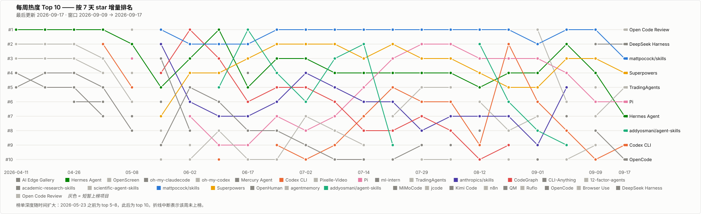
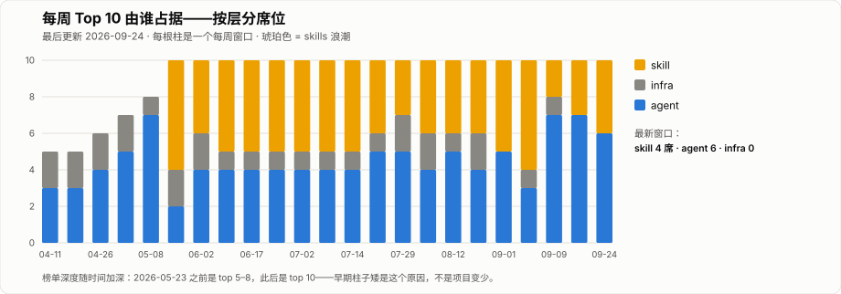
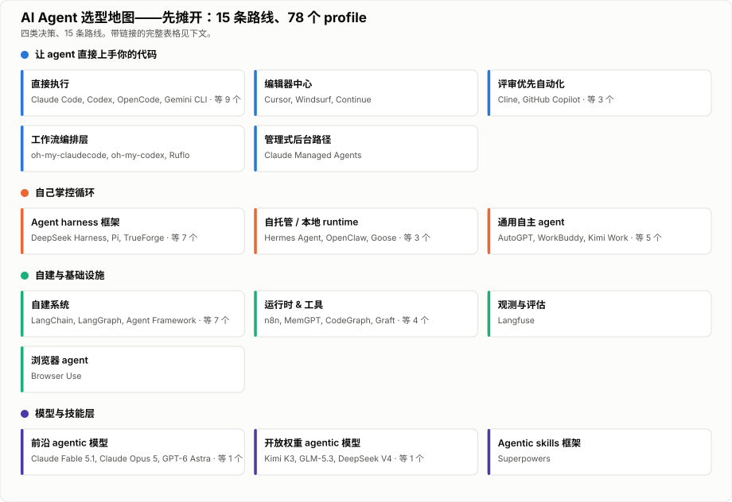

# AI Agent Map

	

AI Agent Map 是一个更偏实用、偏可视化的仓库，用来横向比较主流 AI agent、agent 平台、runtime 和 orchestration 工具。

目标很简单：帮读者更快得到一个靠谱的 shortlist。

## 这个仓库想解决什么

- agent 世界很热闹，但真正帮助选型的内容不多。
- 很多资料会讲理念，却不讲适合什么、不适合什么、代价是什么。
- 大多数人需要的是比较层，不是链接堆。

这个仓库只关注选型：它擅长什么、边界在哪、使用成本是什么。

## 从哪里开始

| 你现在的问题更像什么 | 先看哪里 |
| --- | --- |
| 我要先得到一个候选 shortlist |  |
| 我的问题是"代码自动化怎么选" |  |
| 我已经有候选，想做横向对比 |  |
| 我在意审批、记忆、调度、部署这类能力维度 |  |
| 我想看每个项目在这些维度上并排打分 |  |
| 我想知道跑起来到底多少钱、哪一档模型值得 |   |
| agent 已经在跑了——我需要知道它是不是还正常 |  |
| 我想看存量排行和每周趋势图 |  |
| 我想看问题导向的指南或全部对比页 |   |

## 近期热门榜

热度不等于适合度。

这张表记录的是最近一周 GitHub 快照里特别热的 agent 项目。排名按 7 天增量。下面的总 star 数是这次更新仓库时重新核对过的当前值。

> **最后更新：** 2026-10-07 · **快照窗口：** 2026-09-30 → 2026-10-07（自上次更新以来的增量，**7 天**，上一个窗口是 6 天，两列原始增量不可直接比较；下面所有判断一律按**周率**讲）· **star 数：** 更新时点抓取

项目名链接指向上游 GitHub 仓库。本仓库已写入的 profile，在"在本仓库中的状态"列单独给出链接。

| 排名 | 项目 | 当前 stars | 快照增量 | 在本仓库中的状态 | 应该怎么读 |
| --- | --- | --- | --- | --- | --- |
| #1&#8288;（↑） | [mattpocock/skills](https://github.com/mattpocock/skills) | 278.5k | +6,506 | 候补（Skills 浪潮） | **重回 #1**，是它在 25 个记录窗口里的第 13 个 #1，周率涨 **57%**——自 09-06 以来连续四次放缓之后的第一次加速。越过 **27.5 万**，领先 #2 共 1,626 |
| #2&#8288;（↓） | [DeepSeek Harness](https://github.com/deepseek-ai/deepseek-harness) | 244.8k | +4,880 | 已收录 · [profile](agents/deepseek-harness.md) | 它的 #1 只坐了一个窗口。周率降 **26%**，是它五个可测窗口里最低的，也是连续第三次放缓。越过 **24 万** |
| #3&#8288;（↑） | [Superpowers](https://github.com/obra/superpowers) | 296.1k | +3,175 | 已收录 · [profile](agents/superpowers.md) | 周率涨 20%，是 09-17 以来第一次加速。越过 **29.5 万** |
| #4&#8288;（↑） | [Pi](https://github.com/earendil-works/pi) | 113.1k | +2,672 | 已收录 · [profile](agents/pi.md) | 在发布 **v1.0.0**（10 月 1 日）的这个窗口周率涨 **56%**，把上期 30% 的跌幅全部涨了回来还有富余，连坐四期 #6 就此结束。自 09-06 以来第一次回到 #4 |
| #5&#8288;（↑） | [addyosmani/agent-skills](https://github.com/addyosmani/agent-skills) | 102.3k | +2,343 | 候补（Skills 浪潮） | **越过 10 万**（102,252），周率涨 68% |
| #6&#8288;（↓） | [Hermes Agent](https://github.com/NousResearch/hermes-agent) | 251.8k | +1,719 | 已收录 · [profile](agents/hermes-agent.md) | 周率降 11%，是自 09-06 峰值以来连续第五次放缓。**25 个记录窗口全勤**，仍是唯一一个一次都没缺席的项目 |
| #7&#8288;（↓） | [Open Code Review](https://github.com/alibaba/open-code-review) | 44.1k | +1,533 | 已收录 · [profile](agents/open-code-review.md) | 周率降 **45%**，连续第三次放缓。它没有像上期看起来那样在约 2,800/周附近走平；现在约为上 Trending 前约 370/周的 4 倍 |
| #8&#8288;（新） | [OpenHuman](https://github.com/tinyhumansai/openhuman) | 41.5k | +1,326 | 已收录 · [profile](agents/openhuman.md) | 自 09-01 以来第一次回到榜上——25 个窗口里的第四个席位——周率约为上期约 112/周的 **12 倍**，是 09-01 以来最快的。**原因查不到**：9 月 30 日发了一个版本（v0.64.10），仓库描述也改成了"agent harness"，但两者都解释不了一周 12 倍。它上一次尖峰（08-27 → 09-01）在一个窗口之后就没了 |
| #9&#8288;（↓） | [OpenCode](https://github.com/anomalyco/opencode) | 212.1k | +1,183 | 已收录 · [profile](agents/opencode.md) | 周率降 18%，是它自第一个可测窗口以来连续第四次放缓 |
| #10&#8288;（新） | [Claude Code](https://github.com/anthropics/claude-code) | 149.7k | +1,084 | 已收录 · [profile](agents/claude-code.md) | 继 09-24 之后它的第二个前十席位。周率涨 19% 到约 1,084/周，略高于 Opus 5.5 之前那几个窗口 610–1,030 的区间——它拿到席位，主要是因为 #10 的门槛降到了它这里。距 15 万还差 327 |

- 热度适合拿来发现新项目，不适合直接当选型顺序。
- **本窗口 7 天，上一个窗口 6 天。** 两列原始增量不能直接比，所以下面每条判断都按**周率**讲（本期就是表里的增量；上期为增量 ÷ 6 × 7）。
- **全榜略微回暖：55 个可测仓库里 17 个加速、38 个放缓**（上期是 13 与 42）。前十里有六个提速，上期只有一个。但 #10 的门槛还是降了，从 1,166 降到 1,084——前者是 6 天、后者是 7 天，按周率是从约 1,360 降到约 1,084。
- **[mattpocock/skills](https://github.com/mattpocock/skills) 只让出一个窗口就拿回了 #1**，周率是 09-06 以来最快的。这是它在 25 个记录窗口里的第 13 个 #1。它的增量也是四个窗口以来第一次超过其他通用集合之和——只多 **9 个 star**（+6,506，对 Superpowers +3,175、addyosmani +2,343、anthropics/skills +979，合计 6,497），名义上是超过，实际上就是打平。
- **[DeepSeek Harness](agents/deepseek-harness.md) 的 #1 没有扛过第二个窗口。** 上期本榜说这个位置是落到它头上的，不是它抢来的；它离开的方式也一样——周率降 26% 到约 4,880/周，是它五个可测窗口里最低的，也是自 09-17 约 8,800 的峰值以来连续第三次放缓。它仍排 #2，仍是每周约 4,900。
- **上期留下的几个悬念，答案方向一致：向下。** [anthropics/financial-services](https://github.com/anthropics/financial-services) 降 **56%** 到约 661/周，掉出榜外排第 17——仍是旧基线（约 105/周）的约 6 倍，所以尖峰是在消退，还没消失。[CLI-Anything](agents/cli-anything.md) 翻三倍的周率还回 **49%**（约 1,265 → 约 651/周，第 18），所以它确实是尖峰，和本榜"单窗口按尖峰处理"的规矩一致。[Open Code Review](agents/open-code-review.md) 没有像上期看起来那样在约 2,800/周附近走平，又降了 45%，掉到 #7。
- **[OpenHuman](agents/openhuman.md) 是本窗口的尖峰。** 它从每周约 112 涨到 1,326——约 12 倍——离榜五个窗口后回到 #8。没有任何有据可查的原因：9 月 30 日有一个版本、仓库给自己换了"agent harness"的描述，没有 Hacker News 帖子，issue/PR 活跃度反而比上周低。fork 数在 10 月 6 日跳升，而且分布在全天各个时段，看起来像是某个榜单而不是单个帖子——这是推断，不是查实的结论。本榜的单窗口规矩完全适用，而且 OpenHuman 有前科：它 08-27 → 09-01 那次尖峰，下一个窗口就还回了 84%。
- **[Claude Code](agents/claude-code.md) 回到 #10**，第二个席位。和第一次（09-24，Opus 5.5 发布的那个窗口）不同，这次没有对应的发布尖峰：周率涨 19%，略高于它在 Opus 5.5 之前的区间。应当读成 #10 的门槛降到了它这里，而不是新的基线。
- skills 浪潮从 5 席降到 **3/10**（#1、#3、#5）——两个 `anthropics/*` 集合都离开了榜单：anthropics/skills 降 28%、与人并列第 11，financial-services 如上所述在消退。留下的三个，正是自 6 月以来一直撑着这波浪潮的三个通用集合：[mattpocock](https://github.com/mattpocock/skills)、[Superpowers](agents/superpowers.md)、[addyosmani](https://github.com/addyosmani/agent-skills)。
- **默认模型安静的一周，[Pi](agents/pi.md) 发版的一周。** 本窗口没有任何被跟踪的编码 agent 换默认模型（核过：[Claude Code](agents/claude-code.md) `2.1.285`–`2.1.292`、[Codex CLI](agents/codex.md) `rust-v0.160.0`/`.1`、[Gemini CLI](agents/gemini-cli.md) `v0.63.0`、[OpenCode](agents/opencode.md) `v1.18.35`），9 月那一连四次就此打住。Haiku 5.5 仍未发布。Google 于 9 月 30 日发布 **Gemini 4 Argon**，首发价 **$2 / $10**（之后 $4 / $20），但目前只对 Google 的网安防御者计划开放，所以在能买到之前只记进 [market-events](market-events.md)，不进成本表。Pi 于 **10 月 1 日发布 v1.0.0**——默认全屏 TUI，按它的发布说明 codemode 的 prompt token 少了约 40%——正是它周率涨 56% 的这个窗口。
- **待翻正条目：[ZCode](agents/zcode.md) 已进入跟踪**，起点 **7,487** star（`zai-org/ZCode`，9 月 20 日开源），第一个可测增量下期出现。**[Graft](agents/graft.md) 的第一个可测周增量是 +240**（9.6k）。
- 本窗口的里程碑（按原始整数核过，不看四舍五入那一列）：mattpocock/skills 越过 **27.5 万**，DeepSeek Harness **24 万**，Superpowers **29.5 万**，addyosmani/agent-skills **10 万**，[TradingAgents](https://github.com/TauricResearch/TradingAgents) **11 万**，[LiteLLM](agents/litellm.md) **6 万**，[Goose](agents/goose.md) **5.5 万**，[academic-research-skills](https://github.com/Imbad0202/academic-research-skills) **5 万**。两个差一点的：[anthropics/skills](https://github.com/anthropics/skills) 表里显示 180.0k，实际**还差 27 个**（179,973）；Claude Code 距 15 万还差 327。
- [OpenClaw](agents/openclaw.md) 仍是绝对总数第一，391.5k star（+738，周率涨 41%）；它已有 profile，但因为这种体量的项目周环比增量噪声太大，不进按增量排名的表。

更多窗口笔记：skills 浪潮占比、OpenClaw、以及榜外仍在涨的项目

- `.claude/skills` 浪潮**拿下前十里的三席**，比上期少两席：#1、#3、#5。三个都是通用集合；本窗口榜上没有任何厂商集合或垂直集合。[mattpocock/skills](https://github.com/mattpocock/skills) 的 +6,506 比其他通用集合之和（Superpowers +3,175、addyosmani +2,343、anthropics/skills +979，合计 6,497）多 9 个 star——这是 09-09 以来"一个目录就是整波浪潮"这个旧判断第一次在算术上成立，但差距太小，谈不上反转。政策不变：策展型集合按 Skills 浪潮条目跟踪，框架那一端通过 [Superpowers](agents/superpowers.md) 覆盖。
- 刚好卡在榜外：[CodeGraph](agents/codegraph.md) 73.4k（+979）与 [anthropics/skills](https://github.com/anthropics/skills) 180.0k（+979）**并列第 11**，CodeGraph 周率涨 91%；[Codex CLI](agents/codex.md) 128.1k（+923）第 13，连续第四次放缓；[academic-research-skills](https://github.com/Imbad0202/academic-research-skills) 50.7k（+814）第 14；[TradingAgents](https://github.com/TauricResearch/TradingAgents) 110.0k（+777）第 15。OpenClaw 不参与本榜，所以这几个榜外名次也按同一口径数。
- **两个科研类集合分道扬镳。** [academic-research-skills](https://github.com/Imbad0202/academic-research-skills) 加速 16%，结束了自 09-06 峰值以来连续四次的放缓。[K-Dense](https://github.com/K-Dense-AI/scientific-agent-skills)（−24%，47.8k）自 09-01 的峰值以来**连续第六个窗口**放缓，现在的周率已远不到峰值的十分之一。
- **[eve](agents/eve.md) 与 [TrueForge](agents/trueforge.md) 都放缓了**（eve +65，−24%；TrueForge +58，−36%）。在这个体量上，几十个 star 就是噪声。[Flowise](agents/flowise.md) 少了 6 个 star，是唯一一个周增量为负的跟踪仓库。
- 本窗口仍在涨但没进前 10（按增量，7 天原始口径）：[CodeGraph](agents/codegraph.md) 73.4k（+979）、[anthropics/skills](https://github.com/anthropics/skills) 180.0k（+979）、[Codex CLI](agents/codex.md) 128.1k（+923）、[academic-research-skills](https://github.com/Imbad0202/academic-research-skills) 50.7k（+814）、[TradingAgents](https://github.com/TauricResearch/TradingAgents) 110.0k（+777）、[scientific-agent-skills](https://github.com/K-Dense-AI/scientific-agent-skills) 47.8k（+699）、[anthropics/financial-services](https://github.com/anthropics/financial-services) 38.9k（+661）、[CLI-Anything](agents/cli-anything.md) 51.7k（+651）、[OpenHands](agents/openhands.md) 90.1k（+604）、[Browser Use](agents/browser-use.md) 117.3k（+581）、[Ruflo](agents/ruflo.md) 74.0k（+508）、[n8n](agents/n8n.md) 206.8k（+486）、[Cline](agents/cline.md) 70.0k（+390）、[LiteLLM](agents/litellm.md) 60.3k（+383）、[LangGraph](agents/langgraph.md) 42.8k（+330）、[Omnigent](agents/omnigent.md) 10.6k（+287）、[Langfuse](agents/langfuse.md) 35.5k（+256）、[Goose](agents/goose.md) 55.0k（+244）、[LangChain](agents/langchain.md) 147.5k（+244）、[Graft](agents/graft.md) 9.6k（+240）、[CrewAI](agents/crewai.md) 59.4k（+214）、[agentmemory](https://github.com/rohitg00/agentmemory) 29.2k（+169）、[mini-swe-agent](agents/mini-swe-agent.md) 8.3k（+164）、[Aider](agents/aider.md) 49.4k（+123）、[12-factor-agents](https://github.com/humanlayer/12-factor-agents) 26.6k（+115）、[Qwen Code](agents/qwen-code.md) 28.3k（+115）、[jcode](agents/jcode.md) 20.3k（+113）、[Microsoft Agent Framework](agents/microsoft-agent-framework.md) 14.0k（+113）、[Grok Build](agents/grok-build.md) 27.2k（+96）、[Letta (MemGPT)](agents/memgpt.md) 25.1k（+91）、[Continue](agents/continue.md) 36.1k（+78）、[QM](agents/qm.md) 15.4k（+72）、[LlamaIndex](agents/llamaindex.md) 52.4k（+65）、[eve](agents/eve.md) 5.5k（+65）、[AutoGPT](agents/autogpt.md) 187.7k（+64）、[TrueForge](agents/trueforge.md) 6.1k（+58）、[SWE-agent](agents/swe-agent.md) 20.5k（+49）、[Kimi Code](agents/kimi-code.md) 7.8k（+48）、[MiMoCode](agents/mimocode.md) 13.6k（+45）、[Gemini CLI](agents/gemini-cli.md) 107.2k（+45）、[Open Interpreter](agents/open-interpreter.md) 68.5k（+44）、[OpenHarness](agents/openharness.md) 15.9k（+33）、[CodeWhale](agents/codewhale.md) 41.1k（+28）、[CoStrict](agents/costrict.md) 4.4k（+8）

### 排名趋势

每周 Top 10 自开始追踪以来的名次变化——一条折线一个项目，折线中断表示该周掉出榜单：

  

同样的窗口按"每层占几席"来读——就是每周叙事里那条 skills 浪潮故事的量化版：

  

按类别的完整存量排行——Agent 榜、Agent 基础设施榜、Skill 榜及各自的垂类榜，按 star 总量排序——见 [rankings/](rankings/README.md)。

## 榜单之外

热度告诉你该看什么。这四页告诉你该选什么：

- **[能力矩阵](capabilities/matrix.md)** —— 每个项目在九个统一[能力维度](capabilities/README.md)上并排打分（●/◐/○/—），按路线分组。回答"就这项能力而言，谁把它当核心强项"。
- **[成本 & benchmark](comparisons/cost-and-benchmarks.md)** —— 前沿模型能力 vs 每 token 价格，加上每个编码 agent 实际怎么收费。模型层分档按量之后，"这个任务用哪一档"就是选型决策本身。
- **[记忆方案对比](comparisons/memory-approaches.md)** —— "有记忆"这句话背后的七种不同含义，从自编辑存储到被动语义召回，以及你要持久化什么就该选哪种。
- **[观测与评估](comparisons/observability-and-evals.md)** —— 上面这一切之下的那一层：agent 一旦无人值守地跑起来，故障就不再长得像崩溃，而是长得像静默的质量漂移。对比 [Langfuse](agents/langfuse.md)、Opik、Phoenix、Helicone、LangSmith 等——并理清这个领域里"开源"的四种不同含义。

## 市场脉搏

当下影响选型的三条结构性主线——完整的日期与来源档案见[市场事件](market-events.md)：

- **`.claude/skills` 浪潮仍占着榜上不小的份额，但已经收缩到它那三个核心通用集合**（2026-05 起）：curated skill 合集与 skills 框架四个半月来一直占据每周热度前 10 的 2 到 6 席，席位数一直在轮换而不是不动——6/10，然后 2/10、3/10、4/10、5/10，现在是 **3/10**（2026-10-07）。上期把它推到五席的两个 `anthropics/*` 集合都离开了榜单；留下的是 [mattpocock/skills](https://github.com/mattpocock/skills)（重回 #1）、[Superpowers](agents/superpowers.md) 和刚破 10 万的 [addyosmani/agent-skills](https://github.com/addyosmani/agent-skills)。本窗口 mattpocock 的增量自 09-09 以来第一次超过其他通用集合之和——但只多 9 个 star（+6,506 对 +6,497），所以关键人风险该读成悬而未决，而不是卷土重来。本仓库通过 [Superpowers](agents/superpowers.md) 覆盖框架那一端，集合则在 [skill 榜](rankings/skill-verticals.md)上跟踪。
- **模型层变成预算决策——而 9 月里两家都把自家编码 agent 往阶梯下方挪**：[Claude Fable 5.1](agents/claude-fable-5.md)（9 月 1 日）与 [GPT-6 Astra](agents/gpt-6-astra.md)（9 月 3 日）仍都标 **$10 / $50**，但 9 月 22 日 Anthropic 发了 **Claude Opus 5.5**（**$4 / $20**），OpenAI 发了 **GPT-6 Sol**（**$2 / $10**）与 **GPT-6 Luna**（**$0.10 / $0.50**）。一周后两家的中间档又各换一次：**Claude Sonnet 5.5**（9 月 28 日）与 **GPT-6.1 Sol**（9 月 29 日），都是 **$2 / $10**，并且各自成了自家编码 agent 的默认——[Claude Code](agents/claude-code.md) `2.1.284` 与 [Codex CLI](agents/codex.md) `rust-v0.159.1`。一个月里四次"默认模型在补丁版本里换掉"。中间档标价既然完全相同，**缓存读又重新成了区分它们的那一列**——GPT-6.1 Sol $0.10/M，Sonnet 5.5 $0.20/M，距两家在 $0.20 上汇合只过了一周——此外还有长上下文的计价形状（OpenAI 输入超 272k token 后对整个请求换价，Anthropic 不这样）。见[成本 & benchmark](comparisons/cost-and-benchmarks.md)。
- **产品边界在向上坍缩**：OpenAI 把 Codex 并入 ChatGPT 应用（7 月 9 日），又在 DevDay（9 月 29 日）用可在任何设备上使用的可复用云端环境，把它进一步搬离笔记本——OpenAI 侧的"选哪个 coding agent"继续在变成"你怎么用 ChatGPT"。打包默认模型一个月里换了两次：`rust-v0.153.4`（9 月 4 日）起是 [GPT-6 Astra](agents/gpt-6-astra.md)，`rust-v0.159.1`（9 月 29 日）起是 **GPT-6.1 Sol**。如果你按默认值跑 Codex，请钉死模型 id；产品不会替你把它固定住。详见 [Codex](agents/codex.md)。

## 先把地图摊开

  

| 路线 | 代表项目 | 常见使用者 |
| --- | --- | --- |
| 直接执行型 | [Claude Code](agents/claude-code.md), [Aider](agents/aider.md), [Codex](agents/codex.md), [Kimi Code](agents/kimi-code.md), [MiMoCode](agents/mimocode.md), [CodeWhale](agents/codewhale.md), [ZCode](agents/zcode.md), [OpenCode](agents/opencode.md), [Gemini CLI](agents/gemini-cli.md), [Qwen Code](agents/qwen-code.md), [Grok Build](agents/grok-build.md), [Devin](agents/devin.md), [Jules](agents/jules.md) | 想把明确 coding 任务交给 agent 的人（见[终端编码 CLI 对比](comparisons/coding-cli-agents.md)） |
| Agent harness 框架 | [DeepSeek Harness](agents/deepseek-harness.md), [Pi](agents/pi.md), [jcode](agents/jcode.md), [OpenHands](agents/openhands.md), [SWE-agent](agents/swe-agent.md), [mini-swe-agent](agents/mini-swe-agent.md), [OpenHarness](agents/openharness.md), [QM](agents/qm.md), [Omnigent](agents/omnigent.md), [TrueForge](agents/trueforge.md) | 想自己掌控 agent loop、工具表面和权限，而不是直接接受厂商成品的人——QM 和 Omnigent 把这条推到"在一层之下同时跑*多个* harness"（见 [harness 框架对比](comparisons/agent-harness-frameworks.md)） |
| 前沿 agentic 模型 | [Claude Fable 5.1](agents/claude-fable-5.md), [Claude Opus 5](agents/claude-opus-5.md), [GPT-6 Astra](agents/gpt-6-astra.md), [GPT-5.5](agents/gpt-5.5.md) | 在选要接入自己 agent 系统的模型，或在评估 Anthropic / OpenAI 系 agent 能力上限的人——天花板（Fable 5.1、Astra）和你实际会跑的默认档（Opus 5）是两个独立决策 |
| 开放权重 agentic 模型 | [Kimi K3](agents/kimi-k3.md), [GLM-5.3](agents/glm-5.md), [DeepSeek V4](agents/deepseek-v4.md), [Qwen3-Coder](agents/qwen3-coder.md) | 想在自己托管、自己承担许可的权重上拿到前沿级能力的人——这和在几个闭源天花板之间做选择是两个不同的决策 |
| Agentic skills 框架 | [Superpowers](agents/superpowers.md) | 想要一套方法论 + 可组合 skills 层、能接到 Claude Code、Codex、Cursor 等 agent 之上的人 |
| 工作流 / orchestration layer | [oh-my-claudecode](agents/oh-my-claudecode.md), [oh-my-codex](agents/oh-my-codex.md), [Ruflo](agents/ruflo.md) | 已经认可 Claude Code 或 Codex，只想在上面补强 orchestration 的人（Ruflo 把这条进一步推到跨机器联邦和 100+ 专用 agent） |
| 编辑器中心工作流 | [Cursor](agents/cursor.md), [Windsurf](agents/windsurf.md), [Continue](agents/continue.md) | 想让编辑器本身保持在工作流核心的人 |
| review-first 自动化 | [Cline](agents/cline.md), [GitHub Copilot](agents/github-copilot.md), [Froge Code](agents/froge-code.md), [CoStrict](agents/costrict.md), [Open Code Review](agents/open-code-review.md) | 想把 review 和人工控制留在核心的人（CoStrict 加了企业严格流程 + 私有化部署；Open Code Review 只做评审，为 CI 里的准确率调优） |
| 管理式后台路径 | [Claude Managed Agents](agents/claude-managed-agents.md) | 需要 Anthropic 的定时、云端或后台工作流的人 |
| 通用自主 agent | [AutoGPT](agents/autogpt.md), [Agent Zero](agents/agent-zero.md), [BabyAGI](agents/babyagi.md), [Julep](agents/julep.md), [GenericAgent](agents/generic-agent.md), [ml-intern](agents/ml-intern.md), [WorkBuddy](agents/workbuddy.md), [Kimi Work](agents/kimi-work.md) | 想要通用自主任务执行的人（ml-intern 是 ML 工程取向的特化版本） |
| 自建系统 | [LangChain](agents/langchain.md), [LangGraph](agents/langgraph.md), [CrewAI](agents/crewai.md), [LlamaIndex](agents/llamaindex.md), [Haystack](agents/haystack.md), [Semantic Kernel](agents/semantic-kernel.md), [DSPy](agents/dspy.md), [Pydantic AI](agents/pydantic-ai.md), [Microsoft Agent Framework](agents/microsoft-agent-framework.md) | 想自己搭 agent 平台的团队 |
| 运行时 & 工具 | [n8n](agents/n8n.md), [MemGPT](agents/memgpt.md), [Open Interpreter](agents/open-interpreter.md), [LiteLLM](agents/litellm.md), [Flowise](agents/flowise.md), [CodeGraph](agents/codegraph.md), [Graft](agents/graft.md), [CLI-Anything](agents/cli-anything.md) | 需要工作流自动化、代码执行、LLM 网关、agent 上下文基础设施、agent 驱动 CLI 或可视化构建器的团队 |
| 观测与评估 | [Langfuse](agents/langfuse.md) | agent 已经跑在生产上，需要知道它做了什么、花了多少、质量有没有漂移的人（见[观测与评估](comparisons/observability-and-evals.md)） |
| 浏览器 agent | [Browser Use](agents/browser-use.md) | 任务活在一个没有 API 的网站上的人——这和"agent 怎么改文件"是两个问题，因为它决定的是允许一个 agent 以你的身份在开放互联网上做什么 |
| 自托管 / 本地 runtime | [AI Edge Gallery](agents/ai-edge-gallery.md), [Goose](agents/goose.md), [Hermes Agent](agents/hermes-agent.md), [OpenClaw](agents/openclaw.md), [Mercury Agent](agents/mercury-agent.md), [OpenHuman](agents/openhuman.md) | 需要端侧隐私、长期运行、本地控制、渠道、设备或个人数据生活集成能力的人 |

## 当前已覆盖的主流项目

已收录 78 个项目，按形态分组。展开任意一组，或到 [agents/](agents/README.md) 浏览完整的路线表与覆盖表。

<strong>编码 agent、编辑器与编排</strong>（32 个）

| 项目 | 路线 | 一句话定位 |
| --- | --- | --- |
| [Aider](agents/aider.md) | 直接执行 | 终端优先、贴近 git 的 AI 结对编程 |
| [Claude Code](agents/claude-code.md) | 直接执行 | 本地和 IDE 优先的 coding agent |
| [Claude Managed Agents](agents/claude-managed-agents.md) | 管理式后台路径 | Anthropic 管理式 / 云端执行工作流映射 |
| [Codex](agents/codex.md) | 直接执行 | ChatGPT 应用内的 coding agent，支持异步云端委派 |
| [oh-my-claudecode](agents/oh-my-claudecode.md) | 工作流层 | Claude Code 之上的 teams-first orchestration layer |
| [oh-my-codex](agents/oh-my-codex.md) | 工作流层 | 为 Codex CLI 增强工作流、teams 和持久状态 |
| [Cursor](agents/cursor.md) | 编辑器中心平台 | 覆盖本地编码、云端 agent 和集成的 AI 编辑器 |
| [GitHub Copilot](agents/github-copilot.md) | 平台 | VS Code + GitHub 里的多表面 agent 平台 |
| [Cline](agents/cline.md) | review-first 执行 | 编辑器内 approval-first coding agent |
| [Windsurf](agents/windsurf.md) | AI 原生 IDE | 以 Cascade 为中心的 AI IDE |
| [OpenHands](agents/openhands.md) | 开源执行 | 开源 AI 软件工程 agent |
| [Devin](agents/devin.md) | 托管执行 | 端到端软件工程执行 |
| [Jules](agents/jules.md) | 托管云端执行 | GitHub 连接、PR 回收的 coding delegation |
| [Continue](agents/continue.md) | 编辑器中心 | 支持自选模型的开源 IDE 扩展 |
| [Froge Code](agents/froge-code.md) | review-first 自动化 | 当前按 Automagik Genie 暂定映射 |
| [Pi](agents/pi.md) | 直接执行 | 极简终端 coding agent harness，多 LLM provider 支持 |
| [jcode](agents/jcode.md) | Agent harness 框架 | Rust 多会话 coding harness——启动最快、provider 中立 OAuth、被动语义记忆 |
| [CodeWhale](agents/codewhale.md) | 直接执行 | DeepSeek + MiMo 终端 coding agent（原 DeepSeek-TUI） |
| [Kimi Code](agents/kimi-code.md) | 直接执行 | Moonshot AI 官方、Kimi 原生的终端 coding CLI（kimi-cli 继任者） |
| [MiMoCode](agents/mimocode.md) | 直接执行 | 小米官方的 MiMo 终端 coding agent，内置跨会话记忆 |
| [Grok Build](agents/grok-build.md) | 直接执行 | SpaceXAI 官方的 Rust 终端 coding agent——全屏 TUI、headless CI 模式、ACP 编辑器服务 |
| [CoStrict](agents/costrict.md) | review-first 自动化 | Cline 血统的企业 coding agent，含严格标准化流程、AI 代码评审、私有化部署 |
| [SWE-agent](agents/swe-agent.md) | Agent harness 框架 | Princeton + Stanford 的 SWE-bench 原始 harness，single-YAML 配置 |
| [mini-swe-agent](agents/mini-swe-agent.md) | Agent harness 框架 | SWE-agent 的 ~100 行 Python 接班版，SWE-bench Verified 仍 >74% |
| [OpenHarness](agents/openharness.md) | Agent harness 框架 | HKUDS 的 10 子系统开源 agent harness，43+ 工具、兼容 anthropics/skills、支持 MCP |
| [Omnigent](agents/omnigent.md) | Agent harness 框架 | 元 harness——在一个会话里混用 Claude Code、Codex、Cursor、OpenCode、Hermes、Pi，带策略与云沙箱 |
| [OpenCode](agents/opencode.md) | 直接执行型 | 体量最大的厂商中立开源编码 agent——20.5 万 star，MIT |
| [Gemini CLI](agents/gemini-cli.md) | 直接执行型 | 谷歌的终端 agent；每天 1,000 次免费请求，内置搜索接地 |
| [Qwen Code](agents/qwen-code.md) | 直接执行型 | 客户端与权重都开放，可在 OpenAI/Anthropic/Gemini/本地之间运行时切换 |
| [DeepSeek Harness](agents/deepseek-harness.md) | Agent harness 框架 | 一切皆插件的 harness——连 agent 循环本身都能从配置里换掉 |
| [ZCode](agents/zcode.md) | 直接执行型 | 智谱的桌面 agentic 开发环境：长周期 "Goal" 任务，可从微信/飞书/Telegram 远程操控 |
| [Open Code Review](agents/open-code-review.md) | review-first 自动化 | 阿里的准确率优先代码评审 CLI——模型外面包确定性流水线，带 CI 与 agent 插件表面 |

<strong>自主与自托管 agent</strong>（17 个）

| 项目 | 路线 | 一句话定位 |
| --- | --- | --- |
| [AI Edge Gallery](agents/ai-edge-gallery.md) | 端侧本地 runtime | 带 agent skills 的移动端本地 assistant 沙盒 |
| [Goose](agents/goose.md) | 开源本地平台 | 跨 desktop、CLI、API 的可扩展本地 agent |
| [Hermes Agent](agents/hermes-agent.md) | 多 agent / 自托管 | 带 memory、skills、gateway 的长期工作环境 |
| [OpenClaw](agents/openclaw.md) | runtime | 多渠道、多设备、本地优先运行层 |
| [AutoGPT](agents/autogpt.md) | 自主 agent 平台 | 可视化 agent 构建器，带工作流、市场和多模型支持 |
| [Agent Zero](agents/agent-zero.md) | 自主 agent | 自构建自主 agent，动态创建工具 |
| [BabyAGI](agents/babyagi.md) | 实验性 | 开创性自主 agent 实验——教学用，非生产 |
| [Open Interpreter](agents/open-interpreter.md) | 运行时 | 自然语言到本地代码执行，无沙盒 |
| [Mercury Agent](agents/mercury-agent.md) | 自托管多通道 | 主打 CLI + Telegram 的权限硬化 agent，带 token 预算 |
| [ml-intern](agents/ml-intern.md) | 垂直领域自主 agent | Hugging Face 的自主 ML 工程师——基于 HF 生态做研究、写代码、发布 ML 成果 |
| [GenericAgent](agents/generic-agent.md) | 自演进自主 agent | 从小种子起步、每完成任务长出 skill tree 的自主 agent |
| [OpenHuman](agents/openhuman.md) | 自托管 / 本地 runtime | 桌面生活集成 agent，118+ 连接器、本地 Memory Tree、支持 Ollama |
| [Julep](agents/julep.md) | 工作流引擎 | Temporal 支撑的持久化有状态 AI agent 工作流引擎 |
| [QM](agents/qm.md) | Agent harness 框架 | Y Combinator 的多人协作 agent，跑在 Slack 和 web——按人和按房间分作用域、自托管、harness 无关 |
| [WorkBuddy](agents/workbuddy.md) | 通用自主 agent | 腾讯的桌面办公 agent——同一套循环，指向文档、幻灯片与表格 |
| [Kimi Work](agents/kimi-work.md) | 通用自主 agent | 月之暗面的桌面知识工作 agent：挂载文件夹、浏览器自动化、内置 cron |
| [TrueForge](agents/trueforge.md) | Agent harness 框架 | harness 即服务端——一个循环挂在 HTTP API 后面，带聊天 UI、TypeScript SDK 与可嵌入 UI |

<strong>框架与基础设施</strong>（20 个）

| 项目 | 路线 | 一句话定位 |
| --- | --- | --- |
| [eve](agents/eve.md) | 自建平台 | Vercel 的文件系统优先 agent 框架——持久化执行、沙箱、审批、渠道、evals |
| [LangChain](agents/langchain.md) | 平台 | 快速搭自定义 agent 的高层框架 |
| [LangGraph](agents/langgraph.md) | 平台 | 搭持久化、有状态 agent workflow 的底层框架 |
| [CrewAI](agents/crewai.md) | 多 agent 框架 | 角色型 agent 协作，快速搭原型 |
| [LlamaIndex](agents/llamaindex.md) | 数据优先框架 | 基于文档和数据的 RAG 与 agentic 应用 |
| [n8n](agents/n8n.md) | 工作流自动化 | 带原生 AI agent 节点和 400+ 集成的可视化工作流平台 |
| [MemGPT](agents/memgpt.md) | 有状态 agent 平台 | 跨会话学习的持久记忆 agent（现名 Letta） |
| [Haystack](agents/haystack.md) | 框架 | deepset 的生产导向 RAG 和 agent 框架 |
| [Semantic Kernel](agents/semantic-kernel.md) | 框架 | 微软的 AI 编排 SDK，支持 .NET、Python、Java |
| [DSPy](agents/dspy.md) | 框架 | 程序化 prompt 优化——编程而非手调 LM |
| [LiteLLM](agents/litellm.md) | 基础设施 | 100+ LLM provider 的统一 API 网关 |
| [Langfuse](agents/langfuse.md) | 基础设施 | 开源的 agent 观测、评估与 prompt 管理（观察 agent，不运行 agent） |
| [Pydantic AI](agents/pydantic-ai.md) | 框架 | 类型安全 Python agent 框架，结构化输出 |
| [Flowise](agents/flowise.md) | 可视化构建器 | 基于 LangChain 的拖拽式 LLM 应用和 agent 构建器 |
| [Ruflo](agents/ruflo.md) | 工作流 / orchestration layer | 面向 Claude 的多 agent 编排平台，支持跨机器联邦、神经记忆和 100+ 专用 agent |
| [CodeGraph](agents/codegraph.md) | 运行时 & 工具 | 为 Claude Code、Cursor、Codex CLI、opencode、Hermes Agent 提供预索引的代码知识图谱 + MCP server |
| [Graft](agents/graft.md) | 运行时 & 工具 | 把代码上下文写成仓库里互相链接的 markdown，一条命令接进八个以上的 agent |
| [Browser Use](agents/browser-use.md) | 浏览器 agent | 把一个真浏览器交给 agent——打开页面、点击、输入、填表单 |
| [Microsoft Agent Framework](agents/microsoft-agent-framework.md) | 自建系统 | AutoGen 的继任者；跨 Python、.NET、Go 的生产级多 agent 工作流 |
| [CLI-Anything](agents/cli-anything.md) | 运行时 & 工具 | 为任意软件自动生成 Click CLI，让 agent 能驱动没有 API 的应用 |

<strong>模型与技能</strong>（9 个）

| 项目 | 路线 | 一句话定位 |
| --- | --- | --- |
| [Claude Fable 5.1](agents/claude-fable-5.md) | 前沿 agentic 模型 | Anthropic 的 Mythos 级天花板——你花额度去买的那个模型，2026-09-01 刷新 |
| [Claude Opus 5](agents/claude-opus-5.md) | 前沿 agentic 模型 | 天花板一半价格的 Opus 档——大多数 Claude 系 agent 真正在跑的模型 |
| [GPT-6 Astra](agents/gpt-6-astra.md) | 前沿 agentic 模型 | OpenAI 当前的天花板（2026-09-03），面向公众发布的是受限版本 |
| [GPT-5.5](agents/gpt-5.5.md) | 前沿 agentic 模型 | OpenAI 2026 春季的模型，作为 GPT-5.6 到 Astra 的血统参照保留 |
| [Kimi K3](agents/kimi-k3.md) | 开放权重 agentic 模型 | 首个开放的 3T 级模型——2.8T 参数、原生视觉、100 万上下文、自定义许可 |
| [GLM-5.3](agents/glm-5.md) | 开放权重 agentic 模型 | 按厂商数字最强的开放权重编码模型，Apache-2.0——且网安能力不设闸 |
| [DeepSeek V4](agents/deepseek-v4.md) | 开放权重 agentic 模型 | 1.6T 参数下的 MIT；SWE-bench Verified 80.6，且因权重开放而可复现 |
| [Qwen3-Coder](agents/qwen3-coder.md) | 开放权重 agentic 模型 | 塞得进去的那个——80B 里激活约 3B，256K→100 万上下文，跑在你所在的地方 |
| [Superpowers](agents/superpowers.md) | Agentic skills 框架 | 一整套方法论 + 可组合 skills 层，可接到 Claude Code、Codex、Cursor 等 agent 之上 |

## 可以这样开始

如果还不确定从哪里切入，可以先按这些示意路径读一轮，再按自己的场景分支出去。

| 如果你更像这样 | 推荐阅读路径 | 这条路径会帮你回答什么 |
| --- | --- | --- |
| 我想找一个日常 coding agent，但还没想清楚终端还是编辑器 | [Aider](agents/aider.md) → [Claude Code](agents/claude-code.md) → [终端编码 CLI 对比](comparisons/coding-cli-agents.md) → [Cursor](agents/cursor.md) → [Cline](agents/cline.md) → [use-cases/coding-automation.md](use-cases/coding-automation.md) | 哪个厂商 CLI 配你的模型、终端优先 vs 编辑器中心 vs 强审批控制怎么取舍 |
| 我已经喜欢 Claude Code 或 Codex，但想补强 orchestration | [Claude Code](agents/claude-code.md) → [oh-my-claudecode](agents/oh-my-claudecode.md) → [Codex](agents/codex.md) → [oh-my-codex](agents/oh-my-codex.md) → [comparisons/mainstream-agent-landscape.md](comparisons/mainstream-agent-landscape.md) | 底层 agent 够不够用，什么时候值得再加一层工作流 |
| 我想搞清楚 2026 模型竞赛怎么改变 agent 选型 | [Claude Fable 5.1](agents/claude-fable-5.md) → [Claude Opus 5](agents/claude-opus-5.md) → [GPT-6 Astra](agents/gpt-6-astra.md) → [Codex](agents/codex.md) → [Claude Code](agents/claude-code.md) → [市场事件](market-events.md) | 前沿档与其下的默认档怎样抬高能力天花板，又怎样影响产品选型 |
| 我想要专用 AI IDE，而不是继续拼装工具 | [Cursor](agents/cursor.md) → [Windsurf](agents/windsurf.md) → [GitHub Copilot](agents/github-copilot.md) → [comparisons/mainstream-agent-landscape.md](comparisons/mainstream-agent-landscape.md) | AI 原生编辑器和生态型平台怎么区分 |
| 我想把 ticket 交出去，过一会儿再回来验收 | [Codex](agents/codex.md) → [Jules](agents/jules.md) → [Devin](agents/devin.md) → [Claude Managed Agents](agents/claude-managed-agents.md) → [comparisons/mainstream-agent-landscape.md](comparisons/mainstream-agent-landscape.md) | 异步云端委派和管理式后台自动化有什么差别 |
| 我需要开源、自托管或者更强本地控制面 | [Aider](agents/aider.md) → [OpenHands](agents/openhands.md) → [Goose](agents/goose.md) → [Hermes Agent](agents/hermes-agent.md) → [capabilities](capabilities/README.md) | 终端控制、开源执行和本地运行控制面的取舍 |
| 我不是买产品，而是要搭自己的 agent 体系 | [LangChain](agents/langchain.md) → [LangGraph](agents/langgraph.md) → [capabilities](capabilities/README.md) → [comparisons/mainstream-agent-landscape.md](comparisons/mainstream-agent-landscape.md) | framework、runtime、product 三者边界怎么分 |

## 免责声明

表格里的 star 数和 7 天增量，都是仓库更新时点抓取的 GitHub 快照；不同周次之间会出现波动，少量取整误差也是正常的。每个项目的描述、厂商和能力总结，反映的是写作时点的公开信息，可能因项目演进、被收购、转型而过时。本仓库提供的是**选型参考**，不是背书、不是投资建议、也不是生产可用性保证。最终决策前请以各项目自己的官方文档为准。