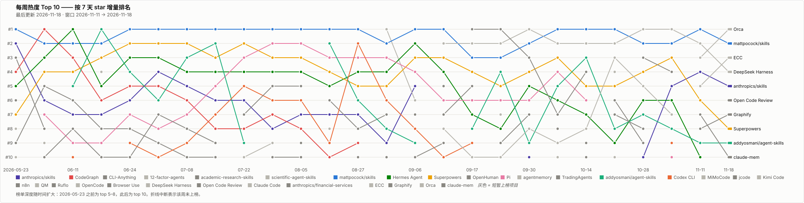
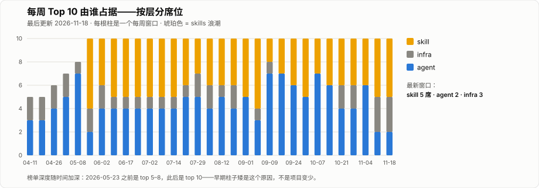
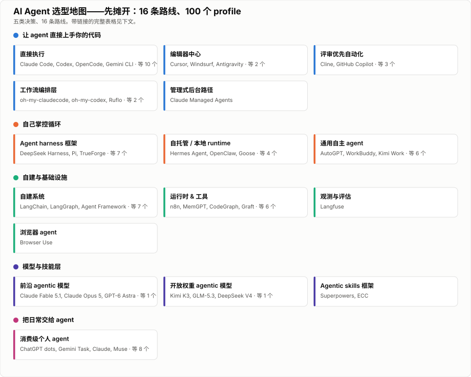

# AI Agent Map

	

AI Agent Map 是一个更偏实用、偏可视化的仓库，用来横向比较主流 AI agent、agent 平台、runtime 和 orchestration 工具。

目标很简单：帮读者更快得到一个靠谱的 shortlist。

## 这个仓库想解决什么

- agent 世界很热闹，但真正帮助选型的内容不多。
- 很多资料会讲理念，却不讲适合什么、不适合什么、代价是什么。
- 大多数人需要的是比较层，不是链接堆。

这个仓库只关注选型：它擅长什么、边界在哪、使用成本是什么。

## 从哪里开始

| 你现在的问题更像什么 | 先看哪里 |
| --- | --- |
| 我要先得到一个候选 shortlist |  |
| 我的问题是"代码自动化怎么选" |  |
| 我已经有候选，想做横向对比 |  |
| 我在意审批、记忆、调度、部署这类能力维度 |  |
| 我想看每个项目在这些维度上并排打分 |  |
| 我想知道每档模型多能打、agent 怎么计费 |   |
| agent 已经在跑了——我需要知道它是不是还正常 |  |
| 我想看存量排行和每周趋势图 |  |
| 我想看问题导向的指南或全部对比页 |   |

## 近期热门榜

热度不等于适合度。

这张表记录的是最近一周 GitHub 快照里特别热的 agent 项目。排名按 7 天增量。下面的总 star 数是这次更新仓库时重新核对过的当前值。

> **最后更新：** 2026-11-18 · **快照窗口：** 2026-11-11 → 2026-11-18（自上次更新以来的增量：**日历 7 天**，按抓取时间约 7.07 天，上个窗口约 7.17 天，所以下面的比较都按实际时长）· **star 数：** 更新时点抓取

项目名链接指向上游 GitHub 仓库。本仓库已写入的 profile，在"在本仓库中的状态"列单独给出链接。

| 排名 | 项目 | 当前 stars | 快照增量 | 在本仓库中的状态 | 应该怎么读 |
| --- | --- | --- | --- | --- | --- |
| #1&#8288;（↑） | [Orca](https://github.com/stablyai/orca) | 128.3k | +6,528 | 已收录 · [profile](agents/orca.md) | **第一次拿下 #1**，这是它第二个可测窗口：按实际时长持平（降 7%，约 6,460/周），而上期排在它前面的都降得更多。它是第二个拿到 #1 的 infra 仓库，上一个是 06-02 的 [CodeGraph](agents/codegraph.md)。**越过 12.5 万**（128,275）。五个桌面版本 `v1.4.257`–`v1.4.262`，另有 Android 构建 |
| #2&#8288;（↓） | [mattpocock/skills](https://github.com/mattpocock/skills) | 327.0k | +5,791 | 候补（Skills 浪潮） | 按实际时长降 **39%** 到约 5,731/周，把上期的涨幅还了回去，只坐一期 #1 就让出。对 [Superpowers](agents/superpowers.md) 的领先仍扩大到 **7,422**（327,036 对 319,614）。**越过 32.5 万**。两个提交，没有发版 |
| #3&#8288;（↑） | [ECC](https://github.com/affaan-m/ECC) | 305.9k | +4,972 | 已收录 · [profile](agents/ecc.md) | 按实际时长涨 **16%** 到约 4,920/周；这是它第二个可测窗口，也是第一次能和上期比。**越过 30.5 万**（305,913）。`v2.2.3`（10 月 1 日）之后没有发版；有 hook 校验和 CI 的提交 |
| #4&#8288;（↓） | [DeepSeek Harness](https://github.com/deepseek-ai/deepseek-harness) | 283.3k | +4,854 | 已收录 · [profile](agents/deepseek-harness.md) | 按实际时长降 **31%** 到约 4,803/周，是 10-14 以来最小的 7 天增量。**#4 是它连续在榜 11 个窗口里最低的名次**，此前每一期都是 #1 或 #2。**越过 28 万**（283,319）。三个预发布版 `dsh-v0.2.2-rc.2`–`rc.4` |
| #5&#8288;（↓） | [anthropics/skills](https://github.com/anthropics/skills) | 196.9k | +4,315 | 候补（Skills 浪潮） | 连续两次加速后，按实际时长降 20%。**越过 19.5 万**（196,939）。两个提交更新 `docx`、`pdf`、`pptx`、`xlsx` 四个 skill；没有发版 |
| #6&#8288;（新） | [Open Code Review](https://github.com/alibaba/open-code-review) | 54.0k | +4,202 | 已收录 · [profile](agents/open-code-review.md) | **离榜四个窗口后回来**，按实际时长涨 **866%**（+4,202 对 +441），是 09-24 以来最大的增量。窗口里找不到原因：五个补丁版本（`v1.13.8`–`v1.13.12`）和日常提交，所以按本榜规矩，扛过第二个窗口之前算尖峰。**越过 5 万**（54,018） |
| #7&#8288;（↑） | [Graphify](https://github.com/Graphify-Labs/graphify) | 149.8k | +4,049 | 已收录 · [profile](agents/graphify.md) | 第二个可测窗口，按实际时长持平（涨 6%）。**差 159 到 15 万**（149,841）。六个版本 `v0.9.107`–`v0.9.112` |
| #8&#8288;（↓） | [Superpowers](https://github.com/obra/superpowers) | 319.6k | +3,726 | 已收录 · [profile](agents/superpowers.md) | 按实际时长持平（降 5%，约 3,687/周），上期降了 29%。**落后 mattpocock/skills 7,422**。11 月 3 日以来没有发版也没有提交 |
| #9&#8288;（=） | [addyosmani/agent-skills](https://github.com/addyosmani/agent-skills) | 118.8k | +3,380 | 候补（Skills 浪潮） | 按实际时长涨 **48%**，连续第二次加速。**越过 11.8 万**（118,765）。插件版本 `0.6.16`（11 月 14 日） |
| #10&#8288;（↓） | [claude-mem](https://github.com/thedotmack/claude-mem) | 118.1k | +2,147 | 已收录 · [profile](agents/claude-mem.md) | 第二个可测窗口，按实际时长降 **44%**；以 346 领先 [Hermes Agent](agents/hermes-agent.md) 守住最后一席。**越过 11.8 万**（118,091）。十一个版本 `v15.17.1`–`v16.0.0` |

- 热度适合拿来发现新项目，不适合直接当选型顺序。
- **窗口长度。** 两次抓取相隔约 **7.07 天**（北京时间 11 月 11 日 15:20 → 11 月 18 日 17:06），上个窗口约 **7.17 天**。1% 的差距远低于本榜必须换口径的 5%，但前三期都是按实际时长读的，这一期也照此。表里放原始增量；个位数的变化按持平看。
- **全榜降温。** 两期都可测的 60 个仓库里，按实际时长 **23 个加速、37 个放缓**（按原始增量也是 23 与 37）。上期新跟踪的五个仓库这是第一次有上期速度，所以本期计入了它们。前十席约 43,505/周，上期约 48,831（降 11%）；#10 的门槛降约 3%（约 2,195 → 约 2,125/周）。上期也在榜的九个上榜者里，两个提速（[ECC](agents/ecc.md)、addyosmani/agent-skills），三个持平（[Orca](agents/orca.md)、[Graphify](agents/graphify.md)、[Superpowers](agents/superpowers.md)），四个放缓（mattpocock/skills、[DeepSeek Harness](agents/deepseek-harness.md)、anthropics/skills、[claude-mem](agents/claude-mem.md)）。
- **[Orca](agents/orca.md) 站稳不动拿下 #1。** 它持平（降 7%），而 mattpocock/skills 降 39%、DeepSeek Harness 降 31%。这是 31 个窗口里第二个拿到 #1 的 infra 仓库，上一个是 06-02 的 [CodeGraph](agents/codegraph.md)。这只是它第二个可测窗口，所以本榜对它只有一次比较，谈不上趋势。mattpocock/skills 的 #1 只坐了一期，但对 Superpowers 的领先扩大到 **7,422**；增量比其他四个通用集合之和少 10,602（5,791 对 4,972 + 4,315 + 3,726 + 3,380 = 16,393）。
- **上期新跟踪的仓库第二次测量走势分开。** [ECC](agents/ecc.md) 提速 16%；Orca 和 [Graphify](agents/graphify.md) 持平；[claude-mem](agents/claude-mem.md) 降 44%，[Paperclip](agents/paperclip.md) 降 22%（第 13）。两个窗口还不足以判断哪一个的速度能持续。
- **[Hermes Agent](agents/hermes-agent.md) 的连续在榜停在 30 个窗口。** 本图记录的每一个窗口它都在前十；这一次排第 11（+1,801，降 19%），落后 claude-mem 346，窗口内有 `v0.23.2` 和每日 canary 构建。[Superpowers](agents/superpowers.md) 和 mattpocock/skills（各 26）现在是仍在继续的最长连续；其次是 DeepSeek Harness（11）和 addyosmani/agent-skills（10）。DeepSeek Harness 的 #4 是它进入跟踪以来最低的名次：此前每个窗口都是 #1 或 #2。
- **新的尖峰。** [Open Code Review](agents/open-code-review.md) 离榜四个窗口后回来，按实际时长涨 **866%** 到 #6（+4,202 对 +441），越过 5 万。窗口里只有五个补丁版本和日常提交，所以按本榜规矩，扛过第二个窗口之前算尖峰。榜外的 [Qwen Code](agents/qwen-code.md) 涨 370% 到第 14，越过 3 万，同期发了 `v0.27.3`–`v0.28.0`、`v1.0.0-preview.1` 和桌面版构建。
- **榜面结构没变。** skills 占**五席**（#2、#3、#5、#8、#9），连续第二个窗口全是通用集合。infra 占**三席**（Orca、Graphify、claude-mem），追平上期创下的纪录。agent 只有**两席**（#4、#6），连续第二个窗口追平最少纪录。
- **模型层：两个新档位，一个仍在预发布里的换默认。** (1) **OpenAI 发布 GPT-6.2 Astra 和 GPT-6.2 Sol**（11 月 17 日），同时上 API、ChatGPT Work 和 Codex：Astra 用于"demanding reasoning and coding tasks"，Sol 用于"everyday coding and agent workflows"。OpenAI 的 changelog 没有本图能记录的基准分。GitHub Copilot 同日加入两者。[Codex CLI](agents/codex.md) 的 PR 62106（11 月 17 日合并）把 GPT-6.2 Sol 设为"the default catalog selection"，但它只在预发布版 `rust-v0.171.0-alpha.13` 里，正式版 `0.170.0` 没有包含，所以本图暂不把它算作已发布的换默认。(2) **Google 发布 Gemini 4 Hydrogen**（11 月 12 日，`gemini-4-hydrogen`），Gemini API 免费档和付费档都可用，新增第四档 `xhigh` 思考强度。Google 自报 Terminal-Bench 4.1 得分 57%。在 [Antigravity](agents/antigravity.md) 里它面向付费 Pro、Ultra 和企业版，并在新的 Orchestrator 选项里与 Carbon 或 Argon 搭配；Copilot 11 月 13 日加入。(3) **Copilot 下线模型**：11 月 16 日下线 Claude Opus 4.8、Claude Opus 5 和 GPT-5.6 Terra，12 月 14 日还将下线 Fable 5、Gemini 4 Argon、Gemini 3.8 Flash 等。本窗口没有被跟踪的编码 agent 在正式版里换默认模型：[Claude Code](agents/claude-code.md)（四个版本）没换；[Gemini CLI](agents/gemini-cli.md) main 分支的源码默认仍是 `gemini-2.5-pro`，Google 将在 12 月 1 日把它路由到 `gemini-3.8-flash`。详见[市场事件](market-events.md)。
- **Microsoft Agent Framework 的仓库从 GitHub 上消失了。** 本次抓取时 `microsoft/agent-framework` 的 API 和网页都返回 404，不是重定向，本图也没找到任何公告。PyPI 上的 `agent-framework` 包（`1.26.0`，11 月 12 日）仍链接到它，learn.microsoft.com/agent-framework 的文档仍能打开。它本期没有增量，在仓库恢复或确认新地址之前移出跟踪；[profile](agents/microsoft-agent-framework.md) 已加带日期的说明。
- **本次更新无新 profile。** [DeerFlow](https://github.com/bytedance/deer-flow)（85.5k）和 [nanobot](https://github.com/HKUDS/nanobot) 正在单独起草收录。扫描还找到 [janestreet/agent_skills](https://github.com/janestreet/agent_skills)（10.0k，11 月 3 日创建），是一个 skills 集合，列入候补。
- 里程碑（按原始整数核过，不是表里四舍五入的数）：**mattpocock/skills 32.5 万**、**ECC 30.5 万**、DeepSeek Harness **28 万**、anthropics/skills **19.5 万**、[Codex CLI](agents/codex.md) **13.5 万**、Orca **12.5 万**、[CrewAI](agents/crewai.md) **6.1 万**、[CLI-Anything](agents/cli-anything.md) **5.9 万**、两个科研集合 **5.7 万**、Open Code Review **5 万**、[LangGraph](agents/langgraph.md) **4.5 万**、Qwen Code **3 万**、[TrueForge](agents/trueforge.md) **6.5k**。差一点：[Ruflo](agents/ruflo.md) **差 1 到 8.2 万**，[CodeGraph](agents/codegraph.md) 差 76 到 7.8 万，Graphify 差 159 到 15 万，[LangChain](agents/langchain.md) 差 164 到 15 万。
- [OpenClaw](agents/openclaw.md) 仍是绝对第一，394.7k star（+390，按实际时长降 11%）；已写 profile，但不进增量榜，因为这么大的项目周度增量噪声太大。

更多窗口笔记：skills 浪潮占比、OpenClaw，以及前 10 之外还在涨的项目

- `.claude/skills` 浪潮**占前十中的五席**：#2、#3、#5、#8、#9，连续第二个窗口全是通用集合。政策不变：curated 集合作为 Skills Wave 条目跟踪，在 [Agent Skills](comparisons/agent-skills.md) 页比较；框架端通过 [Superpowers](agents/superpowers.md) 和 [ECC](agents/ecc.md) 写 profile。
- 刚好卡在榜外（按实际时长）：[Hermes Agent](agents/hermes-agent.md) 264.3k（+1,801）第 11，降 19%，第一次离榜；[OpenCode](agents/opencode.md) 227.7k（+1,729）第 12，涨 11%，发了 `v2.3.0`–`v2.3.2`；[Paperclip](agents/paperclip.md) 114.7k（+1,657）第 13，降 22%；[Qwen Code](agents/qwen-code.md) 30.7k（+1,448）第 14，涨 370%；[Pi](agents/pi.md) 122.6k（+1,310）第 15，持平（降 9%）；TradingAgents 123.0k（+1,105）第 16，降 27%；academic-research-skills 57.4k（+998）第 17，降 13%；[Codex CLI](agents/codex.md) 135.7k（+912）第 18，降 48%；scientific-agent-skills 57.6k（+872）第 19，涨 14%；[Claude Code](agents/claude-code.md) 156.1k（+865）第 20，涨 11%，四个版本（`v2.1.323`、`v2.1.325`、`v2.1.326`、`v2.1.327`）。OpenClaw 不进榜，所以这些榜外名次也按同样口径算。
- **两个科研集合再次靠近。** scientific-agent-skills 提速 14%，academic-research-skills 放缓 13%，但 K-Dense 的领先从 369 缩到 243（57,640 对 57,397）。[mini-swe-agent](agents/mini-swe-agent.md) 把上期的跳增大部分还了回去（+201，降 56%）。[Gemini CLI](agents/gemini-cli.md) 从很低的基数翻了一倍多（+144，涨 147%，第 40）。[anthropics/financial-services](https://github.com/anthropics/financial-services) 放缓 14%（+160，第 38）。
- 本窗口仍在涨但没进前 10（按增量，日历 7 天的原始口径）：[Hermes Agent](agents/hermes-agent.md) 264.3k（+1,801）、[OpenCode](agents/opencode.md) 227.7k（+1,729）、[Paperclip](agents/paperclip.md) 114.7k（+1,657）、[Qwen Code](agents/qwen-code.md) 30.7k（+1,448）、[Pi](agents/pi.md) 122.6k（+1,310）、[TradingAgents](https://github.com/TauricResearch/TradingAgents) 123.0k（+1,105）、[academic-research-skills](https://github.com/Imbad0202/academic-research-skills) 57.4k（+998）、[Codex CLI](agents/codex.md) 135.7k（+912）、[scientific-agent-skills](https://github.com/K-Dense-AI/scientific-agent-skills) 57.6k（+872）、[Claude Code](agents/claude-code.md) 156.1k（+865）、[n8n](agents/n8n.md) 210.8k（+725）、[Browser Use](agents/browser-use.md) 121.4k（+724）、[CLI-Anything](agents/cli-anything.md) 59.3k（+697）、[CodeGraph](agents/codegraph.md) 77.9k（+571）、[Ruflo](agents/ruflo.md) 82.0k（+546）、[OpenHands](agents/openhands.md) 93.7k（+540）、[LangChain](agents/langchain.md) 149.8k（+496）、[LiteLLM](agents/litellm.md) 63.5k（+389）、[LangGraph](agents/langgraph.md) 45.1k（+321）、[CrewAI](agents/crewai.md) 61.1k（+306）、[Langfuse](agents/langfuse.md) 37.6k（+305）、[Goose](agents/goose.md) 56.7k（+301）、[Cline](agents/cline.md) 71.7k（+225）、[mini-swe-agent](agents/mini-swe-agent.md) 9.7k（+201）、[12-factor-agents](https://github.com/humanlayer/12-factor-agents) 27.3k（+195）、[jcode](agents/jcode.md) 21.9k（+185）、[agentmemory](https://github.com/rohitg00/agentmemory) 30.4k（+162）、[anthropics/financial-services](https://github.com/anthropics/financial-services) 41.4k（+160）、[ZCode](agents/zcode.md) 8.8k（+150）、[Gemini CLI](agents/gemini-cli.md) 108.9k（+144）、[Trail Code (Graft)](agents/graft.md) 11.3k（+133）、[eve](agents/eve.md) 6.0k（+107）、[Aider](agents/aider.md) 50.2k（+101）、[OpenHuman](agents/openhuman.md) 42.7k（+98）、[AutoGPT](agents/autogpt.md) 188.1k（+92）、[Omnigent](agents/omnigent.md) 11.4k（+83）、[LlamaIndex](agents/llamaindex.md) 52.9k（+65）、[Letta (MemGPT)](agents/memgpt.md) 25.5k（+65）、[Grok Build](agents/grok-build.md) 27.8k（+58）、[QM](agents/qm.md) 15.7k（+53）、[Continue](agents/continue.md) 36.5k（+52）、[Kimi Code](agents/kimi-code.md) 8.2k（+51）、[SWE-agent](agents/swe-agent.md) 20.8k（+47）、[Open Interpreter](agents/open-interpreter.md) 68.9k（+45）、[TrueForge](agents/trueforge.md) 6.5k（+34）、[OpenHarness](agents/openharness.md) 16.2k（+30）、[MiMoCode](agents/mimocode.md) 13.8k（+9）、[Flowise](agents/flowise.md) 55.6k（+8）、[CodeWhale](agents/codewhale.md) 41.2k（+6）、[CoStrict](agents/costrict.md) 4.5k（+1）

### 排名趋势

每周 Top 10 自开始追踪以来的名次变化——一条折线一个项目，折线中断表示该周掉出榜单：

  

同样的窗口按"每层占几席"来读——就是每周叙事里那条 skills 浪潮故事的量化版：

  

按类别的完整存量排行——Agent 榜、Agent 基础设施榜、Skill 榜及各自的垂类榜，按 star 总量排序——见 [rankings/](rankings/README.md)。

## 榜单之外

热度告诉你该看什么。这六页告诉你该选什么：

- **[能力矩阵](capabilities/matrix.md)** —— 每个项目在九个统一[能力维度](capabilities/README.md)上并排打分（●/◐/○/—），按路线分组。回答"就这项能力而言，谁把它当核心强项"。
- **[基准与计费](comparisons/benchmarks-and-billing.md)** —— 前沿模型能力，加上每个编码 agent 怎么计费。模型层分档按量之后，"这个任务用哪一档"就是选型决策本身。本图不列价格，也不比较价格。
- **[记忆方案对比](comparisons/memory-approaches.md)** —— "有记忆"这句话背后的七种不同含义，从自编辑存储到被动语义召回，以及你要持久化什么就该选哪种。
- **[消费级个人 agent](comparisons/personal-agents.md)** —— 你把日常交出去的那类 agent——ChatGPT dots、Gemini Task、Claude、Muse、Grok Bot、Cue、豆包、千问、AutoGLM、元宝、Today——按事实和控制力比较，而不是按热度，因为闭源产品没有可供排名的公开数字。
- **[Agent Skills](comparisons/agent-skills.md)** —— skill 是什么、哪些 agent 能加载它，以及最大的五个集合和框架（mattpocock/skills、Superpowers、ECC、anthropics/skills、addyosmani/agent-skills）在类型、体量、维护者和许可证上的对比，外加装别人的 skill 前要查什么。集合在这里比较，不单独写 profile。
- **[观测与评估](comparisons/observability-and-evals.md)** —— 上面这一切之下的那一层：agent 一旦无人值守地跑起来，故障就不再长得像崩溃，而是长得像静默的质量漂移。对比 [Langfuse](agents/langfuse.md)、Opik、Phoenix、Helicone、LangSmith 等——并理清这个领域里"开源"的四种不同含义。

## 市场脉搏

当下影响选型的三条结构性主线——完整的日期与来源档案见[市场事件](market-events.md)：

- **`.claude/skills` 浪潮占五席，mattpocock/skills 超过 Superpowers**（2026-05 起）：curated skill 合集与 skills 框架五个月来一直占据每周热度前 10 的 2 到 6 席，席位数一直在轮换而不是不动：6/10，然后 2/10、3/10、4/10、5/10、3/10，连续四个窗口 4/10，现在是 **5/10**（2026-11-11），而且第一次五席全是通用集合：[mattpocock/skills](https://github.com/mattpocock/skills)、[anthropics/skills](https://github.com/anthropics/skills)、[ECC](agents/ecc.md)、[Superpowers](agents/superpowers.md)、[addyosmani/agent-skills](https://github.com/addyosmani/agent-skills)。ECC 是第一次被计入，用的是它第一个可测增量。mattpocock（321,245）现在领先 Superpowers（315,888）5,357，所以本图跟踪的最大集合是一个个人目录，正是本图自 6 月以来提示的单人风险；不过它的增量仍比其他四个之和少 6,439。ECC（300,941）排第三。本图通过 Superpowers 和 ECC 写框架端的 profile，集合放在 [Agent Skills](comparisons/agent-skills.md) 页比较。
- **两家的模型阶梯每一级都有人了，Google 也有了新的顶端**：[Claude Fable 5.2](agents/claude-fable-5.md)（11 月 9 日）、[GPT-6 Astra](agents/gpt-6-astra.md)（9 月 3 日）和 Google 的 **Gemini 4 Carbon**（10 月 28 日发布，11 月 10 日进入 Gemini API）在顶端；往下是 **Opus 5.5**（9 月 22 日）、两个中间档 **Sonnet 5.5** 与 **GPT-6.1 Sol**（9 月 28–29 日，各是自家编码 agent 的默认），再往下是最低档 **GPT-6 Luna**（9 月 22 日）与 **Claude Haiku 5.5**（10 月 7 日）。**10 月 26 日** OpenAI 又加了 **GPT-6.1 Terra**，可在 Codex 里选用，但没有设为默认。Google 的 **Gemini 4 Argon** 于 **10 月 13 日**开放付费 API，Meta 于 10 月 12 日发布 **Muse Wonder**。开放权重一侧，**Kimi K3.1 Pro** 的权重最晚 11 月 5 日已公开。见[基准与计费](comparisons/benchmarks-and-billing.md)。
- **产品边界在向上坍缩**：OpenAI 把 Codex 并入 ChatGPT 应用（7 月 9 日），又在 DevDay（9 月 29 日）用可在任何设备上使用的可复用云端环境，把它进一步搬离笔记本——OpenAI 侧的"选哪个 coding agent"继续在变成"你怎么用 ChatGPT"。打包默认模型一个月里换了两次：`rust-v0.153.4`（9 月 4 日）起是 [GPT-6 Astra](agents/gpt-6-astra.md)，`rust-v0.159.1`（9 月 29 日）起是 **GPT-6.1 Sol**，`rust-v0.161.0`（10 月 7 日）把它带到主发布线。`0.162.0`（10 月 8 日）起 TUI 还会跟随服务端的模型默认，所以实际生效的默认不发版也能变；**10 月 14 日** OpenAI 又让 GPT-5.5 从 Codex 与 ChatGPT 下线（限 ChatGPT 账号登录）。"没有被跟踪的编码 agent 在发版里换默认"的连续纪录在 11 月 9 日停在五个窗口，但不是 Codex 换的：[Claude Code](agents/claude-code.md) 把 Fable 默认换成 5.2，[Pi](agents/pi.md) 把 `anthropic` provider 的默认换成 Opus 5.5；Codex 的主默认自 9 月 29 日起一直是 GPT-6.1 Sol。如果你按默认值跑 Codex，仍然请钉死模型 id——同时要知道钉死的模型也可能被下线；这两样产品都不会替你固定住。详见 [Codex](agents/codex.md)。

## 先把地图摊开

  

| 路线 | 代表项目 | 常见使用者 |
| --- | --- | --- |
| 直接执行型 | [Claude Code](agents/claude-code.md), [Aider](agents/aider.md), [Codex](agents/codex.md), [Kimi Code](agents/kimi-code.md), [MiMoCode](agents/mimocode.md), [CodeWhale](agents/codewhale.md), [ZCode](agents/zcode.md), [CodeBuddy](agents/codebuddy.md), [OpenCode](agents/opencode.md), [Gemini CLI](agents/gemini-cli.md), [Qwen Code](agents/qwen-code.md), [Grok Build](agents/grok-build.md), [Devin](agents/devin.md), [Jules](agents/jules.md) | 想把明确 coding 任务交给 agent 的人（见[终端编码 CLI 对比](comparisons/coding-cli-agents.md)） |
| Agent harness 框架 | [DeepSeek Harness](agents/deepseek-harness.md), [Pi](agents/pi.md), [jcode](agents/jcode.md), [OpenHands](agents/openhands.md), [SWE-agent](agents/swe-agent.md), [mini-swe-agent](agents/mini-swe-agent.md), [OpenHarness](agents/openharness.md), [QM](agents/qm.md), [Omnigent](agents/omnigent.md), [TrueForge](agents/trueforge.md) | 想自己掌控 agent loop、工具表面和权限，而不是直接接受厂商成品的人——QM 和 Omnigent 把这条推到"在一层之下同时跑*多个* harness"（见 [harness 框架对比](comparisons/agent-harness-frameworks.md)） |
| 前沿 agentic 模型 | [Claude Fable 5.2](agents/claude-fable-5.md), [Claude Opus 5](agents/claude-opus-5.md), [GPT-6 Astra](agents/gpt-6-astra.md), [GPT-5.5](agents/gpt-5.5.md) | 在选要接入自己 agent 系统的模型，或在评估 Anthropic / OpenAI 系 agent 能力上限的人——天花板（Fable 5.2、Astra）和你实际会跑的下一档是两个独立决策（Opus 5 曾是 Claude Code 的默认 Opus，9 月 22 日由 Opus 5.5 接替；9 月 28 日默认 Sonnet 也换成了 Sonnet 5.5） |
| 开放权重 agentic 模型 | [Kimi K3](agents/kimi-k3.md), [GLM-5.3](agents/glm-5.md), [DeepSeek V4](agents/deepseek-v4.md), [Qwen3-Coder](agents/qwen3-coder.md) | 想在自己托管、自己承担许可的权重上拿到前沿级能力的人——这和在几个闭源天花板之间做选择是两个不同的决策 |
| Agentic skills 框架 | [Superpowers](agents/superpowers.md), [ECC](agents/ecc.md) | 想要一套方法论 + 可组合 skills 层、能接到 Claude Code、Codex、Cursor 等 agent 之上的人 |
| 工作流 / orchestration layer | [oh-my-claudecode](agents/oh-my-claudecode.md), [oh-my-codex](agents/oh-my-codex.md), [Ruflo](agents/ruflo.md), [Orca](agents/orca.md), [Paperclip](agents/paperclip.md) | 已经认可 Claude Code 或 Codex，只想在上面补强 orchestration 的人（Ruflo 把这条进一步推到跨机器联邦和 100+ 专用 agent）；Orca 和 Paperclip 同时调度多个不同的 agent |
| 编辑器中心工作流 | [Cursor](agents/cursor.md), [Windsurf](agents/windsurf.md), [Google Antigravity](agents/antigravity.md), [TRAE](agents/trae.md), [Continue](agents/continue.md) | 想让编辑器本身保持在工作流核心的人 |
| review-first 自动化 | [Cline](agents/cline.md), [GitHub Copilot](agents/github-copilot.md), [Froge Code](agents/froge-code.md), [CoStrict](agents/costrict.md), [Open Code Review](agents/open-code-review.md) | 想把 review 和人工控制留在核心的人（CoStrict 加了企业严格流程 + 私有化部署；Open Code Review 只做评审，为 CI 里的准确率调优） |
| 管理式后台路径 | [Claude Managed Agents](agents/claude-managed-agents.md) | 需要 Anthropic 的定时、云端或后台工作流的人 |
| 消费级个人 agent | [ChatGPT dots](agents/chatgpt-dots.md), [Gemini Task](agents/gemini-task.md), [Claude（Cowork）](agents/claude-cowork.md), [Claude Duet](agents/claude-duet.md), [Muse（Meta）](agents/meta-muse.md), [Grok Bot](agents/grok-bot.md), [Cue（Manus）](agents/manus-cue.md), [豆包](agents/doubao.md), [千问 App](agents/qwen-app.md), [AutoGLM](agents/autoglm.md), [元宝](agents/yuanbao.md), [Today](agents/today-ai.md) | 想把跑腿、收件箱、预订或手机交给一个以产品形式出售、而不是自己运行的 agent 的人（见[个人 agent 对比](comparisons/personal-agents.md)） |
| 通用自主 agent | [AutoGPT](agents/autogpt.md), [Agent Zero](agents/agent-zero.md), [BabyAGI](agents/babyagi.md), [Julep](agents/julep.md), [GenericAgent](agents/generic-agent.md), [ml-intern](agents/ml-intern.md), [WorkBuddy](agents/workbuddy.md), [Kimi Work](agents/kimi-work.md) | 想要通用自主任务执行的人（ml-intern 是 ML 工程取向的特化版本；WorkBuddy 和 Kimi Work 把同一套循环对准桌面知识工作，而不是代码仓库） |
| 自建系统 | [LangChain](agents/langchain.md), [LangGraph](agents/langgraph.md), [CrewAI](agents/crewai.md), [LlamaIndex](agents/llamaindex.md), [Haystack](agents/haystack.md), [Semantic Kernel](agents/semantic-kernel.md), [DSPy](agents/dspy.md), [Pydantic AI](agents/pydantic-ai.md), [eve](agents/eve.md), [Microsoft Agent Framework](agents/microsoft-agent-framework.md) | 想自己搭 agent 平台的团队 |
| 运行时 & 工具 | [n8n](agents/n8n.md), [MemGPT](agents/memgpt.md), [Open Interpreter](agents/open-interpreter.md), [LiteLLM](agents/litellm.md), [Flowise](agents/flowise.md), [CodeGraph](agents/codegraph.md), [Trail Code (Graft)](agents/graft.md), [CLI-Anything](agents/cli-anything.md), [claude-mem](agents/claude-mem.md), [Graphify](agents/graphify.md) | 需要工作流自动化、代码执行、LLM 网关、agent 上下文基础设施、agent 驱动 CLI 或可视化构建器的团队 |
| 观测与评估 | [Langfuse](agents/langfuse.md) | agent 已经跑在生产上，需要知道它做了什么、花了多少、质量有没有漂移的人（见[观测与评估](comparisons/observability-and-evals.md)） |
| 浏览器 agent | [Browser Use](agents/browser-use.md) | 任务活在一个没有 API 的网站上的人——这和"agent 怎么改文件"是两个问题，因为它决定的是允许一个 agent 以你的身份在开放互联网上做什么 |
| 自托管 / 本地 runtime | [AI Edge Gallery](agents/ai-edge-gallery.md), [Goose](agents/goose.md), [Hermes Agent](agents/hermes-agent.md), [OpenClaw](agents/openclaw.md), [Mercury Agent](agents/mercury-agent.md), [OpenHuman](agents/openhuman.md) | 需要端侧隐私、长期运行、本地控制、渠道、设备或个人数据生活集成能力的人 |

## 当前已覆盖的主流项目

已收录 98 个项目，按形态分组。展开任意一组，或到 [agents/](agents/README.md) 浏览完整的路线表与覆盖表。

<strong>编码 agent、编辑器与编排</strong>（36 个）

| 项目 | 路线 | 一句话定位 |
| --- | --- | --- |
| [Aider](agents/aider.md) | 直接执行 | 终端优先、贴近 git 的 AI 结对编程 |
| [Claude Code](agents/claude-code.md) | 直接执行 | 本地和 IDE 优先的 coding agent |
| [Claude Managed Agents](agents/claude-managed-agents.md) | 管理式后台路径 | Anthropic 管理式 / 云端执行工作流映射 |
| [Codex](agents/codex.md) | 直接执行 | ChatGPT 应用内的 coding agent，支持异步云端委派 |
| [oh-my-claudecode](agents/oh-my-claudecode.md) | 工作流层 | Claude Code 之上的 teams-first orchestration layer |
| [oh-my-codex](agents/oh-my-codex.md) | 工作流层 | 为 Codex CLI 增强工作流、teams 和持久状态 |
| [Orca](agents/orca.md) | 工作流 / orchestration layer | 开源桌面应用：把任意 CLI coding agent 放进各自的 git worktree 并排跑，带评审、浏览器、远程服务器和手机端 |
| [Cursor](agents/cursor.md) | 编辑器中心平台 | 覆盖本地编码、云端 agent 和集成的 AI 编辑器 |
| [GitHub Copilot](agents/github-copilot.md) | 平台 | VS Code + GitHub 里的多表面 agent 平台 |
| [Cline](agents/cline.md) | review-first 执行 | 编辑器内 approval-first coding agent |
| [Windsurf](agents/windsurf.md) | AI 原生 IDE | 以 Cascade 为中心的 AI IDE |
| [Google Antigravity](agents/antigravity.md) | 编辑器中心工作流 | 谷歌的 agent 优先平台：agent 桌面应用、`agy` CLI、独立 IDE 和编辑器扩展共用一套为 Gemini 调优的 harness；免费档按周封顶，闭源 |
| [TRAE](agents/trae.md) | 编辑器中心工作流 | 字节跳动的 AI IDE：VS Code 风格的 IDE 加 AI 主导的 SOLO 模式，另有跑并行、云端和定时任务的 Agent 窗口；国际版与国内版分开；不开隐私模式，对话可能被用于训练 |
| [OpenHands](agents/openhands.md) | 开源执行 | 开源 AI 软件工程 agent |
| [Devin](agents/devin.md) | 托管执行 | 端到端软件工程执行 |
| [Jules](agents/jules.md) | 托管云端执行 | GitHub 连接、PR 回收的 coding delegation |
| [Continue](agents/continue.md) | 编辑器中心 | 支持自选模型的开源 IDE 扩展 |
| [Froge Code](agents/froge-code.md) | review-first 自动化 | 当前按 Automagik Genie 暂定映射 |
| [Pi](agents/pi.md) | Agent harness 框架 | 极简终端 coding agent harness，多 LLM provider 支持 |
| [jcode](agents/jcode.md) | Agent harness 框架 | Rust 多会话 coding harness——启动最快、provider 中立 OAuth、被动语义记忆 |
| [CodeWhale](agents/codewhale.md) | 直接执行 | provider 中立的 Rust 终端 coding agent，40 多条 provider 路线，默认仍是 DeepSeek（原 DeepSeek-TUI） |
| [Kimi Code](agents/kimi-code.md) | 直接执行 | Moonshot AI 官方、Kimi 原生的终端 coding CLI（kimi-cli 继任者） |
| [MiMoCode](agents/mimocode.md) | 直接执行 | 小米官方的 MiMo 终端 coding agent，内置跨会话记忆 |
| [Grok Build](agents/grok-build.md) | 直接执行 | SpaceXAI 官方的 Rust 终端 coding agent——全屏 TUI、headless CI 模式、ACP 编辑器服务 |
| [CoStrict](agents/costrict.md) | review-first 自动化 | Cline 血统的企业 coding agent，含严格标准化流程、AI 代码评审、私有化部署 |
| [SWE-agent](agents/swe-agent.md) | Agent harness 框架 | Princeton + Stanford 的 SWE-bench 原始 harness，single-YAML 配置 |
| [mini-swe-agent](agents/mini-swe-agent.md) | Agent harness 框架 | SWE-agent 的 ~100 行 Python 接班版，SWE-bench Verified 仍 >74% |
| [OpenHarness](agents/openharness.md) | Agent harness 框架 | HKUDS 的 10 子系统开源 agent harness，43+ 工具、兼容 anthropics/skills、支持 MCP |
| [Omnigent](agents/omnigent.md) | Agent harness 框架 | 元 harness——在一个会话里混用 Claude Code、Codex、Cursor、OpenCode、Hermes、Pi，带策略与云沙箱 |
| [OpenCode](agents/opencode.md) | 直接执行型 | 体量最大的厂商中立开源编码 agent，22.2 万 star（2026-10-28），MIT |
| [Gemini CLI](agents/gemini-cli.md) | 直接执行型 | 谷歌的开源终端 agent，内置搜索接地；2026-06-18 起只服务 Code Assist 标准版/企业版与付费 API key，个人用户已转到 Antigravity CLI |
| [Qwen Code](agents/qwen-code.md) | 直接执行型 | 客户端与权重都开放，可在 OpenAI/Anthropic/Gemini/本地之间运行时切换 |
| [DeepSeek Harness](agents/deepseek-harness.md) | Agent harness 框架 | 一切皆插件的 harness——连 agent 循环本身都能从配置里换掉 |
| [ZCode](agents/zcode.md) | 直接执行型 | 智谱的桌面 agentic 开发环境：长周期 "Goal" 任务，可从微信/飞书/Telegram 远程操控 |
| [CodeBuddy](agents/codebuddy.md) | 直接执行型 | 腾讯云的编程产品线（编辑器插件、CodeBuddy IDE、CodeBuddy Code CLI）：Claude Code 式循环，跨厂商模型目录，带私有云版本 |
| [Open Code Review](agents/open-code-review.md) | review-first 自动化 | 阿里的准确率优先代码评审 CLI——模型外面包确定性流水线，带 CI 与 agent 插件表面 |

<strong>自主与自托管 agent</strong>（17 个）

| 项目 | 路线 | 一句话定位 |
| --- | --- | --- |
| [AI Edge Gallery](agents/ai-edge-gallery.md) | 端侧本地 runtime | 带 agent skills 的移动端本地 assistant 沙盒 |
| [Goose](agents/goose.md) | 开源本地平台 | 跨 desktop、CLI、API 的可扩展本地 agent |
| [Hermes Agent](agents/hermes-agent.md) | 多 agent / 自托管 | 带 memory、skills、gateway 的长期工作环境 |
| [OpenClaw](agents/openclaw.md) | runtime | 多渠道、多设备、本地优先运行层 |
| [AutoGPT](agents/autogpt.md) | 自主 agent 平台 | 可视化 agent 构建器，带工作流、市场和多模型支持 |
| [Agent Zero](agents/agent-zero.md) | 自主 agent | 自构建自主 agent，动态创建工具 |
| [BabyAGI](agents/babyagi.md) | 实验性 | 开创性自主 agent 实验——教学用，非生产 |
| [Open Interpreter](agents/open-interpreter.md) | 运行时 | 自然语言到本地代码执行，无沙盒 |
| [Mercury Agent](agents/mercury-agent.md) | 自托管多通道 | 主打 CLI + Telegram 的权限硬化 agent，带 token 预算 |
| [ml-intern](agents/ml-intern.md) | 垂直领域自主 agent | Hugging Face 的自主 ML 工程师——基于 HF 生态做研究、写代码、发布 ML 成果 |
| [GenericAgent](agents/generic-agent.md) | 自演进自主 agent | 从小种子起步、每完成任务长出 skill tree 的自主 agent |
| [OpenHuman](agents/openhuman.md) | 自托管 / 本地 runtime | 桌面生活集成 agent，118+ 连接器、本地 Memory Tree、支持 Ollama |
| [Julep](agents/julep.md) | 工作流引擎 | Temporal 支撑的持久化有状态 AI agent 工作流引擎 |
| [QM](agents/qm.md) | Agent harness 框架 | Y Combinator 的多人协作 agent，跑在 Slack 和 web——按人和按房间分作用域、自托管、harness 无关 |
| [WorkBuddy](agents/workbuddy.md) | 通用自主 agent | 腾讯的桌面办公 agent——同一套循环，指向文档、幻灯片与表格 |
| [Kimi Work](agents/kimi-work.md) | 通用自主 agent | 月之暗面的桌面知识工作 agent：挂载文件夹、浏览器自动化、内置 cron |
| [TrueForge](agents/trueforge.md) | Agent harness 框架 | harness 即服务端——一个循环挂在 HTTP API 后面，带聊天 UI、TypeScript SDK 与可嵌入 UI |

<strong>框架与基础设施</strong>（23 个）

| 项目 | 路线 | 一句话定位 |
| --- | --- | --- |
| [eve](agents/eve.md) | 自建平台 | Vercel 的文件系统优先 agent 框架——持久化执行、沙箱、审批、渠道、evals |
| [LangChain](agents/langchain.md) | 平台 | 快速搭自定义 agent 的高层框架 |
| [LangGraph](agents/langgraph.md) | 平台 | 搭持久化、有状态 agent workflow 的底层框架 |
| [CrewAI](agents/crewai.md) | 多 agent 框架 | 角色型 agent 协作，快速搭原型 |
| [LlamaIndex](agents/llamaindex.md) | 数据优先框架 | 基于文档和数据的 RAG 与 agentic 应用 |
| [n8n](agents/n8n.md) | 工作流自动化 | 带原生 AI agent 节点和 400+ 集成的可视化工作流平台 |
| [MemGPT](agents/memgpt.md) | 有状态 agent 平台 | 跨会话学习的持久记忆 agent（现名 Letta） |
| [Haystack](agents/haystack.md) | 框架 | deepset 的生产导向 RAG 和 agent 框架 |
| [Semantic Kernel](agents/semantic-kernel.md) | 框架 | 微软的 AI 编排 SDK，支持 .NET、Python、Java |
| [DSPy](agents/dspy.md) | 框架 | 程序化 prompt 优化——编程而非手调 LM |
| [LiteLLM](agents/litellm.md) | 基础设施 | 100+ LLM provider 的统一 API 网关 |
| [Langfuse](agents/langfuse.md) | 基础设施 | 开源的 agent 观测、评估与 prompt 管理（观察 agent，不运行 agent） |
| [Pydantic AI](agents/pydantic-ai.md) | 框架 | 类型安全 Python agent 框架，结构化输出 |
| [Flowise](agents/flowise.md) | 可视化构建器 | 基于 LangChain 的拖拽式 LLM 应用和 agent 构建器 |
| [Ruflo](agents/ruflo.md) | 工作流 / orchestration layer | 面向 Claude 的多 agent 编排平台，支持跨机器联邦、神经记忆和 100+ 专用 agent |
| [Paperclip](agents/paperclip.md) | 工作流 / orchestration layer | 自托管控制平面，像管公司一样管 agent 团队：关联目标的工单、组织架构、预算、审批和定时 routine |
| [CodeGraph](agents/codegraph.md) | 运行时 & 工具 | 为 Claude Code、Cursor、Codex CLI、opencode、Hermes Agent 提供预索引的代码知识图谱 + MCP server |
| [Trail Code (Graft)](agents/graft.md) | 运行时 & 工具 | 把代码上下文写成仓库里互相链接的 markdown，一条命令接进八个以上的 agent |
| [claude-mem](agents/claude-mem.md) | 运行时 & 工具 | 外挂式跨会话记忆：hooks 采集 agent 活动、模型压缩、下次会话注入相关上下文；可选付费托管 observer |
| [Graphify](agents/graphify.md) | 运行时 & 工具 | 把代码库连同文档、PDF 和媒体变成带来源标签的知识图谱，agent 通过 skill、CLI 或本地 MCP server 查询 |
| [Browser Use](agents/browser-use.md) | 浏览器 agent | 把一个真浏览器交给 agent——打开页面、点击、输入、填表单 |
| [Microsoft Agent Framework](agents/microsoft-agent-framework.md) | 自建系统 | AutoGen 的继任者；跨 Python、.NET、Go 的生产级多 agent 工作流 |
| [CLI-Anything](agents/cli-anything.md) | 运行时 & 工具 | 为任意软件自动生成 Click CLI，让 agent 能驱动没有 API 的应用 |

<strong>模型与技能</strong>（10 个）

| 项目 | 路线 | 一句话定位 |
| --- | --- | --- |
| [Claude Fable 5.2](agents/claude-fable-5.md) | 前沿 agentic 模型 | Anthropic 的 Mythos 级天花板——你花额度去买的那个模型，2026-11-09 刷新 |
| [Claude Opus 5](agents/claude-opus-5.md) | 前沿 agentic 模型 | Fable 之下的 Opus 档；9 月 22 日之前是 Claude Code 的默认 Opus，此后由 Opus 5.5 接替（9 月 28 日默认 Sonnet 也换成了 Sonnet 5.5） |
| [GPT-6 Astra](agents/gpt-6-astra.md) | 前沿 agentic 模型 | OpenAI 当前的天花板（2026-09-03），面向公众发布的是受限版本 |
| [GPT-5.5](agents/gpt-5.5.md) | 前沿 agentic 模型 | OpenAI 2026 春季的模型，作为 GPT-5.6 到 Astra 的血统参照保留 |
| [Kimi K3](agents/kimi-k3.md) | 开放权重 agentic 模型 | 首个开放的 3T 级模型——2.8T 参数、原生视觉、100 万上下文、自定义许可 |
| [GLM-5.3](agents/glm-5.md) | 开放权重 agentic 模型 | 按厂商数字最强的开放权重编码模型，Apache-2.0——且网安能力不设闸 |
| [DeepSeek V4](agents/deepseek-v4.md) | 开放权重 agentic 模型 | 1.6T 参数下的 MIT；SWE-bench Verified 80.6，且因权重开放而可复现 |
| [Qwen3-Coder](agents/qwen3-coder.md) | 开放权重 agentic 模型 | 塞得进去的那个——80B 里激活约 3B，256K→100 万上下文，跑在你所在的地方 |
| [Superpowers](agents/superpowers.md) | Agentic skills 框架 | 一整套方法论 + 可组合 skills 层，可接到 Claude Code、Codex、Cursor 等 agent 之上 |
| [ECC](agents/ecc.md) | Agentic skills 框架 | 跨 harness 插件：314 个 skill、71 个 subagent、强制 hooks、记忆库和 AgentShield 配置扫描，Claude Code 优先 |

<strong>消费级个人 agent</strong>（12 个）

| 项目 | 路线 | 一句话定位 |
| --- | --- | --- |
| [ChatGPT dots](agents/chatgpt-dots.md) | 消费级个人 agent | OpenAI 放在 ChatGPT 里的常驻 agent——GPT-6 Astra、自己的云电脑，可在 Slack、Teams 和电话里找到；仅限 Pro，欧洲不可用 |
| [Gemini Task](agents/gemini-task.md) | 消费级个人 agent | Gemini 应用的 agent 模式（原 Spark）——在 Google Workspace 与 Chrome 里定时干活，公开列出确认清单 |
| [Claude（Cowork）](agents/claude-cowork.md) | 消费级个人 agent | Cowork 已并入 Claude 应用——任务可定时、在隔离的云端会话里持续运行，三种命名清楚的审批模式 |
| [Claude Duet](agents/claude-duet.md) | 消费级个人 agent | Anthropic 独立的主动型 agent 应用：早间简报、每隔几小时查一次你的账号、自己的虚拟机，发送、付款、签字、删除前都要你批准；美国候补名单 |
| [Muse（Meta）](agents/meta-muse.md) | 消费级个人 agent | Meta 在自家应用和 WhatsApp 里的跑腿 agent——专属云端虚拟机、一次性卡号付款，美国小范围测试，新加坡已开放 |
| [Grok Bot](agents/grok-bot.md) | 消费级个人 agent | xAI 的一组常驻 Bot，共用 Cursor 云上的一台电脑，可按计划重跑保存的技能 |
| [Cue（Manus）](agents/manus-cue.md) | 消费级个人 agent | Manus 的个人 agent 应用，每个 agent 都有自己的邮箱、电话、钱包和电脑；邀请制抢先体验 |
| [豆包](agents/doubao.md) | 消费级个人 agent | 字节跳动的助手，带工作任务模式，以及在合作手机上操作其他应用的系统级手机助手（Beta） |
| [千问 App](agents/qwen-app.md) | 消费级个人 agent | 阿里的消费级应用变成了跑腿 agent——成品交付、定时任务、外卖、酒店和政务 |
| [AutoGLM](agents/autoglm.md) | 消费级个人 agent | 智谱的手机操作 agent：一个在云手机上干活的免费应用，加上能操作你自己手机的 Apache-2.0 框架 Open-AutoGLM |
| [元宝](agents/yuanbao.md) | 消费级个人 agent | 腾讯的免费助手，Hy3 Agent 功能交付办公文件——WorkBuddy 同一模型家族的消费级那一端 |
| [Today](agents/today-ai.md) | 消费级个人 agent | 主打记忆与主动帮助的个人 AI 助理：早晚间简报、定时任务、云端电脑和 Chrome 插件；中国版数据原则上留在中国大陆，另有国际版 |

## 可以这样开始

如果还不确定从哪里切入，可以先按这些示意路径读一轮，再按自己的场景分支出去。

| 如果你更像这样 | 推荐阅读路径 | 这条路径会帮你回答什么 |
| --- | --- | --- |
| 我想找一个日常 coding agent，但还没想清楚终端还是编辑器 | [Aider](agents/aider.md) → [Claude Code](agents/claude-code.md) → [终端编码 CLI 对比](comparisons/coding-cli-agents.md) → [Cursor](agents/cursor.md) → [Cline](agents/cline.md) → [use-cases/coding-automation.md](use-cases/coding-automation.md) | 哪个厂商 CLI 配你的模型、终端优先 vs 编辑器中心 vs 强审批控制怎么取舍 |
| 我已经喜欢 Claude Code 或 Codex，但想补强 orchestration | [Claude Code](agents/claude-code.md) → [oh-my-claudecode](agents/oh-my-claudecode.md) → [Codex](agents/codex.md) → [oh-my-codex](agents/oh-my-codex.md) → [comparisons/mainstream-agent-landscape.md](comparisons/mainstream-agent-landscape.md) | 底层 agent 够不够用，什么时候值得再加一层工作流 |
| 我想搞清楚 2026 模型竞赛怎么改变 agent 选型 | [Claude Fable 5.2](agents/claude-fable-5.md) → [Claude Opus 5](agents/claude-opus-5.md) → [GPT-6 Astra](agents/gpt-6-astra.md) → [Codex](agents/codex.md) → [Claude Code](agents/claude-code.md) → [市场事件](market-events.md) | 前沿档与其下的默认档怎样抬高能力天花板，又怎样影响产品选型 |
| 我想要专用 AI IDE，而不是继续拼装工具 | [Cursor](agents/cursor.md) → [Windsurf](agents/windsurf.md) → [GitHub Copilot](agents/github-copilot.md) → [comparisons/mainstream-agent-landscape.md](comparisons/mainstream-agent-landscape.md) | AI 原生编辑器和生态型平台怎么区分 |
| 我想把 ticket 交出去，过一会儿再回来验收 | [Codex](agents/codex.md) → [Jules](agents/jules.md) → [Devin](agents/devin.md) → [Claude Managed Agents](agents/claude-managed-agents.md) → [comparisons/mainstream-agent-landscape.md](comparisons/mainstream-agent-landscape.md) | 异步云端委派和管理式后台自动化有什么差别 |
| 我需要开源、自托管或者更强本地控制面 | [Aider](agents/aider.md) → [OpenHands](agents/openhands.md) → [Goose](agents/goose.md) → [Hermes Agent](agents/hermes-agent.md) → [capabilities](capabilities/README.md) | 终端控制、开源执行和本地运行控制面的取舍 |
| 我不是买产品，而是要搭自己的 agent 体系 | [LangChain](agents/langchain.md) → [LangGraph](agents/langgraph.md) → [capabilities](capabilities/README.md) → [comparisons/mainstream-agent-landscape.md](comparisons/mainstream-agent-landscape.md) | framework、runtime、product 三者边界怎么分 |

## 免责声明

表格里的 star 数和 7 天增量，都是仓库更新时点抓取的 GitHub 快照；不同周次之间会出现波动，少量取整误差也是正常的。每个项目的描述、厂商和能力总结，反映的是写作时点的公开信息，可能因项目演进、被收购、转型而过时。本仓库提供的是**选型参考**，不是背书、不是投资建议、也不是生产可用性保证。最终决策前请以各项目自己的官方文档为准。