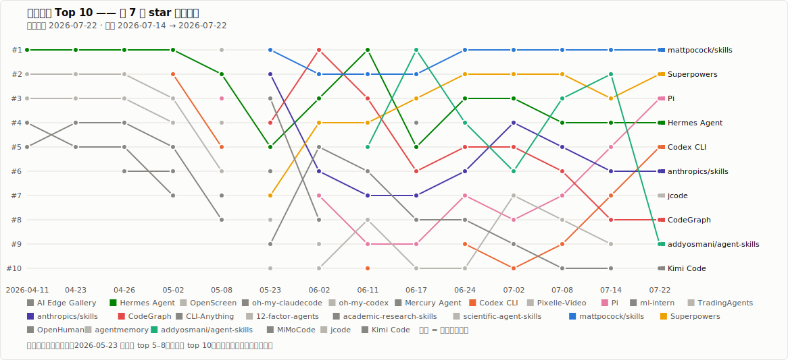

# 分类排行

[English](../../rankings/README.md) | [中文](../README.md)

主页的[热门榜](../README.md#近期热门榜)按 **周增量** 排序，看的是势头；这一页的榜单按 **当前 star 总量** 排序，看的是各类别的存量格局。两边对照读：总量高但没进热榜的项目是已站稳的老玩家，总量低但冲上热榜的项目是正在爆发的新势力。

> **最后更新：** 2026-07-22 · **Star 总数：** 来自最近一次追踪抓取 · **排序：** 当前 star 总量，本周增量仅作参考

## 排名趋势

每周热度 Top 10 自开始追踪以来的名次变化——一条折线一个项目，越靠上名次越好，折线中断表示该周掉出榜单：

  

到目前为止的主线：早期榜单由 Hermes Agent 统治，5 月底起 `.claude/skills` 浪潮接管，6 月中以后前三名几乎完全在 curated skills 合集之间轮换。

## Agent 榜

端到端的 agent——拿来直接干活的产品。垂类细分见 [Agent 垂类排行](agent-verticals.md)。

<!-- auto:board:agent -->
| 排名 | 项目 | 垂类 | Stars | 本周增量 | 状态 |
| --- | --- | --- | --- | --- | --- |
| #1 | [OpenClaw](https://github.com/openclaw/openclaw) | 通用助理 | 383.8k | +982 | 已收录 · [profile](../agents/openclaw.md) |
| #2 | [Hermes Agent](https://github.com/nousresearch/hermes-agent) | 通用助理 | 218.8k | +4,588 | 已收录 · [profile](../agents/hermes-agent.md) |
| #3 | [AutoGPT](https://github.com/significant-gravitas/autogpt) | 通用助理 | 185.7k | — | 已收录 · [profile](../agents/autogpt.md) |
| #4 | [Claude Code](https://github.com/anthropics/claude-code) | 编程开发 | 138.7k | — | 已收录 · [profile](../agents/claude-code.md) |
| #5 | [Codex CLI](https://github.com/openai/codex) | 编程开发 | 100.6k | +2,954 | 已收录 · [profile](../agents/codex.md) |
| #6 | [TradingAgents](https://github.com/tauricresearch/tradingagents) | 金融 | 94.1k | +1,258 | 不收录 |
| #7 | [OpenHands](https://github.com/openhands/openhands) | 编程开发 | 81.7k | — | 已收录 · [profile](../agents/openhands.md) |
| #8 | [Pi](https://github.com/earendil-works/pi) | 编程开发 | 75.4k | +4,876 | 已收录 · [profile](../agents/pi.md) |
| #9 | [Open Interpreter](https://github.com/openinterpreter/openinterpreter) | 通用助理 | 67.1k | — | 已收录 · [profile](../agents/open-interpreter.md) |
| #10 | [Cline](https://github.com/cline/cline) | 编程开发 | 64.9k | — | 已收录 · [profile](../agents/cline.md) |
| #11 | [Goose](https://github.com/aaif-goose/goose) | 通用助理 | 51.5k | — | 已收录 · [profile](../agents/goose.md) |
| #12 | [Aider](https://github.com/aider-ai/aider) | 编程开发 | 47.6k | — | 已收录 · [profile](../agents/aider.md) |
| #13 | [CodeWhale](https://github.com/hmbown/codewhale) | 编程开发 | 40.0k | +263 | 已收录 · [profile](../agents/codewhale.md) |
| #14 | [OpenHuman](https://github.com/tinyhumansai/openhuman) | 通用助理 | 35.2k | +420 | 已收录 · [profile](../agents/openhuman.md) |
| #15 | [Continue](https://github.com/continuedev/continue) | 编程开发 | 35.0k | — | 已收录 · [profile](../agents/continue.md) |
| #16 | [SWE-agent](https://github.com/swe-agent/swe-agent) | 编程开发 | 19.9k | — | 已收录 · [profile](../agents/swe-agent.md) |
| #17 | [OpenHarness](https://github.com/hkuds/openharness) | 编程开发 | 15.0k | — | 已收录 · [profile](../agents/openharness.md) |
| #18 | [MiMoCode](https://github.com/xiaomimimo/mimo-code) | 编程开发 | 12.3k | +393 | 已收录 · [profile](../agents/mimocode.md) |
| #19 | [jcode](https://github.com/1jehuang/jcode) | 编程开发 | 10.6k | +2,319 | 已收录 · [profile](../agents/jcode.md) |
| #20 | [mini-swe-agent](https://github.com/swe-agent/mini-swe-agent) | 编程开发 | 6.0k | — | 已收录 · [profile](../agents/mini-swe-agent.md) |
| #21 | [Kimi Code](https://github.com/moonshotai/kimi-code) | 编程开发 | 4.5k | +1,452 | 已收录 · [profile](../agents/kimi-code.md) |
| #22 | [CoStrict](https://github.com/zgsm-ai/costrict) | 编程开发 | 4.3k | +24 | 已收录 · [profile](../agents/costrict.md) |
<!-- /auto:board:agent -->

## Agent 基础设施榜

agent 之下的那一层——框架、编排、记忆与上下文、网关和工作流引擎。它们不是"指着任务就能跑"的 agent，而是 agent 开发者用来搭建系统的底座。

<!-- auto:board:infra -->
| 排名 | 项目 | 分组 | Stars | 本周增量 | 状态 |
| --- | --- | --- | --- | --- | --- |
| #1 | [n8n](https://github.com/n8n-io/n8n) | 工作流 | 197.5k | — | 已收录 · [profile](../agents/n8n.md) |
| #2 | [LangChain](https://github.com/langchain-ai/langchain) | 框架 | 142.3k | — | 已收录 · [profile](../agents/langchain.md) |
| #3 | [Ruflo](https://github.com/ruvnet/ruflo) | 编排 | 65.5k | +1,205 | 已收录 · [profile](../agents/ruflo.md) |
| #4 | [CodeGraph](https://github.com/colbymchenry/codegraph) | 记忆与上下文 | 61.6k | +1,968 | 已收录 · [profile](../agents/codegraph.md) |
| #5 | [CrewAI](https://github.com/crewaiinc/crewai) | 框架 | 56.0k | — | 已收录 · [profile](../agents/crewai.md) |
| #6 | [Flowise](https://github.com/flowiseai/flowise) | 工作流 | 54.8k | — | 已收录 · [profile](../agents/flowise.md) |
| #7 | [LiteLLM](https://github.com/berriai/litellm) | 网关与执行 | 54.4k | — | 已收录 · [profile](../agents/litellm.md) |
| #8 | [LlamaIndex](https://github.com/run-llama/llama_index) | 框架 | 51.0k | — | 已收录 · [profile](../agents/llamaindex.md) |
| #9 | [CLI-Anything](https://github.com/hkuds/cli-anything) | 网关与执行 | 45.7k | +481 | 已收录 · [profile](../agents/cli-anything.md) |
| #10 | [LangGraph](https://github.com/langchain-ai/langgraph) | 编排 | 37.9k | — | 已收录 · [profile](../agents/langgraph.md) |
| #11 | [agentmemory](https://github.com/rohitg00/agentmemory) | 记忆与上下文 | 25.6k | +473 | 候补 |
| #12 | [Letta (MemGPT)](https://github.com/letta-ai/letta) | 记忆与上下文 | 23.9k | — | 已收录 · [profile](../agents/memgpt.md) |
<!-- /auto:board:infra -->

## Skill 榜

skill 合集、skill 框架和 agent 方法论——内容资产而非 agent 表面。多数作为候补跟踪；框架那一端通过 [Superpowers](../agents/superpowers.md) 的 profile 覆盖。方向细分见 [Skill 垂类排行](skill-verticals.md)。

<!-- auto:board:skill -->
| 排名 | 项目 | 方向 | Stars | 本周增量 | 状态 |
| --- | --- | --- | --- | --- | --- |
| #1 | [Superpowers](https://github.com/obra/superpowers) | 通用技能集 | 259.3k | +5,432 | 已收录 · [profile](../agents/superpowers.md) |
| #2 | [mattpocock/skills](https://github.com/mattpocock/skills) | 通用技能集 | 181.8k | +13,570 | 候补 |
| #3 | [anthropics/skills](https://github.com/anthropics/skills) | 通用技能集 | 163.4k | +2,510 | 候补 |
| #4 | [addyosmani/agent-skills](https://github.com/addyosmani/agent-skills) | 通用技能集 | 79.8k | +1,908 | 候补 |
| #5 | [academic-research-skills](https://github.com/imbad0202/academic-research-skills) | 学术科研 | 39.0k | +1,286 | 候补 |
| #6 | [anthropics/financial-services](https://github.com/anthropics/financial-services) | 金融 | 33.7k | +246 | 不收录 |
| #7 | [scientific-agent-skills](https://github.com/k-dense-ai/scientific-agent-skills) | 学术科研 | 31.5k | +641 | 候补 |
| #8 | [12-factor-agents](https://github.com/humanlayer/12-factor-agents) | 方法论 | 24.6k | +425 | 不收录 |
<!-- /auto:board:skill -->

## 垂类排行

- [Agent 垂类排行](agent-verticals.md)——编程开发、通用助理、金融
- [Skill 垂类排行](skill-verticals.md)——通用技能集、学术科研、金融、方法论

本页表格和趋势图由 `scripts/render-rankings.py` 与 `scripts/render-trend.py` 在每次发布时自动重新生成——标记块内的表格不要手工编辑。
